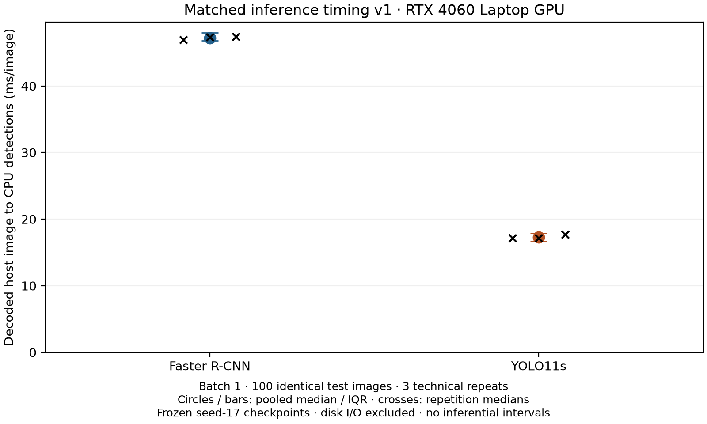

# Standardized inference timing v1

Batch 45 replaces the canonical manuscript's main asymmetric timing comparison
with `decoded-host-to-source-detections-v1`. The historical profiles, training
times, parameter counts, operation counts, and Pareto/raincloud artifacts remain
unchanged. The timing command performs inference only.

## Reporting hardware and reproducibility

The reporting machine is the project's ASUS ROG Strix G16 (G614JV), Intel
i7-13650HX, 16 GB installed system RAM, NVIDIA GeForce RTX 4060 Laptop GPU with
8 GB VRAM, Windows, and driver 610.47. The hardware gate reads the actual GPU,
CPU, system model, and available physical memory identity; it rejects another
machine or a CPU-only runtime before measuring publication values. This session
used the existing `C:\Users\Pouyan\.conda\envs\torch-gpu\python.exe`, with
Python 3.11.15, Torch 2.6.0+cu124, Torchvision 0.21.0+cu124, Ultralytics
8.4.110, CUDA build 12.4, and cuDNN 90100. The driver-reported maximum CUDA
compatibility is not the Torch CUDA build version.

Config: [`configs/inference_timing_v1.yaml`](../configs/inference_timing_v1.yaml).
Exact PowerShell command from the repository root:

```powershell
& C:\Users\Pouyan\.conda\envs\torch-gpu\python.exe -m src.benchmark_inference --config configs/inference_timing_v1.yaml --mode run
```

Use `--mode preflight` for read-only checks, `--mode verify` for rehashing and
recomputing statistics from saved per-image times, and `--mode report` to
regenerate the table/figure from verified saved timing. `run` refuses to replace
existing timing outputs. A deliberate future timing campaign should use a
reviewed new protocol/output version, preserving these accepted measurements.
The repository `.venv` currently contains CPU Torch; it can run unit tests and
offline verification but cannot generate publication timings. No final timing
may be substituted from an unrelated GPU environment.

## Historical boundary reconstruction and preservation

The historical implementations are
`src/models/train_faster_rcnn.py::_profile_inference` and
`src/models/yolo_reporting.py::profile_yolo_checkpoint` / `_profile_tensor`.
Both use batch 1, 10 warm-up iterations followed by 100 timed iterations, and
explicit CUDA synchronization. The first validation image is used for the
registered-operation profile during warm-up; it is not a complete operation
inventory. Historical timed images follow the warm-up images in validation
record order. Neither historical profile is the separate Phase 5
`evaluation_fps` audit, whose YOLO interval includes file I/O and whose Faster
R-CNN interval starts after transfer.

| Historical stage | Faster R-CNN | YOLO11s |
|---|---|---|
| Disk access and image decode | Excluded | Excluded |
| Tensor conversion and host-to-device transfer | Excluded | Excluded |
| Resize | Included in native Torchvision transform | Excluded; PIL bilinear resize to 640 square before timing |
| Forward | Included, float16 autocast | Included, fused model, bfloat16 autocast |
| Native postprocessing/NMS | Included | Included |
| Restore source-image box coordinates | Included in Torchvision postprocess | Not performed in the historical profile |
| Copy final detections to host arrays | Excluded | Excluded |

The preservation manifest is
[`historical_artifacts.json`](../results/logs/phase45_inference_timing_v1/historical_artifacts.json).
It freezes 46 files in place, including all ten compute CSVs and training
summaries/configs, the timing implementations, split/annotation source,
comparison tables, and historical figures. SHA256 checks run before and after
v1. Historical CSVs do not store individual timings; total elapsed is
reconstructed as `timed_images * mean_latency_ms / 1000`, and FPS is checked as
`timed_images / total_elapsed_seconds`. This is an algebraic reconstruction,
not a new measurement or a claim to recover unavailable latency samples.
Seed-17 reconstructed totals are 9.091535900004601 seconds for Faster R-CNN
and 1.532834300014656 seconds for YOLO11s; the latter also appears explicitly in
its training summary. The historical numerical results remain preserved and
are not the manuscript's primary matched runtime evidence.

## Matched boundary and configuration

Each call starts with the same decoded, original-resolution, uint8 RGB source
array already in host memory. Both calls include resize/letterbox, tensor
conversion and normalization, host-to-device transfer, model forward, native
postprocessing/NMS, source-coordinate restoration, and extraction of CPU box,
score, and category-label arrays. YOLO's RGB-to-BGR array conversion and native
Python prediction API overhead are included. There is no disk access or image
decoding within the timer. The clock starts after a CUDA synchronization and
stops after another synchronization on the same device.

The native spatial transforms are preserved: Torchvision resize/normalization
and source-size restoration for Faster R-CNN; Ultralytics letterbox and
`scale_boxes` restoration for YOLO11s. This matches conceptual start/end
states without claiming the implementations perform identical operations.

The two frozen primary seed-17 best checkpoints are hash-checked against the
release inventory and historical compute tables. The common evaluation config
supplies the candidate floor 0.001, final NMS IoU 0.50, maximum 100 detections,
class mapping, and 640-pixel resolution. These are candidate-level inference
measurements, not timings at detector-specific clinical operating thresholds.

The subset is 100 test images selected by ascending SHA256 of
`17:<file_name>`; names break digest ties. Selection never consults labels,
scores, or latency. The ordered IDs and per-image hashes are in the summary.
Only this subset is decoded into memory. Batch size is 1. Each of three complete
repetitions uses the identical ordered subset and 10 warm-up images per detector.
Model order alternates Faster/YOLO, YOLO/Faster, Faster/YOLO. Both models are
resident; no simultaneous model execution or training occurs. One Torch CPU
thread, deterministic algorithms, disabled cuDNN benchmark, and disabled TF32
are checked and recorded. GPU temperature/power/utilization snapshots are
captured outside measurement.

AMP is explicit: float16 for Faster R-CNN, bfloat16 for YOLO11s, from their
training configs. A native convolution hook verifies the actual activation
dtype outside timing. Ultralytics `amp=True` alone does not establish prediction
autocast; this v1 protocol wraps the ordinary and timed YOLO calls in explicit
bfloat16 autocast. Thus it is not an assertion that the historical Phase 5
FP32 YOLO bundles are numerically identical to v1 AMP predictions. The primary
accuracy evidence and frozen bundles are unchanged.

## Prediction agreement and timing statistics

For each selected image, ordinary file-based inference independently decodes
the source through the native loader, under the identical explicit AMP and
postprocessing settings. It uses the dataset tensor path for Faster R-CNN and
the normal file-source `YOLO.predict` path for YOLO11s. These reference calls,
model initialization/fusion, and activation-dtype checks are outside timing.
Every timed prediction in all three repetitions is compared against its
reference. Counts and category labels must agree exactly; sorted boxes and
scores use `atol=0.01` source pixels / `atol=0.00001` score and `rtol=0.00001`.
No unmatched detection can be discarded to pass the check. A mismatch aborts
publication output. Per-image errors/counts and per-repetition maxima are saved.

Total elapsed is the **sum of synchronized per-image timed intervals**, excluding
between-image validation/bookkeeping and warm-up; it is not process wall time.
FPS is images divided by that sum, never a mean of per-image reciprocal times.
Median, Q1, Q3, and IQR use NumPy's linear sample quantiles. Aggregate rows pool
300 calls per detector; separate rows expose each 100-image repetition. These
are repeated timings of the same checkpoint and images, not independent
biological, patient, or training replicates. No inferential confidence interval,
hypothesis test, or new n=3 training claim is produced.

## Accepted laptop measurements

| Matched v1 metric | Faster R-CNN | YOLO11s |
|---|---:|---:|
| Total timed elapsed, 300 calls (s) | 14.3466 | 5.2124 |
| FPS (300 / total elapsed) | 20.91 | 57.56 |
| Median image latency (ms) | 47.20 | 17.29 |
| Q1--Q3 image latency (ms) | 46.78--48.00 | 16.68--17.88 |
| IQR image latency (ms) | 1.22 | 1.19 |
| Total parameters | 43,256,153 | 9,428,179 |
| Training-trainable parameters | 43,030,809 | 9,428,163 |

| Detector | Repetition | Total timed elapsed (s) | FPS | Median (ms) | IQR (ms) |
|---|---:|---:|---:|---:|---:|
| faster_rcnn | 1 | 4.7222 | 21.18 | 46.91 | 0.77 |
| faster_rcnn | 2 | 4.8594 | 20.58 | 47.36 | 3.99 |
| faster_rcnn | 3 | 4.7649 | 20.99 | 47.37 | 0.90 |
| yolo11s | 1 | 1.7080 | 58.55 | 17.14 | 0.85 |
| yolo11s | 2 | 1.7361 | 57.60 | 17.14 | 1.39 |
| yolo11s | 3 | 1.7683 | 56.55 | 17.69 | 1.18 |

All 600 timed-image comparisons passed with exactly equal counts, category labels,
boxes, and scores (zero maximum absolute error). Each repetition checks 2,471
Faster R-CNN detections and 165 YOLO11s detections at the common 0.001 floor.
The ratio of aggregate FPS is 2.75; it is descriptive of this protocol.



Sources: [aggregate CSV](../results/tables/inference_timing_v1.csv),
[repetition CSV](../results/tables/inference_timing_v1_repetitions.csv),
[per-image intervals and agreement](../results/tables/inference_timing_v1_images.csv),
[summary/provenance](../results/logs/phase45_inference_timing_v1/summary.json).

## Parameter counts and incomplete operation profiles

Parameter counts remain 43,256,153 total / 43,030,809 training-trainable for
Faster R-CNN and 9,428,179 / 9,428,163 for YOLO11s. They describe the saved
networks before inference fusion. Frozen profiler totals remain 450.7637248 and
21.4198784 billion **incomplete profiler-registered operations**. The counter
registers convolution/matrix work and omits unsupported work including
RoIAlign, NMS, much elementwise/normalization work, sorting, and bookkeeping.
Its Faster R-CNN result depends on realized proposals. No approximate 21-fold
ratio is used as an architecture-level or headline efficiency fact. Full
historical operator attribution remains in
[`QUANTITATIVE_COMPARISON.md`](QUANTITATIVE_COMPARISON.md).

## Claim limits and artifact provenance

The matched boundary removes the historical inclusion/exclusion asymmetry,
but measurements still describe one laptop/software/power state, one checkpoint
per detector, a fixed subset, different AMP dtypes, native transforms, and API
overhead. Three technical repetitions cannot characterize between-machine or
between-training variability. Disk/DICOM decode, network transfer, PACS I/O,
clinical workflow and concurrency are outside this boundary. Historical
five-run Pareto/raincloud timing axes remain explicitly historical and must not
be relabeled as this new protocol or joined to the three technical repetitions.

The summary binds config, code, checkpoints, native adapters, environment files,
input-image hashes, hardware, AMP checks, raw intervals, summary tables, figure,
and agreement evidence. The scientific artifact manifest and manuscript claim
bindings point to the new version. A first development trial was excluded after
the deprecated `half=False` keyword generated a warning inside each YOLO timed
call; the trial is retained in ignored `tmp/inference_timing_trial_deprecated_half/`.
The accepted protocol uses `quantize=None` and reruns all repetitions, without
choosing runs based on faster timing values.
