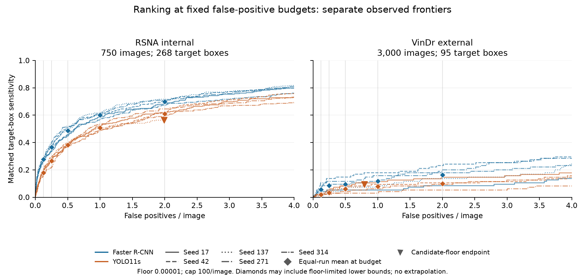
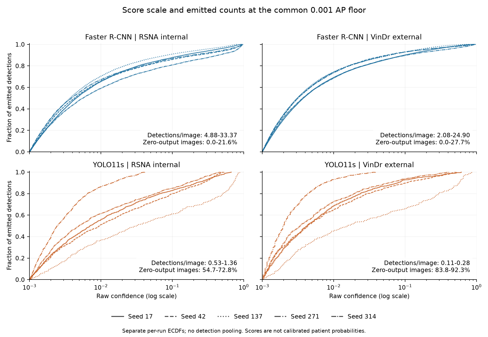
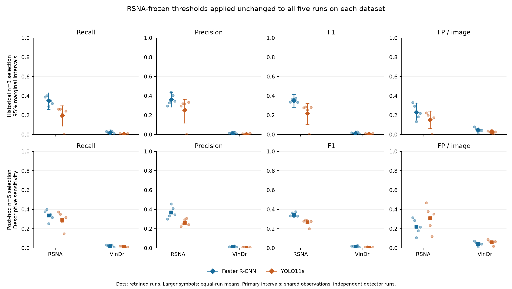

# VinDr statistics and cross-dataset transportability — Batch 50

Generated from [summary.json](../results/vindr_external_v1/statistics/summary.json). Methods and estimands: [VINDR_STATISTICS.md](VINDR_STATISTICS.md).

## Central question

**Detector ordering and RSNA-selected operating points do not transport in the same sense.** The observed equal-run AP and fixed-budget FROC ordering remains Faster R-CNN above YOLO11s, while both pipelines lose substantial absolute performance and the frozen thresholds yield very low external recall. Preserved ordering is not preserved performance. The detector gaps and the evidence about them are reported separately below.

No ontology, threshold, checkpoint, score floor or detection cap was tuned. All five runs per detector, including seed 271, are retained. RSNA and VinDr observations and predictions are never pooled. Changes describe **cross-dataset transportability**; acquisition, institution, country, patient population, annotation ontology and numerical implementation are confounded. No specific factor is identified as the cause.

## Population and estimands

| Dataset | Images | Positive images | Target boxes | Patient groups | Resampling unit |
| --- | --- | --- | --- | --- | --- |
| internal | 750 | 169 | 268 | 323 | NIH_patient |
| external | 3000 | 84 | 95 | Unavailable | released_study_image |

Primary intervals use 2,000 draws, paired observation sampling across both detectors and all runs, and independent within-detector trained-run resampling. RSNA moves all studies from a known NIH patient together. VinDr uses released images because no defensible patient linkage exists; unobserved repeat patients may make those intervals too narrow. Seed-17 checkpoint-conditional intervals resample only observations. All intervals are marginal 95% percentile intervals, conditional on the frozen thresholds and retained candidate support. There are no new hypothesis tests or simultaneous guarantees. New internal intervals here are aligned Batch 50 reconstructions, not replacements for historical outputs.

## A. Ranking and B. false-positive-regime transport

Equal-run means +/- sample SD (n=5 each); A = Faster R-CNN, B = YOLO11s. AP uses the common 0.001 support; FROC uses exact scores at the frozen 0.00001 collection floor. Budget sensitivities are observed maxima at or below the same FP/image budget, without interpolation.

| Endpoint | RSNA A | RSNA B | VinDr A | VinDr B | Ordering | Gap |
| --- | --- | --- | --- | --- | --- | --- |
| ap50 | 0.304224 +/- 0.018896 | 0.162612 +/- 0.016174 | 0.002505 +/- 0.001380 | 0.000501 +/- 0.000272 | unchanged | weakened |
| ap50_95 | 0.099502 +/- 0.006681 | 0.054168 +/- 0.006030 | 0.000618 +/- 0.000170 | 0.000119 +/- 0.000077 | unchanged | weakened |
| froc_0.125 | 0.277612 +/- 0.010082 | 0.179851 +/- 0.018165 | 0.056842 +/- 0.034593 | 0.018947 +/- 0.004708 | unchanged | weakened |
| froc_0.25 | 0.366418 +/- 0.027216 | 0.266418 +/- 0.030611 | 0.086316 +/- 0.040359 | 0.033684 +/- 0.013725 | unchanged | weakened |
| froc_0.5 | 0.485821 +/- 0.030927 | 0.382090 +/- 0.009730 | 0.094737 +/- 0.038676 | 0.061053 +/- 0.024004 | unchanged | weakened |
| froc_1 | 0.600000 +/- 0.020842 | 0.507463 +/- 0.020094 | 0.117895 +/- 0.051783 | 0.077895 +/- 0.030326 | unchanged | weakened |
| froc_2 | 0.697761 +/- 0.019389 | 0.608955 +/- 0.030701 | 0.164211 +/- 0.055998 | 0.098947 +/- 0.033783 | unchanged | weakened |

The change labels compare the signed A-minus-B equal-run gaps: **unchanged** within the configured numerical tolerance; **strengthened** if the magnitude increases without a sign reversal; **weakened** if it decreases; **reversed** if its sign flips. These are descriptive labels, not significance decisions or tests of a dataset interaction. A smaller raw AP gap near zero does not mean that the pipelines have become clinically equivalent.

### Candidate support remains incomplete

| Budget | RSNA YOLO limited runs | VinDr YOLO limited runs | VinDr observed A | VinDr observed B | VinDr B conservative upper |
| --- | --- | --- | --- | --- | --- |
| 0.125 | 0 | 0 | 0.056842 | 0.018947 | 0.018947 |
| 0.25 | 0 | 0 | 0.086316 | 0.033684 | 0.033684 |
| 0.5 | 0 | 0 | 0.094737 | 0.061053 | 0.061053 |
| 1 | 0 | 1 | 0.117895 | 0.077895 | 0.258947 |
| 2 | 1 | 1 | 0.164211 | 0.098947 | 0.280000 |

The conservative upper replaces each floor-limited run's observed sensitivity with 1.0; it is a missing-support bound, not a confidence interval. Unlike the preserved internal no-reversal bound at 2 FP/image, the external upper bounds at 1 and 2 FP/image exceed the observed Faster R-CNN mean. Thus the external ordering is established only on the retained candidate support; reversal beyond that support cannot be ruled out. No further floor change is made. Substantial Faster R-CNN detection-cap saturation is also retained and reported per run.

## Primary uncertainty on VinDr

Estimate [marginal 95% CI]; the contrast is A minus B. FROC intervals describe the observed, support-limited estimand, not an untruncated frontier.

| Endpoint | A | B | A minus B | Valid draws A/B/difference |
| --- | --- | --- | --- | --- |
| ap50 | 0.002505 [0.000880, 0.007484] | 0.000501 [0.000043, 0.002343] | 0.002004 [0.000331, 0.006689] | 2000/2000/2000 |
| ap50_95 | 0.000618 [0.000202, 0.001948] | 0.000119 [0.000011, 0.000572] | 0.000499 [0.000075, 0.001719] | 2000/2000/2000 |
| froc_0.125 | 0.056842 [0.015686, 0.112514] | 0.018947 [0.001866, 0.044450] | 0.037895 [-0.002128, 0.092453] | 2000/2000/2000 |
| froc_0.25 | 0.086316 [0.037033, 0.153850] | 0.033684 [0.008886, 0.071265] | 0.052632 [0.005345, 0.113471] | 2000/2000/2000 |
| froc_0.5 | 0.094737 [0.044736, 0.161842] | 0.061053 [0.024787, 0.106673] | 0.033684 [-0.014829, 0.092312] | 2000/2000/2000 |
| froc_1 | 0.117895 [0.056879, 0.193823] | 0.077895 [0.037197, 0.132586] | 0.040000 [-0.020939, 0.108700] | 2000/2000/2000 |
| froc_2 | 0.164211 [0.091653, 0.253854] | 0.098947 [0.048415, 0.155569] | 0.065263 [-0.005663, 0.149396] | 2000/2000/2000 |
| primary_precision | 0.010830 [0.000000, 0.028886] | 0.004271 [0.000000, 0.016442] | 0.006559 [-0.008360, 0.025664] | 2000/2000/2000 |
| primary_recall | 0.018947 [0.000000, 0.049211] | 0.004211 [0.000000, 0.016280] | 0.014737 [-0.004880, 0.045485] | 2000/2000/2000 |
| primary_f1 | 0.013580 [0.000000, 0.035312] | 0.004214 [0.000000, 0.016519] | 0.009366 [-0.006376, 0.031685] | 2000/2000/2000 |
| primary_fp_per_image | 0.047667 [0.028265, 0.067935] | 0.027067 [0.012195, 0.040200] | 0.020600 [-0.001735, 0.045672] | 2000/2000/2000 |

Intervals that include zero do not resolve a detector difference under this training-procedure estimand. A positive mean alone does not establish a robust detector advantage. Undefined draws are not retried or imputed; all counts are in the interval table.

## C. Score scale and detection counts

Each row first summarizes each run's emitted detections at >=0.001, then weights the five runs equally. Counts are also normalized by cohort size. Confidence is not a calibrated patient probability.

| Endpoint | RSNA A | RSNA B | VinDr A | VinDr B | Gap change |
| --- | --- | --- | --- | --- | --- |
| ap_scores_mean | 0.069399 +/- 0.024569 | 0.076292 +/- 0.074236 | 0.036696 +/- 0.009282 | 0.048210 +/- 0.056450 | strengthened |
| ap_scores_median | 0.004394 +/- 0.000760 | 0.010906 +/- 0.011293 | 0.003364 +/- 0.000337 | 0.005869 +/- 0.005433 | weakened |
| ap_scores_detections_per_image | 16.326133 +/- 12.039007 | 1.080800 +/- 0.333489 | 11.502800 +/- 10.527358 | 0.217200 +/- 0.069370 | weakened |
| ap_scores_percent_zero_detection_images | 7.466667 +/- 8.897940 | 62.373333 +/- 6.896311 | 8.333333 +/- 11.369086 | 87.073333 +/- 3.572145 | strengthened |

All four frozen score supports, full quantiles, per-run detection counts and defined-run counts are preserved in the score CSV and summary. Empty emitted populations have count zero and undefined score summaries; they are not assigned zero confidence or omitted from run inventories. The all-retained support uses Batch 42 v4 internally; AP and threshold supports use the original internal bundles. Historical YOLO internal inference was FP32, whereas external inference used verified bfloat16 AMP, limiting attribution of score shifts.

## D. Frozen operating points and n=3 versus n=5 sensitivity

The primary historical policy selected thresholds from three RSNA validation runs; the secondary policy is Batch 43's post-hoc five-run validation sensitivity. Each is evaluated on five runs per detector in both datasets, with unchanged numerical thresholds. The secondary policy remains descriptive.

| Policy | Faster R-CNN threshold | YOLO11s threshold | Validation runs |
| --- | --- | --- | --- |
| primary | 0.69 | 0.05 | 3 |
| secondary | 0.7 | 0.01 | 5 |

| Endpoint | RSNA A | RSNA B | VinDr A | VinDr B | Cross-dataset gap |
| --- | --- | --- | --- | --- | --- |
| primary_precision | 0.362419 +/- 0.058081 | 0.252403 +/- 0.141790 | 0.010830 +/- 0.008128 | 0.004271 +/- 0.005966 | weakened |
| primary_recall | 0.350746 +/- 0.046305 | 0.194776 +/- 0.110953 | 0.018947 +/- 0.013725 | 0.004211 +/- 0.005766 | weakened |
| primary_f1 | 0.351144 +/- 0.018417 | 0.219206 +/- 0.123269 | 0.013580 +/- 0.009817 | 0.004214 +/- 0.005800 | weakened |
| primary_fp_per_image | 0.232000 +/- 0.080178 | 0.151733 +/- 0.088224 | 0.047667 +/- 0.023512 | 0.027067 +/- 0.016677 | weakened |
| secondary_precision | 0.368647 +/- 0.063211 | 0.263097 +/- 0.035972 | 0.011367 +/- 0.008377 | 0.004499 +/- 0.004510 | weakened |
| secondary_recall | 0.338806 +/- 0.056736 | 0.292537 +/- 0.088638 | 0.018947 +/- 0.013725 | 0.010526 +/- 0.010526 | weakened |
| secondary_f1 | 0.345841 +/- 0.022247 | 0.265713 +/- 0.036676 | 0.014046 +/- 0.010081 | 0.006277 +/- 0.006255 | weakened |
| secondary_fp_per_image | 0.220533 +/- 0.082911 | 0.310400 +/- 0.135126 | 0.044200 +/- 0.022239 | 0.060067 +/- 0.025861 | weakened |
| primary_detections_per_image | 0.357333 +/- 0.095163 | 0.221333 +/- 0.127572 | 0.048267 +/- 0.023860 | 0.027200 +/- 0.016724 | weakened |
| primary_percent_images_with_detections | 25.573333 +/- 6.065861 | 14.213333 +/- 7.978081 | 4.260000 +/- 2.050257 | 2.140000 +/- 1.339652 | weakened |
| secondary_detections_per_image | 0.341600 +/- 0.101449 | 0.414933 +/- 0.166005 | 0.044800 +/- 0.022597 | 0.060400 +/- 0.026104 | weakened |
| secondary_percent_images_with_detections | 24.666667 +/- 6.732343 | 22.080000 +/- 5.630552 | 3.986667 +/- 1.981666 | 4.400000 +/- 1.745629 | reversed |

| Dataset | Metric | Historical n=3 gap | Post-hoc n=5 gap | Policy change |
| --- | --- | --- | --- | --- |
| internal | precision | 0.110016 | 0.105550 | weakened |
| internal | recall | 0.155970 | 0.046269 | weakened |
| internal | f1 | 0.131939 | 0.080128 | weakened |
| internal | fp_per_image | 0.080267 | -0.089867 | reversed |
| internal | detections_per_image | 0.136000 | -0.073333 | reversed |
| external | precision | 0.006559 | 0.006868 | strengthened |
| external | recall | 0.014737 | 0.008421 | weakened |
| external | f1 | 0.009366 | 0.007769 | weakened |
| external | fp_per_image | 0.020600 | -0.015867 | reversed |
| external | detections_per_image | 0.021067 | -0.015600 | reversed |

Lower FP/image alone does not establish improvement when recall and emission rates collapse. The historical-versus-secondary FP/image ordering reverses within both cohorts. Neither policy restores external recall. YOLO seed 271 emits nothing at its historical threshold in either dataset; its zero-valued defined metrics remain in all five-run summaries. No threshold selection uncertainty or clinical utility is inferred.

## Checkpoint-conditional sensitivity and complete provenance

The following intervals hold the seed-17 checkpoints fixed and resample only common external images. They are secondary; their narrower or differently centered contrasts cannot replace the primary training-procedure estimand.

| Endpoint | A | B | A minus B |
| --- | --- | --- | --- |
| ap50 | 0.001172 [0.000348, 0.004487] | 0.000758 [0.000096, 0.003094] | 0.000414 [-0.000553, 0.002401] |
| ap50_95 | 0.000418 [0.000079, 0.001887] | 0.000129 [0.000018, 0.000557] | 0.000289 [-0.000030, 0.001454] |
| froc_0.125 | 0.042105 [0.000000, 0.085382] | 0.021053 [0.000000, 0.060000] | 0.021053 [-0.010753, 0.052083] |
| froc_0.25 | 0.052632 [0.011905, 0.102804] | 0.052632 [0.012048, 0.110002] | 0.000000 [-0.051289, 0.047059] |
| froc_0.5 | 0.052632 [0.011905, 0.102804] | 0.084211 [0.033324, 0.146082] | -0.031579 [-0.088498, 0.022995] |
| froc_1 | 0.052632 [0.011905, 0.102804] | 0.105263 [0.050492, 0.178947] | -0.052632 [-0.116902, 0.000000] |
| froc_2 | 0.084211 [0.033333, 0.147770] | 0.147368 [0.076923, 0.217822] | -0.063158 [-0.125000, 0.000000] |
| primary_precision | 0.012295 [0.000000, 0.028346] | 0.009009 [0.000000, 0.031507] | 0.003286 [-0.012829, 0.018768] |
| primary_recall | 0.031579 [0.000000, 0.072168] | 0.010526 [0.000000, 0.036605] | 0.021053 [0.000000, 0.054948] |
| primary_f1 | 0.017699 [0.000000, 0.040936] | 0.009709 [0.000000, 0.033338] | 0.007990 [-0.008239, 0.028333] |
| primary_fp_per_image | 0.080333 [0.069333, 0.091333] | 0.036667 [0.028658, 0.045008] | 0.043667 [0.033992, 0.054333] |

- [All 20 run rows, support flags, and both policies](../results/vindr_external_v1/statistics/per_run.csv)
- [All marginal intervals for both separate datasets and estimands](../results/vindr_external_v1/statistics/intervals.csv)
- [Per-run score/count summaries](../results/vindr_external_v1/statistics/score_summaries.csv)
- [Internal/external contrasts and change classifications](../results/vindr_external_v1/statistics/transport_comparison.csv)
- [Historical/post-hoc policy contrasts](../results/vindr_external_v1/statistics/threshold_policy_comparison.csv)

The summary binds every input, code/config dependency, bootstrap-array artifact, aggregate table and figure by SHA-256. Exact commands, including full deterministic bootstrap replay, are in [README](../README.md#vindr-statistics-and-cross-dataset-transportability-batch-50). Private image-linked inputs and plot/bootstrap working files remain in ignored local storage. No manuscript rewrite, new inference, training, commit or publication is part of Batch 50.
