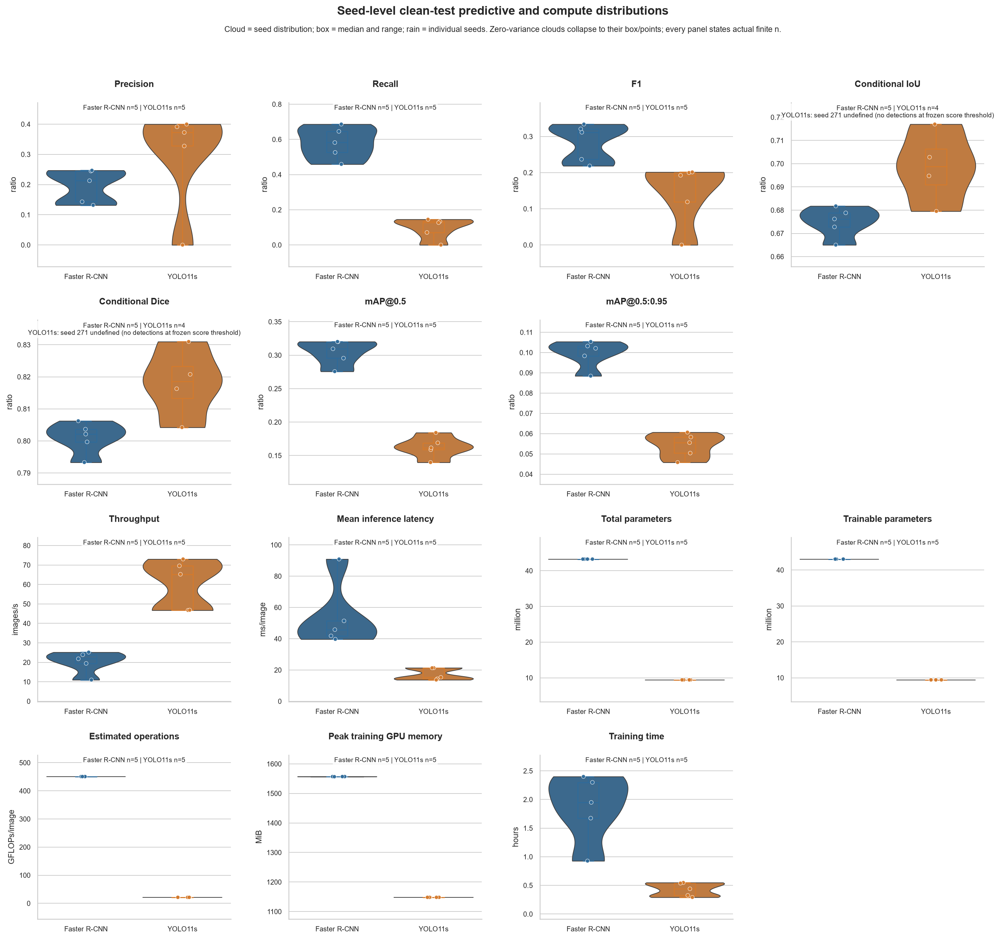
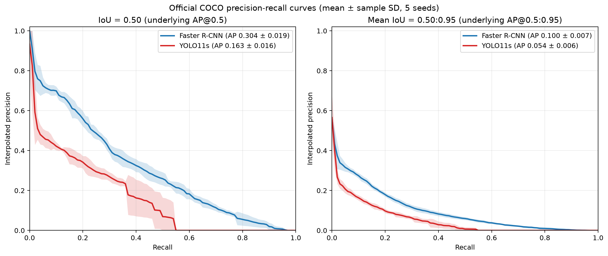
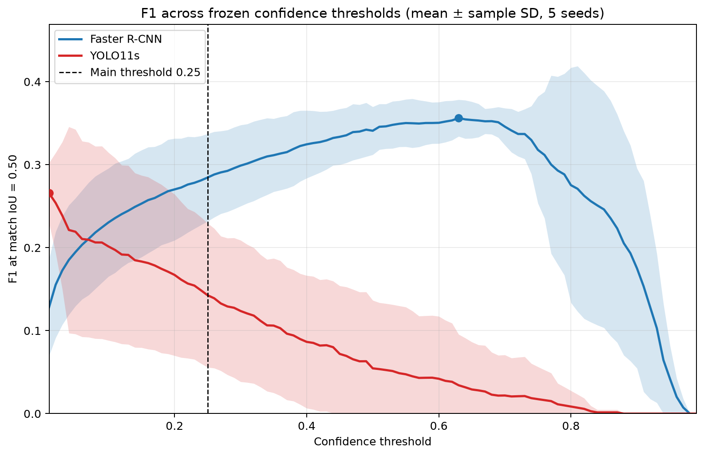
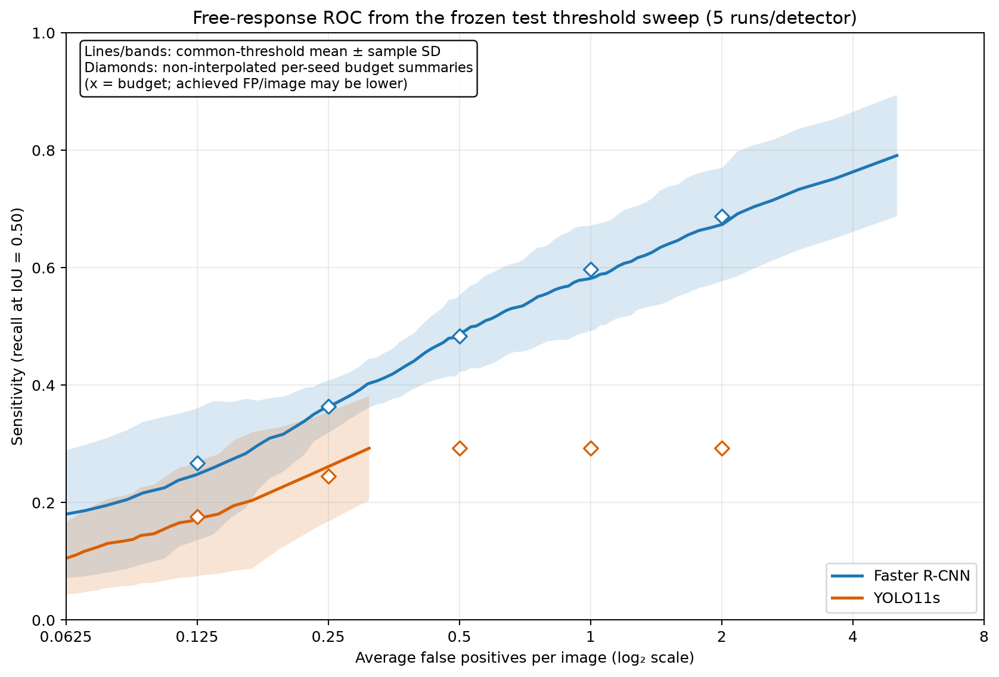
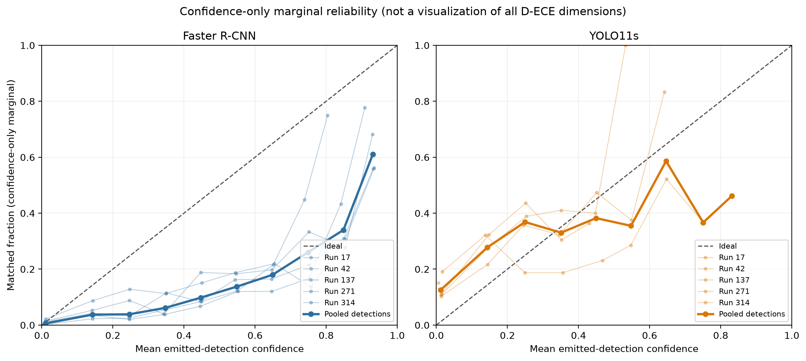
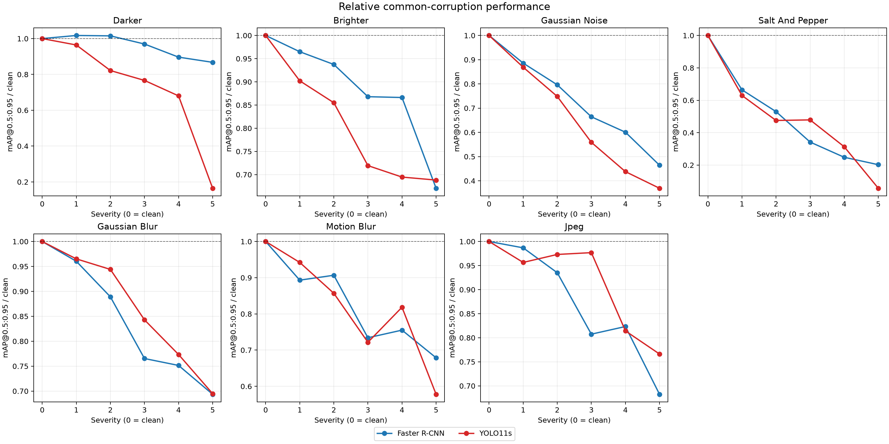
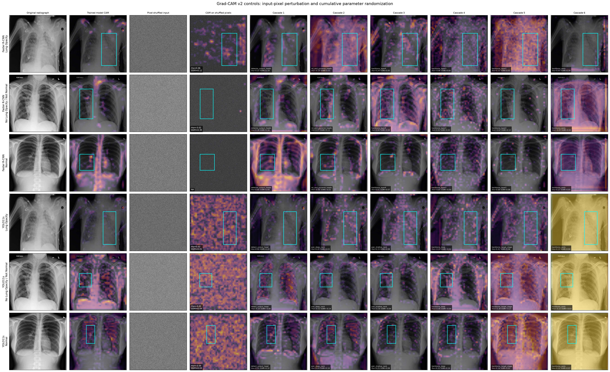

## Abstract

**Background:** The comparative evaluation of object detectors in medical imaging is frequently confounded by simultaneous variations in dataset composition, preprocessing pipelines, augmentation strategies, score thresholds, and evaluation metrics. To address this comparability gap, we conducted a rigorously controlled, multi-axis characterization of two disclosed lung-opacity detector pipelines, deliberately treating operating-score behavior and threshold sensitivity as primary objects of study rather than hidden implementation choices.

**Methods:** This retrospective internal benchmark utilized a deterministic, patient-disjoint subset comprising 5,000 radiographs from the RSNA Pneumonia Detection Challenge. A two-stage proposal-based pipeline (Faster R-CNN) and a one-stage dense pipeline (YOLO11s) were evaluated using common 640-pixel inputs, disabled stochastic augmentations, validation-frozen model selection, and a unified COCO-style evaluator. All five attempted training seeds per detector were strictly retained for the analysis. Detector-specific operating thresholds were selected on the validation set using a frozen n=3 procedure and subsequently applied unchanged across the n=5 internal-testing sensitivity evaluation. The primary training-procedure estimand integrated both patient-cluster and detector-run resampling, while checkpoint-conditional permutation testing served as the secondary estimand.

**Results:** The application of a shared raw score cutoff yielded materially disparate operating regimes for the two architectures. At a nominal threshold of 0.25, YOLO11s appeared substantially more precise but exhibited severely diminished recall. In stark contrast, Faster R-CNN demonstrated higher mean precision at 97 of 101 AP@0.5 recall positions, achieving a mean mAP@0.5:0.95 of 0.0995 versus 0.0542 for YOLO11s. Within the comprehensively evaluated 0.01--0.99 score sweep, Faster R-CNN maintained higher observed sensitivity across all five reported false-positive budgets. Conversely, under the documented detector-specific profiling procedure on the measured laptop hardware, YOLO11s demonstrated superior computational efficiency, achieving approximately 3-fold higher measured throughput, 78% fewer parameters, and about 21-fold fewer estimated registered operations. Notably, one retained YOLO11s run emitted zero detections at its frozen 0.05 threshold (yielding zero precision, recall, and F1), yet paradoxically maintained a plausible mAP@0.5:0.95 of 0.05558 derived from lower-score retained predictions. Detection-specific calibration error was descriptively higher for YOLO11s (mean D-ECE 0.0990 versus 0.0320). Primary bootstrap intervals were wholly positive for Faster R-CNN minus YOLO11s in terms of recall, F1, and both AP endpoints; however, the fixed-threshold precision interval crossed zero. The separate checkpoint-conditional permutation result favored YOLO11s precision at that specific cutoff. Conditional matched-box localization yielded inconclusive differences. Furthermore, controlled digital stress tests and Grad-CAM visual analyses remained descriptive and condition-specific, revealing inherently weak spatial localization for both pipelines.

**Conclusions:** The findings substantiate that Average Precision (AP), raw score scale, fixed-threshold behavior, and detection-level calibration characterize fundamentally distinct properties of these two pipelines. A shared numerical threshold does not guarantee a shared operating regime. Ultimately, the results support a bounded internal benchmark of specific implementations rather than a universal causal ranking of architectures, and they do not establish diagnostic validation or clinical utility for pneumonia detection.

## 1. Introduction

The rigorous evaluation of object detection architectures on chest radiographs extends fundamentally beyond the reporting of a single, internal-testing mean average precision (mAP) metric. A model may ostensibly preserve ranking quality while simultaneously suffering from an unstable confidence-score scale, or it may appear highly precise merely because a shared evaluation threshold acts as an unusually restrictive filter. Furthermore, an algorithm might successfully localize certain detections while systematically missing a majority of annotated findings, or it may exhibit catastrophic failure under minor perturbations in image formation and display conditions. Conversely, a computationally intensive two-stage system may provide superior lesion coverage but prove entirely impractical for resource-constrained point-of-care devices. Consequently, a comprehensive clinical and technical evaluation must intricately connect ranking accuracy with explicit operating points, probabilistic calibration, computational burden, adversarial or environmental robustness, interpretability mechanisms, and statistical uncertainty.

A critical review of published medical-detector comparisons reveals that these multifaceted dimensions are rarely isolated. Transitioning from one detector to another conventionally entails simultaneous modifications to the underlying backbone, the data augmentation stack, input resolution handling, optimization heuristics, post-processing rules, score thresholds, and the metric implementation itself. While point estimates derived from such studies remain valid within their proprietary protocols, they fundamentally lack the isolation required to determine whether a performance discrepancy originates from the intrinsic detector organization, the specific training recipe, or the chosen evaluation pathway. Furthermore, the reliance on a shared numerical confidence threshold introduces a significant confounding variable: because disparate pipelines frequently map their confidence scores onto fundamentally different scales, a singular threshold inevitably samples vastly different portions of their respective output distributions.

To systematically investigate this phenomenon, we designed a controlled comparative study utilizing two deliberately disclosed and representative pipelines: Torchvision `fasterrcnn_resnet50_fpn_v2`, which embodies the two-stage anchor-based proposal detection paradigm, and Ultralytics YOLO11s, which represents the compact, one-stage anchor-free dense detection methodology. The specific clinical task is the localization of the RSNA challenge category `Lung Opacity` on frontal chest radiographs. It is imperative to clarify that this task does not equate to a definitive pneumonia diagnosis; the target is a non-specific radiographic finding, and the negative control strata deliberately encompass both fundamentally normal studies and abnormal studies devoid of the annotated opacity.

The primary research question guiding this investigation was formulated as follows:

> Under a strictly patient-disjoint split, utilizing shared canonical preprocessing, an identical (disabled) stochastic augmentation policy, a common training-budget framework, and a single model-independent evaluator, how do Faster R-CNN and YOLO11s trade off lung-opacity detection coverage and ranking accuracy, operating regimes and confidence calibration, computational efficiency, corruption-specific robustness, and Grad-CAM-observed failure patterns?

This study advances the field through three specific contributions. First, it establishes a rigorously controlled, patient-disjoint comparative framework in which both pipelines consume the exact same images and annotations, utilize identical input sizes, operate without stochastic training augmentations, follow the same seed grid, and are evaluated across identical internal-testing boundaries and metric paths. Second, it fundamentally treats threshold behavior as an empirical result rather than a hidden, arbitrary implementation choice. This is achieved by synthesizing an exploratory threshold sweep, official precision-recall curves, validation-selected operating points, free-response receiver operating characteristic (FROC) curves, and a decoupled recall-weighted F-beta validation sensitivity analysis. Third, it decisively broadens the evidence base beyond idealized clean mAP metrics by incorporating detection-specific calibration (D-ECE), sophisticated patient-cluster inferential statistics, accuracy-efficiency Pareto analysis, digital and acquisition-motivated robustness stress tests, and Grad-CAM localization evaluated alongside rigorous randomization sanity checks.

The hypotheses addressed herein were recorded retrospectively after the majority of experimental artifacts had been frozen; they serve as result-linked traceability checks rather than prospective preregistrations. Most importantly, the experimental design deliberately refrains from attempting to estimate a universal, causal effect of the "one-stage" versus "two-stage" architectural dichotomy. Inevitable framework disparities such as numerical precision, normalization mechanisms, learning rate schedules, loss functions, target assignment, and intrinsic post-processing could not be perfectly symmetrized. Therefore, the appropriate unit of scientific claim is restricted to the behavior of these two specific, working pipelines under the explicitly stated controls and measured hardware budget.

## 2. Related Work

### 2.1 Two-stage and one-stage detector organization

The Faster R-CNN architecture revolutionized object detection by coupling a Region Proposal Network (RPN) to a Region of Interest (RoI)-based second-stage classifier and box regressor, enabling the sharing of rich convolutional features [@ren2015fasterrcnn]. The specific implementation adopted in this study enhances this paradigm by incorporating a ResNet-50 Feature Pyramid Network (FPN), which effectively represents objects across a hierarchy of multiple semantic scales [@lin2017fpn]. By utilizing multiple anchor shapes to generate spatial hypotheses, the proposal filtering mechanism and the subsequent second stage iteratively refine a constrained candidate set, theoretically offering high sensitivity for varied object morphologies.

Conversely, the YOLO (You Only Look Once) paradigm originated from the contrasting philosophy of formulating dense detection as a single-pass regression problem [@redmon2016yolo]. The contemporary YOLO11 iteration preserves this one-stage organization but advances the architecture by utilizing anchor-free grid references, multi-scale feature aggregation, decoupled classification and regression branches, distributed box offsets, and non-maximum suppression (NMS). The distributed regression mechanism shares conceptual lineage with the Generalized Focal Loss framework [@li2020gfl]. Because YOLO11 lacks a standalone, peer-reviewed architecture manuscript, the pinned source code release, the official configuration files, and the instantiated computational graph serve as the ultimate implementation authorities [@ultralytics2024yolo11; @ultralytics2026release; @ultralytics2026yoloarchitecture; @ultralytics2026yolo11config]. For this benchmark, YOLO11s was strategically selected over its larger counterparts to strictly adhere to the 8-GB GPU memory constraint, and over the newer NMS-free YOLO26 family to maintain essential continuity with established medical-detector literature.

It is crucial to recognize that architectural design primarily motivates hypotheses regarding computational efficiency, rather than guaranteeing a definitive accuracy ranking. While the dense head of YOLO circumvents the computational overhead of per-proposal second-stage processing, the explicit proposal refinement inherent to Faster R-CNN might behave fundamentally differently when tasked with localizing subtle, low-contrast, or variably sized pulmonary opacity annotations. The ultimately realized clinical performance remains heavily dependent on the optimization strategy, score formation dynamics, candidate filtering heuristics, and the specific characteristics of the dataset.

### 2.2 The comparability gap in medical detection studies

The foundational RSNA resource manuscript detailed the assembly of a massive chest-radiograph collection alongside an expert annotation workflow targeting possible pneumonia-like pulmonary opacities [@shih2019rsna]. Subsequent applied research has demonstrated the utility of both proposal-based and dense detection approaches on this dataset; however, the literature conspicuously lacks tightly controlled, architecture-family experiments. For instance, studies employing modified Faster R-CNN architectures typically introduce confounding variables by simultaneously altering the backbone, the feature pyramid structure, anchor generation, and the suppression strategy [@yao2021pneumonia]. Similarly, anchor-free RSNA implementations frequently combine bespoke detectors with aggressive augmentation, focal loss implementations, study-specific threshold tuning, custom NMS, and proprietary AP/AR definitions [@wu2024pneumonia]. Analogous trends are observable in brain-MRI detection studies, which routinely conflate architectural comparisons by concurrently modifying the imaging modality, pretraining regimes, loss functions, input spatial organization, and the specific YOLO variants [@kang2023rcsyolo; @kang2025pkyolo].

| Prior work | Data and detector focus | Relevance to the present study | Comparability limit |
|---|---|---|---|
| Shih et al. [@shih2019rsna] | RSNA chest radiographs and expert opacity boxes | Defines the source resource and target | Resource paper, not a detector-family comparison |
| Yao et al. [@yao2021pneumonia] | Modified Faster R-CNN for chest radiographs | Shows two-stage adaptation to low-contrast opacity | Backbone, anchors, preprocessing, and post-processing change together |
| Wu et al. [@wu2024pneumonia] | Anchor-free RSNA detector | Supports dense localization on the same task family | Augmentation, losses, thresholds, and metrics differ |
| Kang et al. [@kang2023rcsyolo] | Efficiency-oriented YOLO for 2-D brain MRI | Treats medical detection as an accuracy-speed problem | Different modality and YOLO-to-YOLO emphasis |
| Kang et al. [@kang2025pkyolo] | Multiplanar MRI with domain pretraining | Highlights small-target and pretraining choices | Different data organization, pretraining, and model variants |

As summarized in the reviewed literature set, experimental parameters such as split construction, preprocessing methodologies, augmentation pipelines, threshold selections, and metric aggregation schemes systematically shift alongside the core architecture. Consequently, the primary gap in the current literature is not a lack of high-performing detectors, but rather the severe scarcity of cross-paradigm evidence wherein these major sources of variation are held strictly constant and the remaining, unavoidable asymmetries are transparently disclosed. Our contribution explicitly addresses this gap for two specific, widely utilized pipelines, though it does not purport to resolve the debate for entire detector families in the abstract.

### 2.3 Robustness, calibration, and explanation

Extensive common-corruption studies have established that pristine "clean" accuracy often fails to predict a model's behavior when subjected to lighting, noise, blur, and compression domain shifts [@hendrycks2019corruptions], a vulnerability similarly documented in object detection frameworks [@michaelis2019detectionrobustness]. While the principle of evaluating across ordered, multi-severity corruptions is highly effective for controlled algorithmic stress testing, arbitrary digital corruptions applied to PNG images must not be misleadingly conflated with actual scanner variation, acquisition discrepancies, site-level shifts, or true clinical population drift. We systematically address this by evaluating post-conversion digital corruptions and radiography-motivated synthetic acquisition/display transformations as two distinct experimental tracks with carefully delineated claim boundaries.

Furthermore, confidence calibration must be distinguished from threshold selectivity. While adjusting a threshold dictates a detector's movement along its precision-recall operating curve, calibration interrogates whether the model's emitted confidence scores reliably reflect the empirical rate of correctness. Given that object detectors output an arbitrary number of spatially localized bounding boxes, conventional classifier-style expected calibration error metrics are insufficient. To address this, we employ the multivariate Detection Expected Calibration Error (D-ECE) framework, which rigorously conditions the definition of correctness on both the confidence score and the predicted box geometry [@kuppers2020calibration].

Finally, in the realm of explainability, Grad-CAM operates by weighting convolutional features using the gradients of a defined target score, thereby yielding a coarse spatial association map [@selvaraju2017gradcam]. When applied to detectors, the target candidate, the specific score, and the targeted feature layer must be explicitly defined; importantly, the candidate selection and NMS processes themselves remain unexplained black boxes. Crucially, visually plausible heatmaps can persistently highlight regions even after severe model randomization, indicating that they do not inherently prove causal or clinically sound reasoning [@adebayo2018sanity; @arun2021saliency]. We mitigate this risk by pairing qualitative visualizations with quantitative energy-in-box and pointing-game metrics [@zhang2016excitation], and subsequently assessing parameter sensitivity through cumulative head-to-backbone network randomization and an inference-time input-pixel perturbation test. The distinct Adebayo data-randomization test, which involves permuting training labels and fully retraining the model, fell outside the scope of our architectural evaluation and was therefore not performed.

## 3. Materials and Methods

### 3.1 Dataset, target, and patient-disjoint split

This investigation utilized the Stage 2 training cohort from the 2018 RSNA Pneumonia Detection Challenge. The complete source repository comprises 26,684 labeled radiographs and 9,555 bounding boxes indicating positive findings. The canonical detector task evaluates a single foreground category: `Lung Opacity`. The study-level classifications of `Normal` and `No Lung Opacity / Not Normal` were preserved as zero-box negative control images. We deliberately avoid characterizing the task as "pneumonia detection," as the bounding box annotations demarcate a non-specific radiographic finding rather than a microbiologically or clinically confirmed diagnosis of pneumonia.

Constrained by hardware availability and computational budgets, we extracted a deterministic, 5,000-study subset; no formal statistical sample-size or power calculation was conducted prior to extraction. The selection mechanism employed seed 17, relied on SHA-256 cryptographic ordering, and stratified across the three study-level labels to maintain the original cohort's stratum proportions. Crucially, examinations were strictly grouped by patient to prevent data leakage; because the Kaggle `patientId` serves as an examination UUID, the official RSNA mapping was cross-referenced to recover the underlying NIH patient keys. Consequently, every examination associated with a given NIH patient group was assigned in its entirety to the train, model-optimization (designated `validation` within repository artifacts), or internal-testing split, ensuring empty patient-key intersections across all sets. The remaining 21,684 labeled source studies were excluded exclusively due to compute constraints rather than annotation-quality deficits. While this hardware-driven subsetting enhances reproducibility on the specified workstation, it inevitably widens sampling uncertainty and restricts broader generalizability to the full source cohort.

**Table 1. Patient-grouped benchmark composition.**

| Split | Radiographs | NIH patient groups | Lung Opacity | No opacity / not normal | Normal | Boxes |
|---|---:|---:|---:|---:|---:|---:|
| Train | 3,500 | 1,492 | 798 | 1,554 | 1,148 | 1,267 |
| Validation | 750 | 321 | 169 | 331 | 250 | 277 |
| Internal testing | 750 | 323 | 169 | 331 | 250 | 268 |
| **Total** | **5,000** | **2,136** | **1,136** | **2,216** | **1,648** | **1,812** |

#### Canonical preprocessing

A comprehensive metadata audit confirmed the absence of malformed, non-positive-area, off-image, or exact duplicate positive bounding boxes. A singular, deterministic conversion pipeline processed the images for both detector arms: DICOM pixel arrays were validated for finite content, inverted to correct `MONOCHROME1` polarity where applicable, subjected to per-image min-max scaling to bound the finite minimum and maximum, and finally encoded as 8-bit grayscale PNGs. The canonical COCO JSON format served as the exclusive annotation source; the requisite YOLO label view was dynamically derived from these precise records rather than sourced from an independently prepared label repository. Both pipelines were strictly configured to ingest 640-pixel inputs, and stochastic data augmentations were globally disabled. The complete split manifests, cryptographic source hashes, image inventory, and preprocessing audit logs are meticulously indexed in the [Supplementary Materials Index](../docs/SUPPLEMENTARY.md#s1-cohort-split-and-provenance-records).

### 3.2 Detector pipelines and controlled training factors

The two-stage experimental arm was instantiated using the Torchvision `fasterrcnn_resnet50_fpn_v2` architecture, initialized with pretrained COCO weights. Both the RPN and RoI heads were structurally adapted to accommodate the config-derived single foreground class. The one-stage experimental arm utilized YOLO11s, pinned to Ultralytics version `8.4.110`, similarly initialized from COCO pretraining. A hardlinked YOLO directory structure was generated from the canonical records to satisfy framework requirements without creating a disparate split or label source.

The rigidly controlled shared factors encompassed the patient-disjoint manifests, 640-pixel input resolution, the single foreground class, COCO initialization, Stochastic Gradient Descent (SGD) optimization, a hard ceiling of 30 epochs, validation-mAP@0.5:0.95 early stopping (enforced after a minimum of eight epochs), and the explicit evaluation grid of seeds 17, 42, 137, 271, and 314. Stochastic training augmentations were aggressively disabled in both arms. Specifically, the Ultralytics-native mosaic, mixup, cutmix, copy-paste, HSV, flip, geometric, erasing, auto-augmentation, and multi-scale transformations were turned off. While this strictly controlled the training data distribution to enable fair comparison, it is acknowledged that this constraint may disadvantage YOLO11s relative to its conventional, augmentation-heavy training recipe.

The training recipes inherently retained certain framework-specific asymmetries. Faster R-CNN operated with a physical batch size of 2, two-step gradient accumulation (effective batch 4), float16 automatic mixed precision (AMP), frozen pretrained BatchNorm running statistics, an initial learning rate of 0.005, and a validation-plateau learning rate scheduler. Conversely, YOLO11s operated with a physical and effective batch size of 4, bfloat16 forward/backward passes coupled with float32 target assignment and loss computation, native BatchNorm updates, a one-epoch linear warmup to a learning rate of 0.001, and a constant post-warmup rate. Attempts to more aggressively match YOLO settings reproducibly induced non-finite gradients or all-zero one-class heads during predeclared sanity diagnostics. Thus, these accepted architectural exceptions were finalized prior to valid benchmark execution. We therefore model the "training recipe" as an explicit comparison factor, interpreting the results as an evaluation of two controlled, disclosed pipelines rather than isolated architectural abstractions. Comprehensive optimizer, checkpoint, timing-gate, and environment specifications are detailed in the [supplementary implementation record](../docs/SUPPLEMENTARY.md#s8-decisions-limitations-and-reproduction).

### 3.3 Seed/run design and unified internal testing

Checkpoint selection was governed exclusively by the mAP computed on the model-optimization (validation) split. Following the freezing of all checkpoints, terminal evaluation was executed on the patient-disjoint internal-testing split. Five independent training attempts per detector were preserved across seeds 17, 42, 137, 271, and 314; critically, no seed was replaced post hoc after observing its internal-testing behavior. These numeric seed labels function as within-program reproducibility metadata, not as stochastically matched blocks across the divergent training frameworks.

Both adapters were constrained to emit original-image `xyxy` coordinates, canonical category IDs, and confidence scores into a singular, unified evaluator. This evaluator computed the official COCO Average Precision (AP) at an Intersection over Union (IoU) of 0.50, as well as the primary metric averaged over the interval 0.50 to 0.95 [@lin2014coco]. Additionally, it calculated global micro precision, recall, and F1 at a nominal score threshold of 0.25 paired with a matching IoU threshold of 0.50. Mean box IoU and Dice scores were computed strictly over matched true-positive bounding boxes. The COCO AP calculation utilized predictions retained at a score `>= 0.001` and inherently bypassed the selected single operating thresholds. Predictions were strictly capped at a maximum of 100 per image. Conditional IoU and Dice metrics, which inherently do not penalize missed target annotations, were analyzed in joint context with recall.

The empirical evidence is delineated across deliberately distinct sample scopes:
- Clean precision, recall, F1, AP, and compute summaries incorporate all five predeclared attempts per detector. Conditional IoU and Dice are reported descriptively utilizing Faster R-CNN `n=5` and YOLO11s `n=4`, and employ four complete seed pairs for rigorous statistical inference, given that YOLO11s seed 271 failed to produce any true positives at the 0.25 score threshold.
- The original threshold sweep, the validation-selected operating points, official precision-recall curves, FROC analyses, and Pareto frontiers remain strictly frozen to seeds 17, 42, and 137 (`n=3`) to serve as historical, prespecified artifacts. A separately versioned all-attempt sensitivity analysis computationally re-evaluates the internal-testing threshold/PR/FROC and Pareto evidence across all five runs. Threshold selection mechanisms remain anchored to n=3; the resulting thresholds of 0.69 and 0.05 are applied uniformly and without modification to all five internal-testing bundles.
- Digital-corruption robustness, raw-array acquisition-shift analysis, and the primary Grad-CAM evaluations isolate the seed-17 checkpoint from each detector on a fixed 300-image subset.
- Detection calibration evaluates all five frozen internal-testing prediction bundles. The XAI sanity-check extension utilizes a nested 50-image subset paired exclusively with the seed-17 checkpoints.

These critical sample-size demarcations accompany every reported result. Exhaustive seed-level tabulations and explicit n=3 archival data are hyperlinked within [Supplementary Sections S2 and S3](../docs/SUPPLEMENTARY.md#s2-full-clean-seed-level-comparison).

### 3.4 Operating-point protocols and FROC

The baseline score-0.25 comparison was strictly preserved as a protocol-sensitivity result, not as an endorsed deployment threshold. A frozen n=3 exploratory analysis systematically evaluated 99 thresholds ranging from 0.01 to 0.99 over the internal-testing predictions. Furthermore, it directly ingested the official `pycocotools` interpolated precision tensor at 101 recall positions, eschewing the approximation of the AP curve from the sparse 99-point threshold grid.

Maintaining identical grid and matching logic, a separately versioned sensitivity analysis replicated these internal-testing computations across all five frozen runs per detector. The precise 10 prediction bundles leveraged by the clean comparison were cryptographically hash-checked to guarantee integrity; no checkpoint was reloaded, and no prediction was dynamically regenerated. These n=5 curves constitute the principal operating-regime visualization under decision D-008, as they retain every predeclared attempt, while the original n=3 curves are preserved as immutable provenance.

Primary single-threshold selection was executed independently across the six n=3 validation bundles. The identical 99-point grid was evaluated via the common matcher, and the specific threshold maximizing the arithmetic mean validation F1 score across the three seeds was permanently frozen for each detector; exact numerical ties were resolved in favor of the higher threshold. These thresholds were subsequently applied exactly once to the corresponding internal-testing bundles. Batch 35 further applied these identical thresholds to seeds 271 and 314. Crucially, internal-testing outcomes were strictly prohibited from feeding back into the selection process under any scope.

The Free-Response Receiver Operating Characteristic (FROC) analysis reparameterized the exploratory internal-testing sweep, mapping sensitivity against false positives (FP) per image. At predefined budgets of 0.125, 0.25, 0.5, 1, and 2 FP/image, each seed contributed its highest empirically observed sensitivity that did not violate the budget constraint. Neither interpolation nor extrapolation was permitted. The historical n=3 and the sensitivity n=5 FROC curves are documented in separate artifacts with prominently visible run-count labels; neither construct is utilized to select a clinical threshold.

### 3.5 Recall-weighted F-beta and hypothetical error-loss sensitivity

The validation-only preference sensitivity analysis utilized the weighted harmonic mean:

$$
F_\beta(\tau)=
\frac{(1+\beta^2)P(\tau)R(\tau)}{\beta^2P(\tau)+R(\tau)},
$$

evaluated for $\beta\in\{1,3,5,10\}$. Here, $\beta$ operates as a recall-versus-precision preference parameter, whereby $\beta^2\in\{1,9,25,100\}$ dictates the relative mathematical weight of recall within the formulation. It is critical to state that this is a theoretical preference parameter, not an empirically derived clinical-harm ratio. Expressed via raw counts, the objective becomes:

$$
F_\beta(\tau)=\frac{(1+\beta^2)TP(\tau)}
{(1+\beta^2)TP(\tau)+\beta^2FN(\tau)+FP(\tau)},
$$

which is mathematically distinct from the objective of minimizing a linear weighted error. For each detector and beta value, the canonical sensitivity threshold was defined as the value that maximized the lower pointwise 95% bootstrap bound across the 0.01--0.99 grid. The original 2,000-draw random stream was rigidly retained. A descriptive, near-optimal plateau identified contiguous thresholds falling within 0.01 of the absolute maximum lower bound. Each bootstrap iteration independently supplied a mean-F-beta argmax and a candidate selection frequency; however, this diagnostic distribution did not supersede the canonical lower-bound selection rule.

A separate, purely hypothetical analysis sought to minimize $L(\tau;r)=rFN(\tau)/N+FP(\tau)/N$ under assumed False Negative to False Positive (FN:FP) loss ratios of $r\in\{1,9,25,100\}$, where $N$ represents the aggregate validation-image count. These are strict linear box-error penalties, and do not represent measured patient harms or real-world deployment utilities. Under decision D-006, both of these exploratory analyses are maintained entirely independent of the primary maximum-mean-F1 thresholds. Selection and diagnostics were restricted exclusively to validation data; no threshold derived from these sensitivity analyses was selected from, or applied to, the internal testing set, FROC plots, Pareto frontiers, or any downstream outcome analyses.

### 3.6 Detection-specific confidence calibration

The calibration analysis strictly evaluated all post-NMS predictions retained above a baseline confidence floor of `>= 0.001`. To construct the evaluation pairs, the canonical matcher utilized a stable, descending-score ordering mechanism, enforced a hard cap of 100 detections per image, and required same-class pairing to the highest-IoU currently unmatched ground-truth target without allowing target reuse, maintaining a minimum IoU threshold of `>= 0.50`. Adopting the multivariate Detection Expected Calibration Error (D-ECE) framework [@kuppers2020calibration], the predicted class was treated as a categorical stratum; consequently, the one-class benchmark configuration possessed exactly one such stratum. 

The multidimensional space encompassing confidence score, relative bounding-box center coordinates, width, and height constituted the five numeric axes for D-ECE calculation. Each continuous dimension was partitioned into five equal-width bins, where internal boundary edges were inclusively mapped to the upper bin, and the absolute maximum value of 1.0 was contained within the final terminal bin. To ensure statistical reliability, partitioned cells containing fewer than eight bounding-box detections contributed zero to the error sum, though importantly, all emitted detections were unconditionally retained within the global weighting denominator. For all adequately supported cells $b$, the D-ECE was formulated as:

$$
\operatorname{D\text{-}ECE}=
\sum_b \frac{n_b}{N}\left|
\operatorname{precision}(b)-\operatorname{confidence}(b)
\right|.
$$

This metric mathematically codifies the calibration error for black-box detection confidence exclusively conditional on emitted bounding boxes; under this rigid protocol, a lower D-ECE strictly denotes superior calibration alignment. Crucially, a ground-truth object missed by the detector lacks an emitted confidence score and inherently falls outside the bounds of this specific estimand. For each evaluated run, we comprehensively tabulated total detection counts, the matrix of 3,125 theoretically possible multivariate cells, empirically occupied and supported cells, the fraction of detections falling within supported cells, and descriptive statistics of supported-cell capacities. 

A predeclared sensitivity analysis traversed a descriptive grid crossing 3, 5, and 7 bins per numeric dimension against minimum-cell support thresholds of 1, 4, 8, and 16; the canonical 5-bin/minimum-8 configuration was maintained as the primary reporting standard. Concurrently, confidence-floor sensitivity was evaluated at 0.001, 0.005, 0.01, and 0.05. It is imperative to state that no hyperparameter configuration was selectively optimized to yield a favorable result, no outlier run received special analytical handling, and no post hoc recalibration mapping was fitted to the data. Accompanying reliability diagrams function solely as confidence-marginal summaries, not as comprehensive visualizations of the full five-dimensional D-ECE landscape. Furthermore, this detection-level D-ECE evaluation was strictly demarcated from exam-level, outcome-probability calibration—the latter being an absolute prerequisite for valid clinical Decision Curve Analysis (DCA). Conventional DCA was deliberately excluded, as constructing valid, validation-fitted, run-specific exam-outcome probability mappings across the entirety of the retained runs was infeasible without compromising the internal-testing firewall. Thus, the historical raw-score utility calculations were preserved only as supplementary, relabeled sensitivity artifacts.

### 3.7 Compute and Pareto analysis

Computational profiling was executed leveraging batch-1 mixed-precision inference workflows. To isolate steady-state performance, the protocol mandated 10 initial warm-up images followed immediately by 100 explicitly timed images, enforcing strict CUDA synchronization on an RTX 4060 Laptop GPU. The recorded computational metrics comprehensively captured frames per second (FPS), per-image latency, trainable parameter counts, estimated registered-operation GFLOPs, aggregate training duration, and peak allocated GPU memory footprint during optimization. The integrated FLOP counter systematically aggregated registered convolutional, matrix, and batch-matrix multiplications, though it inherently omitted unsupported operations; thus, empirically measured latency served as the definitive benchmark for runtime efficiency. Framework-specific implementation nuances were meticulously preserved: Faster R-CNN executed input resizing internally within its timed forward pass, whereas the YOLO pipeline required tensor resizing as a precursor to its timed forward-plus-NMS execution.

The frozen historical n=3 Pareto analysis, alongside a separately delineated n=5 sensitivity study, systematically paired run-specific Average Precision (AP) or validation-selected internal-testing recall against the corresponding hardware metrics (FPS, latency, parameters, or GFLOPs). Recall thresholds across both evaluation scopes were derived entirely from the original n=3 validation subsets. To establish strict Pareto dominance within this comparative framework, a given detector was required to universally outperform every seed of the opposing architecture along both directed axes simultaneously; mere superiority in mean performance was explicitly deemed insufficient. The n=5 summary statistics utilized equal-run arithmetic means and sample standard deviations, presenting five discrete hardware measurements per detector. To maintain analytical integrity, no metrics from the n=3 and n=5 cohorts were mathematically conflated within any single computed frontier.

### 3.8 Digital corruption and radiography-motivated synthetic sensitivity

The static robustness evaluation sample comprised 300 internal-testing radiographs drawn from 183 distinct patients, segregating into 68 opacity-positive and 232 negative images containing a total of 111 annotated bounding boxes. Proportional largest-remainder allocation was employed to rigorously preserve the original source proportions of the three study strata, deliberately blinding the selection process to any detector-derived outcomes. Both architectural arms processed identical, pixel-for-pixel corrupted matrices.

The post-conversion digital corruption grid simulated varied degradation phenomena—specifically darker and brighter intensity shifts, Gaussian noise, salt-and-pepper noise, Gaussian blur, motion blur, and JPEG compression artifacts—evaluated across five monotonically increasing severity levels. Model performance was quantified using both absolute raw metrics and clean-relative retention ratios. These transformations represent deterministic mathematical operations applied to 8-bit PNG arrays, and must not be misinterpreted as simulations of true acquisition physics, hardware drift, or clinical population shifts.

The discrete stored-array sensitivity study was meticulously re-audited against contemporary DICOM PS3.3 and PS3.4 standards [@dicom2026ps33; @dicom2026ps34]. While all 300 target objects embedded the `Modality=CR` tag, their operative SOP Class was explicitly identified as Secondary Capture Image Storage. Consequently, every object constituted a workstation-converted (`WSD`), 8-bit `MONOCHROME2` array, bearing flags indicating prior lossy JPEG compression. The files universally lacked critical acquisition metadata, including Pixel Intensity Relationship/Sign, Presentation Intent Type, Modality LUT/rescale values, VOI LUT/Window Center/Width parameters, and raw processing logs. Consequently, the stored pixel matrices cannot be scientifically classified as linearly or logarithmically proportional to incident X-ray signal, nor can they be reliably inverted to establish such a physical scale.

Preceding the shared 8-bit scaler, four precise DICOM default-`LINEAR` center/width permutations interrogated algorithmic sensitivity to display-transform dynamics (Class A). Three signal-dependent, Poisson-like count permutations were introduced exclusively as generic intensity noise parameters (Class B), as they lack the physical grounding required to serve as valid dose or quantum-noise proxies for these specific matrices (Class D). Spatial resolution degradation was probed using finite 3x3, 5x5, and 9x9 Gaussian kernels (Class C), functioning as generic blur proxies rather than modeled scanner Modulation Transfer Functions (MTFs). The primary descriptive retention endpoint was defined as:

$$
\mathrm{DSI}=1-\frac{\mathrm{performance}_{shifted}}
{\mathrm{performance}_{clean}},
$$

evaluated utilizing mAP@0.5:0.95. The Domain Sensitivity Index (DSI) functions strictly as a descriptive gauge of performance retention under synthetic attack, not as a reliable statistical estimator for inter-site clinical transportability. To further characterize the transformations, per-image normalized Mean Absolute Error (MAE) and Root Mean Square Error (RMSE) were computed both prior to and following min-max scaling, explicitly quantifying the extent of signal attenuation or amplification introduced by the canonical preprocessing pipeline. 

### 3.9 Grad-CAM localization and sanity checks

The foundational spatial explanation analysis leveraged ordinary ReLU Grad-CAM applied to matched, stride-16, 40x40 pre-neck backbone tensors: specifically, `backbone.body.layer3` within the ResNet-50 architecture and `model.6` for YOLO11s. For each ground-truth bounding box, the designated backpropagation target was the foreground probability score of the retained candidate that exhibited the highest IoU with the ground-truth annotation. To interrogate false negatives operating at the chosen threshold, an explicitly labeled, annotation-guided proxy candidate was synthesized. Spatial concordance was quantitatively assessed via CAM energy encapsulated within the ground-truth rectangle alongside pointing-game accuracy; the fractional box-area served strictly as a no-localization null reference. These extracted localization metrics are purely descriptive; no inferential hypothesis testing was deployed to evaluate their statistical divergence from the baseline area reference.

To validate the fidelity of the generated explanations, a rigorous control analysis utilized a nested, stratified 50-image subset spanning 41 patients. For each independently trained model, the candidate yielding the highest foreground score defined a fixed spatial reference region. A cascading model-parameter randomization protocol was then executed, initiating at the detector output heads and sequentially integrating the neck and progressively earlier backbone modules across six detector-specific stages. Each stage necessitated the instantiation of a pristine in-memory model copy, populating the targeted layers with Xavier-normal randomized weights and zeroed biases while preserving unperturbed buffers; the terminal sixth stage constituted a complete full-parameter randomization control. A parallel, input-pixel randomization control executed a spatial permutation of RGB pixel vectors, preserving the global multiset of pixel values while injecting identical shuffled matrices into both trained detectors. To circumvent the confounding necessity of a fully randomized proposal generator inadvertently failing to emit valid post-NMS geometries, both control protocols relied on a fixed-region, pre-activation foreground target—a target distinct from the primary Grad-CAM estimand. Generated heatmaps were bilinearly downsampled to 40x40 dimensions, subjected to independent min-max normalization, and quantitatively contrasted using Pearson correlation, tie-aware Spearman rank correlation, and Gaussian-window Structural Similarity Index (SSIM) [@wang2004ssim]. Non-finite or mathematically degenerate vector pairs were strictly excluded from the metric aggregation and explicitly tallied, rather than undergoing statistical imputation. The cryptographic hashes of the on-disk checkpoints remained immutable throughout this process. Notably, the canonical Adebayo training-label data-randomization paradigm—which necessitates the permutation of training labels followed by total model retraining—was omitted, as evaluating randomized-annotation fit dynamics fell outside the prescribed architectural scope.

### 3.10 Inferential targets and patient-cluster protocol

The primary **training-procedure estimand** comprehensively encapsulated internal-testing patient sampling variance alongside stochastic retraining instability. Clean, pointwise 95% bootstrap confidence intervals [@efron1993bootstrap] were constructed utilizing 2,000 discrete two-stage iterations: patient groups were initially sampled with replacement (ensuring that all examinations linked to a selected patient traversed the split en masse), followed by the independent resampling of trained runs within each detector family. Matching seed integers across architectures were expressly not treated as statistically paired blocks, acknowledging the profound uncoupling of the PyTorch and Ultralytics data loaders, batching structures, weight initialization routines, RNG-consumption sequences, and early-stopping trajectories. Precision, recall, F1, and AP metric distributions drew upon all five runs per detector; conditional IoU and Dice distributions were restricted to the five defined Faster R-CNN runs and four defined YOLO11s runs. Complex nonlinear metrics, specifically dataset-level AP, were exhaustively reconstructed from the aggregated, sampled predictions within every discrete bootstrap draw.

The secondary **checkpoint-conditional estimand** analytically immobilized the specific observed checkpoints. Two-sided permutation testing was executed via 5,000 iterations of patient-group detector-label swapping, incorporating a standard plus-one correction [@phipson2010permutation]. The resulting p-values were subjected to Holm-adjustment [@holm1979simple] across the seven primary clean endpoints, explicitly labeled as conditional upon the historically observed checkpoints. The unstandardized training-procedure difference—calculated as Faster R-CNN minus YOLO11s—served as the primary effect estimate. Importantly, no seed-aware p-value architecture was introduced. Within the expansive 35-condition corruption matrix, raw performance and clean-relative retention metrics were independently subjected to statistical testing, applying Holm multiplicity correction strictly within each discrete metric/estimand family. To isolate degradation dynamics, identical patient draws were synchronously applied to both the clean and corresponding corrupted evidence pools prior to the derivation of the retention ratio. Historical, image-level computations were relegated to audit-only archival status. McNemar’s test was deliberately excluded, as the detection paradigm—characterized by multiple targets per image compounding with false positives across negative controls—fundamentally precludes reduction to a single, independent binary indicator per radiograph without catastrophic loss of the spatial detection structure.

### 3.11 Retrospective hypothesis and reporting status

Hypotheses H1 through H5 were systematically documented following the freezing of the majority of experimental artifacts, with H6 subsequently integrated as a discrete descriptive inquiry regarding calibration. Consequently, all six hypotheses operate as retrospective, result-linked traceability mechanisms rather than prospectively preregistered confirmatory tests. The precise operational endpoints, dataset and run scoping boundaries, designated source artifacts, statistical multiplicity frameworks, and inherent limitations were comprehensively mapped out and documented prior to the execution of this manuscript rewrite, ensuring analytical transparency.

## 4. Results

Sections 4.1 through 4.8 detail the absolute measurements and descriptive secondary findings, explicitly delineating their respective run, checkpoint, and image boundary scopes. Section 4.9 presents the inferential statistical synthesis, meticulously segregating the primary training-procedure confidence intervals from the secondary, checkpoint-conditional permutation p-values.

### 4.1 Clean internal-testing performance (n=5 per detector; conditional localization n=5/n=4)

The unified evaluation harness processed exactly 750 internal-testing images encompassing 268 reference bounding boxes across each of the 10 frozen checkpoints. Assessed at the baseline operational score threshold of 0.25, Faster R-CNN demonstrated marked superiority in recall, F1 score, and both AP endpoints. Conversely, YOLO11s yielded substantially higher nominal precision and achieved marginally superior conditional localization specifically among the subset of successfully matched detections. It is critical to note that the conditional IoU and Dice computations for YOLO11s relied on only four defined seeds.

| Endpoint | Faster R-CNN, mean +/- SD | YOLO11s, mean +/- SD |
|---|---:|---:|
| Precision at 0.25 | 0.1959 +/- 0.0552 (n=5) | **0.2983 +/- 0.1691 (n=5)** |
| Recall at 0.25 | **0.5799 +/- 0.0911 (n=5)** | 0.0955 +/- 0.0607 (n=5) |
| F1 at 0.25 | **0.2845 +/- 0.0528 (n=5)** | 0.1427 +/- 0.0868 (n=5) |
| Conditional matched-box IoU | 0.6749 +/- 0.0065 (n=5) | **0.6985 +/- 0.0157 (n=4)** |
| Conditional matched-box Dice | 0.8010 +/- 0.0049 (n=5) | **0.8181 +/- 0.0111 (n=4)** |
| mAP@0.5 | **0.3042 +/- 0.0189 (n=5)** | 0.1626 +/- 0.0162 (n=5) |
| mAP@0.5:0.95 | **0.0995 +/- 0.0067 (n=5)** | 0.0542 +/- 0.0060 (n=5) |

The behavior of YOLO11s seed 271 emerged as a critical finding within the all-attempt analysis. Throughout its optimization, training losses consistently decreased and validation mAP converged according to normative expectations. Furthermore, its internal-testing AP@0.5 and AP@0.5:0.95 settled at 0.15872 and 0.05558 respectively, placing it comfortably within the performance distribution of its sibling runs. Paradoxically, its absolute maximum internal-testing confidence score failed to exceed 0.0412735. As a direct consequence, the model emitted zero threshold-compliant detections at the 0.25 cutoff, contributing hard, observed zeros to the precision, recall, and F1 calculations; consequently, matched-box IoU and Dice were rendered mathematically undefined. This phenomenon signifies a profound operational confidence-score degeneracy unique to the model's calibration scale, fundamentally distinct from catastrophic loss divergence or a systematic failure of high-scoring candidates to satisfy spatial IoU constraints. The rigorous retention of this seed prevented the unwarranted, outcome-biased replacement of a procedurally valid training attempt.

The comprehensive raincloud summary (Figure 1) graphically elucidates the complete clean seed distributions, explicitly labeling the finite $n$ contributing to each statistical panel. The historical n=3 threshold validation data are strictly segregated and do not contaminate this distribution.

### 4.2 Operating-regime sensitivity (internal-testing n=5; threshold selection n=3)

The exhaustive n=5 all-attempt threshold sensitivity analysis illuminates the profound inadequacy of interpreting the score-0.25 cross-sectional comparison as evidence of a generalized precision advantage for the YOLO architecture. At the 0.25 cutoff, Faster R-CNN reported a precision/recall/F1 triad of 0.1959/0.5799/0.2845, contrasting sharply with YOLO11s at 0.2983/0.0955/0.1427. However, when the evaluation floor descended to the 0.01 grid boundary, YOLO11s's mean recall expanded to 0.2925, driving its peak observed F1 to 0.2657. Conversely, Faster R-CNN achieved an exploratory peak mean F1 of 0.3562 at a highly restrictive threshold of 0.63. These internal-testing optima function exclusively as descriptive bounds and were strictly excluded from governing any final threshold selection.

Analyzing the definitive five-run official AP@0.5 curve reveals that Faster R-CNN maintained superior mean interpolated precision across 97 of the 101 standardized recall positions, recording exactly four ties and yielding zero positions to YOLO11s. Extending this to the AP@0.5:0.95 frontier, Faster R-CNN commanded 96 positions, surrendered one near-zero-recall position to YOLO11s, and tied on four. Aggregate mean AP@0.5 was established at 0.3042 +/- 0.0189 for Faster R-CNN versus 0.1626 +/- 0.0162 for YOLO11s; corresponding AP@0.5:0.95 metrics were 0.0995 +/- 0.0067 versus 0.0542 +/- 0.0060. The empirically observed precision differential at the shared threshold is thus exposed as an artifact of misaligned score scaling and relative selectivity. Consequently, COCO AP ranking—which robustly evaluates the full output distribution independent of a singular operating cutoff (while remaining bounded by the 0.001 prediction floor and the unified NMS protocol)—decisively favored the Faster R-CNN pipeline (Figure 2). Notably, seed 271 seamlessly contributed its complete, non-zero AP curve to this aggregate, entirely unpenalized by its anomalous lack of detections at the 0.25 mark.

Validation-based threshold selection, strictly anchored to the n=3 protocol, yielded optimal cutoffs of 0.69 for Faster R-CNN and 0.05 for YOLO11s. The subsequent, unmodified application of these isolated thresholds to the entirety of the five internal-testing bundles generated precision/recall/F1 scores of 0.3624 +/- 0.0581, 0.3507 +/- 0.0463, and 0.3511 +/- 0.0184 for Faster R-CNN. The corresponding metrics for YOLO11s registered at 0.2524 +/- 0.1418, 0.1948 +/- 0.1110, and 0.2192 +/- 0.1233. Within this evaluation, seed 271 legitimately contributed mathematically defined zeros, as it failed to emit detections even at the lowered 0.05 threshold. These results constitute n=5 internal-testing sensitivities evaluating a rigorously predefined n=3-selected rule; they are emphatically not operating points reselected via post hoc inspection of internal-testing outcomes.

Assessed across the comprehensive 0.01--0.99 score continuum, the five-run FROC sensitivity analysis definitively established Faster R-CNN’s superiority at every predeclared false-positive budget: 0.2672 versus 0.1761 at 0.125 FP/image; 0.3642 versus 0.2455 at 0.25 FP/image; 0.4836 versus 0.2925 at 0.5 FP/image; 0.5970 versus 0.2925 at 1.0 FP/image; and 0.6873 versus 0.2925 at 2.0 FP/image (Figure 3). The evident plateau in YOLO11s performance beginning at the 0.5 budget occurs because, for every individual run, the highest empirically viable sensitivity was rigidly bound by the 0.01 lower threshold limit of the evaluation sweep. Specifically, seed 271 managed a maximum sensitivity of 0.1493 at the 0.01 threshold before collapsing to zero at 0.04 and above. This observed plateau represents an artificial boundary condition imposed by the evaluation grid, rather than a true global algorithmic asymptote.

The targeted n=3-versus-n=5 analytical audit systematically codifies shifts in evidentiary strength based upon a prespecified directional-margin framework:

| Evidence statement | n=3 to n=5 classification |
|---|---|
| YOLO11s precision margin at shared score 0.25 | Weakened |
| Faster R-CNN recall margin at shared score 0.25 | Weakened |
| Faster R-CNN F1 margin at shared score 0.25 | Strengthened |
| Faster R-CNN mean AP@0.5 and AP@0.5:0.95 gaps | Weakened (both) |
| Faster R-CNN official-curve position lead | Strengthened at AP@0.5; unchanged at AP@0.5:0.95 |
| Faster R-CNN FROC sensitivity gap | Strengthened at all five budgets |
| Faster R-CNN precision/recall/F1 at frozen detector thresholds | Strengthened (all three) |
| Neither detector dominates the four Pareto panels | Unchanged (all four) |
| Reversed conclusions | None |

The exhaustive 19-row tabular record, encapsulating exact numerical margins across both scopes and documenting the specific influence of seed 271, is preserved within `results/tables/operating_regime_n3_vs_n5_conclusions.csv`.

### 4.3 Recall-preference and hypothetical-loss sensitivity (validation n=3)

Optimization of the lower pointwise bootstrap bound for $F_\beta$ over the validation split demonstrated that Faster R-CNN adapted to escalating recall preferences by monotonically relaxing its selection thresholds: stepping through 0.69, 0.33, 0.12, and 0.03 corresponding to beta values of 1, 3, 5, and 10, respectively. Predictably, validation recall expanded from 0.4404 to 0.6534, 0.7413, and ultimately 0.8207, concomitant with a severe degradation in precision from 0.4164 to 0.1958, 0.1247, and 0.0753.

In stark contrast, YOLO11s isolated a threshold of 0.02 at beta 1 (yielding precision 0.3492 and recall 0.3670), before colliding abruptly with the 0.01 grid floor for beta 3, 5, and 10, settling at a precision of 0.3025 and a recall of 0.3971. These three identical threshold selections represent the peak observable values strictly within the evaluated domain grid; they do not signify true global functional optima. It is imperative to reiterate that the prescribed beta configurations function strictly as mathematical preference weightings, disconnected from any empirically validated clinical-harm ratios. Furthermore, the generated intervals are strictly pointwise, and crucially, no threshold derived from this specific F-beta sensitivity exercise was propagated to the internal testing phase. Adhering to protocol D-006, these exploratory derivations did not supplant the canonical 0.69/0.05 thresholds established by the primary maximum-mean-F1 logic.

Analysis of the 0.01-near-optimal operating plateaus yielded ranges of 0.64--0.70, 0.27--0.39, 0.07--0.16, and 0.03--0.04 for Faster R-CNN across beta 1, 3, 5, and 10. The corresponding bootstrap selected-tau 95% confidence intervals spanned 0.63--0.75, 0.13--0.51, 0.04--0.29, and 0.01--0.09, underscoring pronounced selection instability specifically at beta 3 and 5. YOLO11s exhibited a narrow 0.01--0.05 plateau at beta 1 (bootstrap interval 0.01--0.10); critically, across beta 3 through 10, the bootstrap iterations collapsed onto the 0.01 threshold at frequencies of 99.7%, 100%, and 100%. This extreme distributional density is a mathematical artifact of the hard lower boundary of the evaluation grid, and cannot be interpreted as the discovery of a robust, interior algorithmic optimum.

The supplementary linear loss minimization analysis identified Faster R-CNN optimal thresholds of 0.87, 0.61, 0.23, and 0.04 assuming penalty ratios of $r=1,9,25,100$; YOLO11s correspondingly minimized at 0.35, 0.01, 0.01, and 0.01. The marked divergence between the beta-1 thresholds (0.69/0.02) and the structurally analogous r-1 thresholds (0.87/0.35) empirically proves that $F_\beta$ optimization does not act as a functional surrogate for linear error-loss minimization. These arbitrary penalty ratios are devoid of validated clinical valuation, and none of the resulting thresholds transitioned into internal-testing evaluations.

### 4.4 Detection calibration and reliability (descriptive n=5 per detector)

Evaluated across the five predefined random seeds, the mean Detection Expected Calibration Error (D-ECE)—where a lower value strictly indicates superior calibration under the fixed protocol—was established at 0.0320 +/- 0.0058 for the Faster R-CNN pipeline, contrasting with 0.0990 +/- 0.0232 for YOLO11s. The empirical ranges of these seed distributions were entirely non-overlapping: 0.0266--0.0403 for Faster R-CNN and 0.0714--0.1313 for YOLO11s. These metrics function as equal-run descriptive summaries, deliberately isolated from inferential hypothesis testing. The absolute maximum observed D-ECE for YOLO11s registered at 0.13130, specifically originating from seed 271. For this particular run, all 962 emitted detections traversing the 0.001 confidence floor were retained; however, the mean confidence score of this population collapsed to 0.00538 against an empirically matched fraction of 0.15073. This behavior definitively illustrates an observed, systematic score-scale degeneracy rather than a special-case algorithmic anomaly.

The five-dimensional feature space was structurally sparse: per run, only 68 to 354 of the 3,125 theoretically possible multivariate cells were occupied, and a mere 15 to 169 cells satisfied the rigorous eight-detection minimum support threshold. Consequently, the supported-cell detection fractions spanned 0.879--0.983 for Faster R-CNN and 0.543--0.906 for YOLO11s. Interrogating the predeclared multidimensional grid (crossing 3, 5, and 7 bins against minimum-cell capacities of 1, 4, 8, and 16) yielded descriptive mean D-ECE values ranging from 0.0131 to 0.0531 for Faster R-CNN, and 0.0500 to 0.1551 for YOLO11s. Crucially, Faster R-CNN maintained superior calibration (lower D-ECE) across all 12 paired hyperparameter configurations, despite absolute error magnitudes scaling inherently with cell support. Adjusting the confidence floor to 0.005 systematically aggressively truncated the evaluation population, retaining only 46.6% and 53.1% of the baseline emitted detections for the two respective architectures. At a highly restrictive 0.05 floor, one YOLO11s run failed to emit any detections, rendering its D-ECE mathematically undefined rather than zero. This explicitly proves that the specified confidence floor materially defines the evaluated statistical population.

Figure 4 presents a confidence-marginal reliability summary. This one-dimensional projection serves solely as a descriptive visual diagnostic and does not encapsulate the full class, location, and scale-conditioned complexity of the multivariate D-ECE. Importantly, calibration metrics remained strictly conditional on emitted predictions evaluated against the internal-testing subset; the unmeasured risk of missed targets and clinical false negatives fundamentally resided outside this specific estimand.

### 4.5 Compute and Pareto sensitivity (n=5 per detector)

Profiling on the designated RTX 4060 Laptop GPU definitively established YOLO11s as the computationally superior pipeline. Across the five seeds, YOLO11s achieved a mean throughput of 60.29 +/- 12.62 FPS, vastly exceeding Faster R-CNN’s 20.28 +/- 5.62 FPS. Correspondingly, mean latency was recorded at 17.23 +/- 3.83 ms/image for YOLO11s compared to 53.93 +/- 21.15 ms/image for Faster R-CNN. This architectural efficiency was further reflected in model complexity: YOLO11s utilized 9.43 million parameters against Faster R-CNN’s 43.26 million, executing 21.42 estimated registered-operation GFLOPs/image compared to a massive 450.76 GFLOPs/image for its two-stage counterpart. Resource allocation during optimization followed identical trends, with YOLO11s requiring 1,148.16 MiB peak allocated memory and 1,544.75 seconds mean training time, whereas Faster R-CNN demanded 1,556.89 MiB and 6,661.01 seconds, respectively.

The n=5 Pareto sensitivity analysis comprehensively preserved these diametrically opposed operational vectors. Every individual Faster R-CNN run exhibited superior AP, whereas every YOLO11s run exhibited superior throughput. This fundamental trade-off persisted seamlessly when plotting AP against parameter counts, or when contrasting frozen-threshold recall against latency and registered operations. Specifically, test recall stood at 0.3507 +/- 0.0463 for Faster R-CNN versus 0.1948 +/- 0.1110 for YOLO11s, with YOLO11s seed 271 legitimately injecting an observed zero at the 0.05 threshold. Applying a stringent, all-runs Pareto dominance rule revealed that neither detector architecture strictly dominated the other within any of the four evaluated panels (Figure 5), corroborating the historical n=3 findings. This empirically demonstrates a definitive accuracy-efficiency trade-off bound to a specific hardware/software stack, rather than establishing a universal hierarchy of model families.

### 4.6 Digital common-corruption sensitivity (single checkpoint per detector; 300 images)

Evaluated upon the isolated 300-image clean robustness subset, the baseline mAP@0.5:0.95 was measured at 0.147802 for Faster R-CNN and 0.076295 for YOLO11s. When aggregated equally across all 35 synthetic corruption conditions, raw mAP degraded to 0.112898 and 0.054099, corresponding to clean-relative retentions of 0.763846 and 0.709083, respectively. These retention rates equate to mean systemic degradations of 23.62% and 29.09%. Faster R-CNN maintained superior raw mAP across all clean and corrupted states, strictly conditional on the evaluated seed-17 checkpoints and the fixed image sample.

| Severity-5 retention | Faster R-CNN | YOLO11s |
|---|---:|---:|
| Darker | **0.8674** | 0.1645 |
| Brighter | 0.6706 | **0.6882** |
| Gaussian noise | **0.4643** | 0.3692 |
| Salt and pepper | **0.2025** | 0.0570 |
| Gaussian blur | 0.6936 | **0.6949** |
| Motion blur | **0.6788** | 0.5780 |
| JPEG quality 20 | 0.6825 | **0.7662** |

Impulse degradation via salt-and-pepper noise proved to be the most destructive corruption vector for both architectures. The observable reversal of relative ordering across distinct corruption families empirically supports a highly type-specific, non-uniform degradation model. The most pronounced inferential retention contrast emerged under severity-5 darkness: 0.8674 (Faster R-CNN) versus 0.1645 (YOLO11s), yielding a difference of 0.7029 (95% CI 0.2734--0.8158) and a statistically significant Holm-adjusted p=0.0070. The corresponding raw mAP difference for this condition was 0.1156 (95% CI 0.0609--0.1689), which, however, failed to survive the rigorous 35-condition Holm family correction (p=0.0770). The divergence between pointwise separation and multiplicity-controlled evidence rigorously emphasizes the necessity of utilizing distinct inferential targets for raw performance versus relative algorithmic stability.

### 4.7 Radiography-motivated synthetic acquisition/display sensitivity (single checkpoint per detector; 300 images)

The application of signal-dependent Poisson-like and Gaussian spatial distributions induced ordered, measurable degradation in mAP. Subjected to the most aggressive Poisson-like condition (relative count budget of 0.125), Faster R-CNN yielded a shifted mAP of 0.101314 (DSI 0.314529), while YOLO11s dropped to 0.042981 (DSI 0.436641). It must be restated that this perturbation functions purely as a generic intensity noise, not as a physically validated dose or quantum-noise proxy. Under the 9x9, sigma-2.0 generic Gaussian blur, derived DSI values registered at 0.248532 for Faster R-CNN and 0.282869 for YOLO11s. Descriptively, YOLO11s exhibited larger DSI (greater relative degradation) across every evaluated Poisson-like configuration and blur kernel.

Perturbations involving VOI (Value of Interest) display transforms yielded structurally smaller and highly mixed responses. Center shifts elicited DSI values of 0.0431 and 0.0862 for Faster R-CNN, versus 0.1177 and 0.0089 for YOLO11s. Applying a 0.75-width window resulted in DSI values of 0.0716 and -0.0132, whereas a 1.25-width window proved almost completely neutral (-0.0001 and 0.0009). The comprehensive image-space audit elucidated the exact mechanism driving this resilience: the canonical per-image min-max scaling robustly attenuated the median Normalized Mean Absolute Error (NMAE) of the center shifts by 48.2% and 40.7%, and mathematically canceled the widened window transform almost entirely, yielding a median post-scaling NMAE of zero across 264 identical images. However, this normalization failed to cancel the narrow window or the Poisson-like noise, and inadvertently re-stretched the normalized differences induced by Gaussian blur. Consequently, no single display transformation successfully establishes algorithmic scanner-setting invariance, and DSI cannot function as an estimator for cross-institutional transportability.

### 4.8 Explainability and XAI controls (single checkpoint; 300-image localization and 50-image sanity scopes)

Spatial concordance evaluated via Grad-CAM demonstrated weak intrinsic localization for both architectural paradigms. Faster R-CNN generated 110 computationally valid maps across the 111 target bounding boxes, reporting a mean energy-in-box of 0.0869 (against a 0.0713 box-area baseline) and a pointing accuracy of 0.1091. YOLO11s produced 111 valid maps, achieving a mean energy of 0.0975 (against a 0.0718 area baseline) and a pointing accuracy of 0.1261. Evaluating the 110 jointly valid targets, YOLO11s registered higher localized energy on 76 targets, compared to 34 for Faster R-CNN, resulting in a marginal mean Faster-minus-YOLO energy differential of -0.0091. This slight numerical advantage for YOLO did not correlate with qualitatively cleaner spatial attention. Faster R-CNN heatmaps frequently presented as heavily clustered nodes erroneously anchored to mediastinal structures, shoulders, and implantable devices, whereas YOLO11s activations manifested as diffuse, punctate noise scattered across unannotated fields. Absolute energy-over-area lifts—registering at minimal increments of 0.0156 and 0.0257—were purposely excluded from inferential hypothesis testing, as neither magnitude constitutes evidence of robust, clinically reliable localization.

Interrogating the models through the final, full model-parameter randomization cascade yielded mean Pearson, Spearman, and SSIM values of 0.0025, 0.0287, and 0.0381 for Faster R-CNN (across 50 valid computational pairs), and 0.0242, 0.0795, and 0.0476 for YOLO11s (across 46 pairs). While intermediate cumulative randomization stages demonstrated non-monotonic behavior, these exceptionally low final-stage similarities successfully establish basic parameter sensitivity. However, this does not certify anatomical accuracy or causal clinical reasoning. Subjected to the severe input-pixel spatial permutation control, Faster R-CNN means were reported at -0.0206, -0.0188, and 0.2468 (43 pairs), while YOLO11s registered -0.0021, 0.0133, and 0.0067 (50 pairs). The distinctly non-zero SSIM value for Faster R-CNN explicitly underscores why utilizing a single correlation metric is analytically insufficient. Ultimately, this perturbation isolates input spatial dependency; it does not validate a learned data-label relationship, confirming that visually plausible heatmaps function as failure-analysis diagnostics rather than verifications of causal intent.

### 4.9 Estimand-separated statistical synthesis (n=5/5 or n=5/4 runs)

The synthesis table systematically isolates primary training-procedure differences from secondary checkpoint-conditional p-values. Effect differences denote Faster R-CNN metrics minus YOLO11s metrics. Computations utilize the comprehensive pool of 750 images spanning 323 patient clusters. The identifier `Runs A/B` rigorously dictates the eligible trained-run counts for Faster R-CNN and YOLO11s, respectively.

| Endpoint | Runs A/B | Conditioning | Difference (95% training-procedure CI) | Seed 271 | Holm p, conditional on observed checkpoints |
|---|---:|---|---:|---|---:|
| Precision at 0.25 | 5/5 | Unconditional | -0.1024 (-0.2423, 0.0553) | Both runs; YOLO contributes zero | **0.0020** |
| Recall at 0.25 | 5/5 | Unconditional | 0.4843 (0.3830, 0.5830) | Both runs; YOLO contributes zero | **0.0014** |
| F1 at 0.25 | 5/5 | Unconditional | 0.1419 (0.0559, 0.2290) | Both runs; YOLO contributes zero | **0.0014** |
| Conditional IoU | 5/4 | Conditional on a matched detection | -0.0236 (-0.0585, 0.0089) | Faster defined; YOLO undefined | 0.1064 |
| Conditional Dice | 5/4 | Conditional on a matched detection | -0.0171 (-0.0420, 0.0066) | Faster defined; YOLO undefined | 0.1064 |
| mAP@0.5 | 5/5 | Unconditional | 0.1416 (0.1013, 0.1845) | Both ranked bundles contribute | **0.0208** |
| mAP@0.5:0.95 | 5/5 | Unconditional | 0.0453 (0.0313, 0.0599) | Both ranked bundles contribute | **0.0342** |

Evaluated strictly under the primary estimand, the training-procedure confidence intervals for recall, F1, and both aggregate AP metrics persisted completely above zero. Conversely, fixed-threshold precision failed this criterion: its interval explicitly crossed zero, thereby failing to support a robust training-procedure difference. The minuscule checkpoint-conditional permutation p-value for precision strictly signifies that the *historically observed* checkpoints favored YOLO11s at the arbitrary 0.25 cutoff, constrained precisely to the mapped patient clusters. The mathematical divergence between the CI and the p-value is analytically sound, arising because the bootstrap interval rigorously resamples the variance of the trained runs, a variance the permutation test ignores. Conditional localization metrics fundamentally excluded undetected anomalies, rendering their final estimates statistically inconclusive.

While independent detector-run resampling expectedly modulated interval endpoints, it did not alter the fundamental zero-exclusion outcomes documented in the historical paired-seed sensitivity analysis. Explicitly omitting the anomalous seed-label 271 as a descriptive diagnostic shifted the precision difference from -0.1024 to -0.1892, truncated the F1 difference from 0.1419 down to 0.0938, and imperceptibly altered the mAP@0.5:0.95 gap from 0.04533 to 0.04504. Nevertheless, seed 271 was rigorously retained within the primary corrected analysis for every endpoint where it was mathematically defined, preserving the integrity of the intent-to-train evaluation paradigm.

## 5. Discussion

### 5.1 The illusion of shared operating regimes

The paramount finding of this investigation transcends the superficial observation of disparate mAP values; rather, it exposes the fundamental fallacy that a shared nominal threshold inherently guarantees a unified operating regime. At a uniform score cutoff of 0.25, YOLO11s manifested an apparent precision advantage strictly as an artifact of extreme selectivity, while Faster R-CNN preserved a substantially larger fraction of the target annotations. The exhaustive five-run official precision-recall analysis, alongside the FROC sensitivity evaluated across the full 0.01--0.99 continuum, definitively demonstrated that this phenomenon does not constitute a hidden, high-precision frontier for YOLO11s: Faster R-CNN maintained superior interpolated precision across almost every official recall position and yielded higher empirical sensitivity at all reported false-positive budgets. Furthermore, operating points optimized via validation-set F1 maximization diverged severely, selecting 0.69 for Faster R-CNN versus 0.05 for YOLO11s.

These distinct measurements are complementary but strictly non-interchangeable. Average Precision (AP) mathematically summarizes the global ranking of retained predictions—agnostic to any singular deployment threshold—whereas the raw confidence scale inextricably dictates the functional selectivity of a specific numerical cutoff. Similarly, D-ECE evaluates whether emitted probabilities reliably correspond to empirical correctness, heavily conditioned on class, spatial location, and bounding-box scale. The divergent behavior of YOLO11s seed 271 vividly crystallizes this distinction: its AP metrics remained consistent with its sibling runs, yet its absolute confidence scores compressed entirely below 0.042, causing a total collapse in threshold-based detection. This validates that ranking quality can remain robust while the underlying confidence-score scale becomes critically degenerate under a specific optimization recipe. Such evidence strongly advocates for the rigorous reporting of complete operating curves, detector-specific threshold derivation, histogram occupancy, and exhaustive multi-seed evaluations, rather than relying upon the misleading proxy of a shared, arbitrary threshold.

### 5.2 The accuracy-efficiency dichotomy

The empirical evidence solidly establishes a structural dichotomy between detection coverage and computational efficiency. Faster R-CNN consistently delivered superior diagnostic coverage and ranking fidelity, evidenced by its training-procedure intervals for recall, F1, and AP remaining entirely positive against YOLO11s, alongside higher FROC sensitivity across all evaluated budgets. Conversely, under the standardized profiling protocol executed on the targeted hardware, YOLO11s demonstrated overwhelming superiority in implementation efficiency: achieving roughly triple the throughput, requiring a fraction of the trainable parameters (approximately one-fifth), and consuming drastically fewer estimated registered operations (a twenty-one-fold reduction), alongside diminished training time and memory footprint. 

The Pareto sensitivity analysis rigorously codifies this opposition, confirming that neither architectural pipeline achieves strict dominance when accuracy and computational burden are co-optimized. While YOLO11s exhibited marginally superior conditional matched-box IoU and Dice at the 0.25 threshold, these metrics exclusively characterize spatial concordance *after* a successful true-positive match; they systematically ignore the substantially larger false-negative burden (missed annotations) and cannot be utilized to offset inferior global coverage.

### 5.3 Theoretical preference sweeps versus clinical utility

The recall-weighted F-beta validation sweep sharply illustrates how hypothetical preference weightings can drastically perturb optimal threshold selection. As the $\beta$ parameter escalated, Faster R-CNN systematically migrated toward increasingly permissive thresholds to maximize recall. In contrast, YOLO11s precipitously collided with the 0.01 grid boundary by $\beta=3$, exposing a critical lack of operational flexibility within the evaluated domain. The pronounced instability of the bootstrap selected-tau distributions for Faster R-CNN (particularly at $\beta=3$ and $\beta=5$) further underscores that relying on a singular grid argmax is statistically precarious.

Crucially, the $\beta^2$ term operates exclusively as a relative mathematical weight within the harmonic mean; it does not serve as an empirically validated proxy for clinical harm. This distinction was empirically proven by the separate linear loss sweep: assumed FN:FP penalty ratios of 1 selected thresholds of 0.87 and 0.35, fundamentally deviating from the $\beta=1$ F-beta selections of 0.69 and 0.02. Because both sensitivity analyses rely entirely on assumed theoretical penalties rather than patient-derived outcome utilities, they cannot inform clinical deployment. Consequently, the equal-weight validation-F1 thresholds are appropriately preserved as the primary historical operating points.

### 4.4 Condition-specific robustness and synthetic stress tests

The dual robustness evaluations interrogate fundamentally distinct vulnerabilities. The post-conversion digital corruption matrix revealed that performance degradation is highly contingent upon both the specific corruption family and its severity. While Faster R-CNN maintained higher raw mAP across the grid and demonstrated superior average retention, the relative hierarchical ordering occasionally inverted under specific brightness, blur, and JPEG perturbations. Following rigorous patient clustering and multiplicity correction, only the severe-darkness retention advantage remained statistically supported, highlighting the critical necessity of isolating raw performance from relative algorithmic stability within correlated grids.

The stored-array experiment introduced radiography-motivated synthetic transformations but explicitly lacked external clinical validity. The DICOM `LINEAR` configurations effectively evaluated synthetic display transforms; the applied Gaussian blur functioned merely as a spatial-resolution proxy; and the Poisson-like counts simulated generic intensity noise rather than validated quantum-noise/dose physics. Both architectural models degraded predictably as noise and blur intensified, with YOLO11s demonstrating descriptively larger relative degradation. However, display-transform perturbations yielded confounded results, as canonical min-max scaling systematically canceled center shifts and widened window settings while simultaneously re-stretching blur-induced artifacts. Therefore, neither evaluation establishes genuine scanner-setting invariance, inter-site transportability, or real-world clinical robustness.

### 5.5 The fallacy of saliency as causal explanation

Spatial interpretation via Grad-CAM revealed profoundly weak intrinsic localization capabilities for both detector pipelines. While YOLO11s registered a marginal descriptive advantage in energy-in-box metrics, Faster R-CNN maps typically clustered tightly (albeit erroneously on mediastinal or extrathoracic structures), whereas YOLO11s activations manifested as diffuse, punctate noise fields. Neither visualization pattern substantiates a claim of medically valid, causal anatomical reasoning. 

The cascading full model-parameter randomization successfully degraded the heatmaps (evidenced by low final-stage structural similarity), satisfying the minimum criteria for parameter sensitivity. Similarly, the input-pixel permutation control proved that spatial activations rely heavily on input geometry. However, these rudimentary sanity checks do not validate the fidelity of the learned data-label mapping. False-negative proxy maps further complicate clinical utility, as they represent post hoc interrogations of latent candidates rather than prospective explanations of emitted detections. Ultimately, these visual saliency mechanisms function exclusively as technical failure-analysis diagnostics, not as trustworthy clinical rationales.

### 5.6 Scope-restricted synthesis

The cumulative evidence delineates a measured engineering trade-off rather than a prescriptive clinical recommendation. Within the strict confines of this internal benchmark, Faster R-CNN provided superior coverage, ranking accuracy, and threshold-independent FROC sensitivity, whereas YOLO11s delivered critical computational efficiencies (latency, parameter footprint, and memory overhead) on the targeted hardware stack. The preservation of this dichotomy within the Pareto analysis precludes the identification of a universally dominant pipeline.

Importantly, no presented data justify the deployment of these models for autonomous screening, diagnostic triage, rule-out protocols, or point-of-care clinical guidance. Validating such applications would mandate an explicit intended-use specification, prevalence-representative external cohorts, calibrated exam-level risk assessments, rigorous human-factors integration, and formal regulatory safety audits—all of which fall entirely outside the scope of this work. These claims are strictly bounded to the specific implementations tested; they do not establish a universal "one-stage versus two-stage" architectural law, but rather characterize the discrete operational regimes these models occupied under the prescribed controls.

## 6. Limitations

This investigation represents a strictly controlled, retrospective computational benchmark; it does not constitute clinical diagnostic validation and must not be utilized to guide real-world patient care.

**Dataset, population, and target:** The evaluation is entirely dependent on a single, historical, single-institution source, interrogating a non-specific `Lung Opacity` category rather than a microbiologically confirmed diagnosis of pneumonia. The 5,000-study subset is deliberately enriched and stratified, explicitly negating its utility as a prevalence-representative sample. Consequently, precision and false-positive rates must be interpreted strictly as benchmark metrics rather than clinical positive predictive values. The study lacks external validation cohorts, pediatric demographics, multi-site hardware representation, and formal algorithmic fairness evaluations.

**Reference standard and preprocessing:** The ground-truth annotations are coarse rectangular bounding boxes, failing to provide pixel-accurate opacity segmentation. Preprocessing relied upon deterministic DICOM inversion and min-max scaling, which intrinsically fails to replicate sophisticated vendor-specific VOI/LUT display processing, while universal resizing to a 640-pixel resolution risks obliterating subtle, fine-grained pathological features.

**Sampling and seed scope:** The rigid hardware-enforced cohort selection explicitly excluded 21,684 source studies. The evaluation of stochastic retraining variance was limited to a highly coarse sample of five seeds. While internal-testing sensitivities leverage the full n=5 cohort, threshold selections remain anchored to the original n=3 validation subset. Furthermore, critical secondary analyses—including digital robustness, synthetic acquisition shifts, and primary Grad-CAM localizations—were isolated entirely to the seed-17 checkpoints, inherently failing to characterize across-seed uncertainty.

**Pipeline attribution:** The methodological requirement to disable stochastic augmentations established a controlled data distribution but theoretically disadvantages the YOLO architecture, which typically relies heavily on such techniques. Irreconcilable framework disparities necessitated divergent implementations of numerical precision, normalization layers, and learning rate schedules. Therefore, this benchmark characterizes the holistic performance of specific *recipes*, not isolated mathematical architectures.

**Metrics, thresholds, and calibration:** The application of validation-selected thresholds to the testing distribution cannot serve as a mandate for deployment. The F-beta evaluations utilized arbitrary theoretical weights rather than elicited clinical-harm functions. Detection-level D-ECE remains highly dependent on spatial sparsity, cell-support minimums, and the selected confidence floor, failing to provide the exam-level, outcome-probability calibration required for valid clinical risk stratification.

**Decision analysis:** Historical raw-score decision curve calculations were deliberately reclassified as supplementary artifacts and removed from the primary results, as raw detector confidence does not constitute mathematically valid threshold probability for conventional DCA. No claims of net-benefit or clinical utility can be drawn from these metrics.

**Robustness and explainability:** Corruptions evaluated were strictly digital or synthetic in nature (e.g., simplistic Gaussian kernels acting as MTF proxies). Grad-CAM mapping relies on highly coarse spatial features, and the integrated randomization controls serve purely as technical sanity checks rather than validations of clinical causality or anatomical accuracy. 

**Statistical uncertainty and governance:** While patient-cluster resampling successfully mitigates intra-patient dependency, it does not magically synthesize a representative clinical population. All hypotheses were recorded retrospectively, serving as structural guides rather than preregistered confirmatory tests. Finally, this repository lacks an explicit local ethics/consent waiver, participant-flow documentation, and STARD-AI compliance certification, reinforcing its status as foundational computational research rather than a clinical trial.

## 7. Conclusion

Under a rigorously patient-disjoint internal protocol featuring canonical inputs, unified metric evaluation, and validation-frozen decision logic, Faster R-CNN and YOLO11s demonstrated fundamentally divergent operational and resource regimes. Critically, imposing a shared numerical threshold failed to align algorithmic selectivity. Evaluated across all five training attempts, Faster R-CNN established a robust superiority in diagnostic coverage, ranking accuracy, and threshold-independent FROC sensitivity. Primary training-procedure intervals for recall, F1, and AP heavily favored the two-stage pipeline. Conversely, YOLO11s demonstrated overwhelming advantages in computational efficiency—yielding higher throughput alongside drastically lower latency, parameter counts, and memory footprint—although specific runs revealed severe confidence-score scale compression. 

The synthesis of these findings conclusively demonstrates that Average Precision, raw confidence scaling, fixed-threshold deployment behavior, and detection-level probabilistic calibration constitute entirely distinct axes of model evaluation. Saliency mapping provided only weak spatial localization, and synthetic corruption testing revealed profound architectural vulnerabilities to both generic noise and display transformations. Ultimately, this controlled multi-axis characterization provides a definitive engineering benchmark for these specific implementations; it explicitly does not support claims of autonomous clinical readiness, nor does it establish a universal hierarchy of one-stage versus two-stage detection architectures.

## 8. Declarations

**Funding and support:** This research received no external funding.

**Competing interests:** The authors declare no competing interests.

**Ethics and data use:** Ethical review and approval were waived for this study, as it is a retrospective analysis of the publicly available RSNA Pneumonia Detection Challenge dataset, which comprises anonymized chest radiographs. The authors complied with all applicable data-use terms provided by RSNA, Kaggle, and the NIH Clinical Center.

**Consent:** Patient consent was waived due to the retrospective use of a fully anonymized, publicly available dataset.

**Author contributions:** P.D.: Conceptualization, Methodology, Software, Formal analysis, Writing - Original Draft. M.A.H.A.: Validation, Investigation, Data Curation, Writing - Review & Editing. [Professor's Name]: Supervision, Project administration, Writing - Review & Editing.

**Data, code, and model availability:** The software and reproducible benchmark code developed in this study are licensed under AGPL-3.0 and are publicly available at [https://github.com/Alpha-lacrim/medical-object-detector-benchmark](https://www.google.com/search?q=https://github.com/Alpha-lacrim/medical-object-detector-benchmark) (Release v2.0.0). Raw RSNA radiograph data must be accessed directly through the official Kaggle competition portal subject to its data-use terms. Trained model checkpoints are documented via SHA-256 hashes in the repository but are not publicly distributed.

**Patient and public involvement:** No patients or members of the public were involved in the design, conduct, or reporting of this research.
