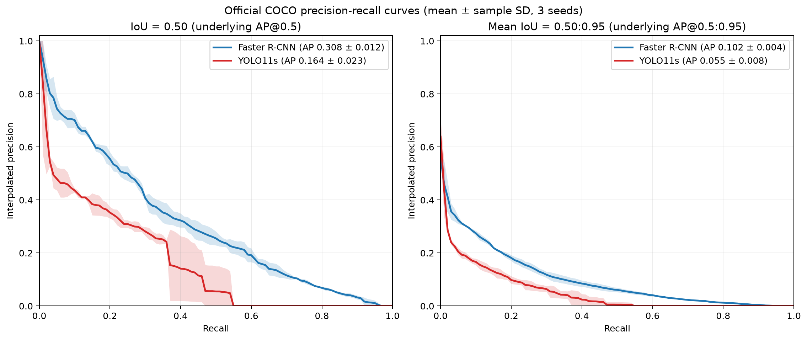
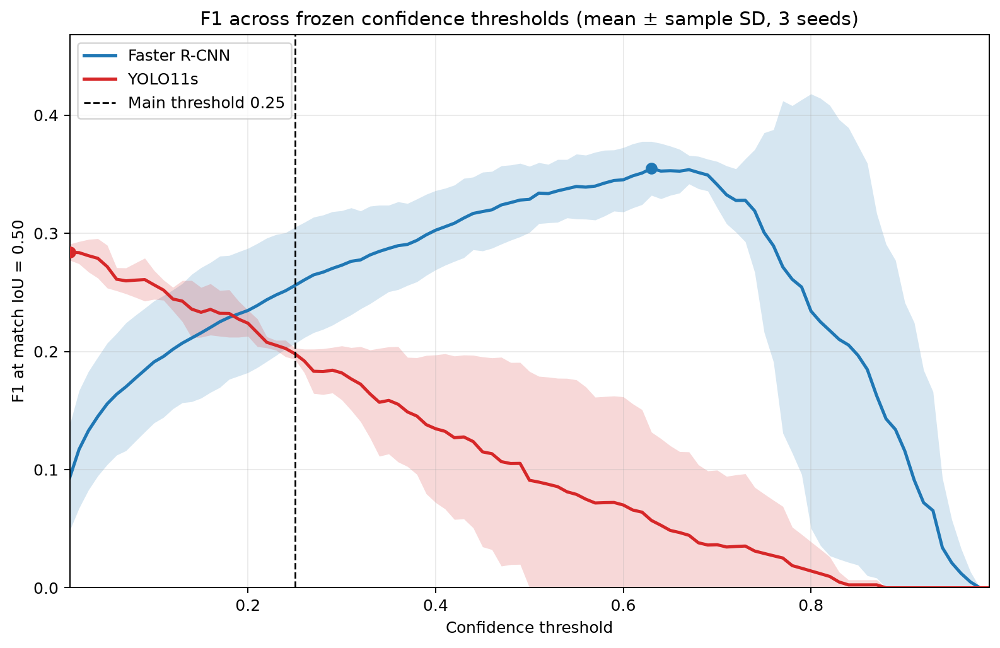
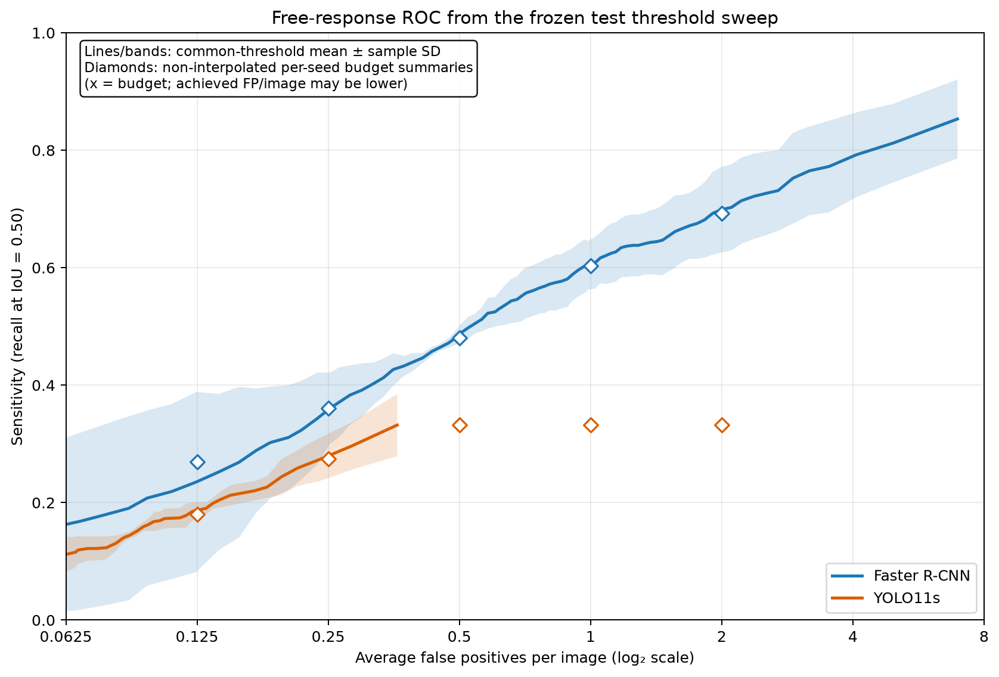
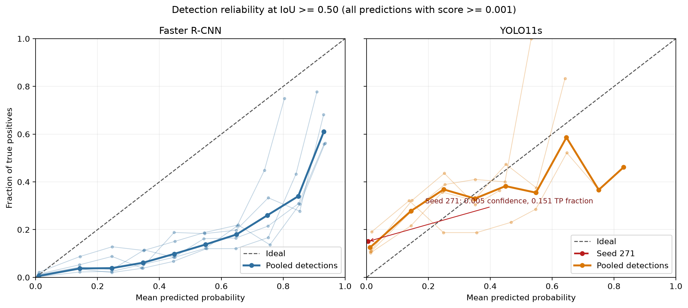
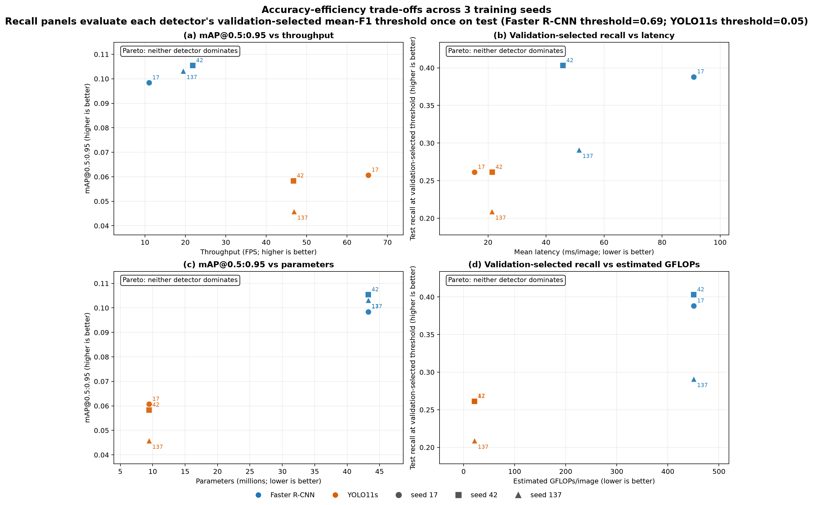
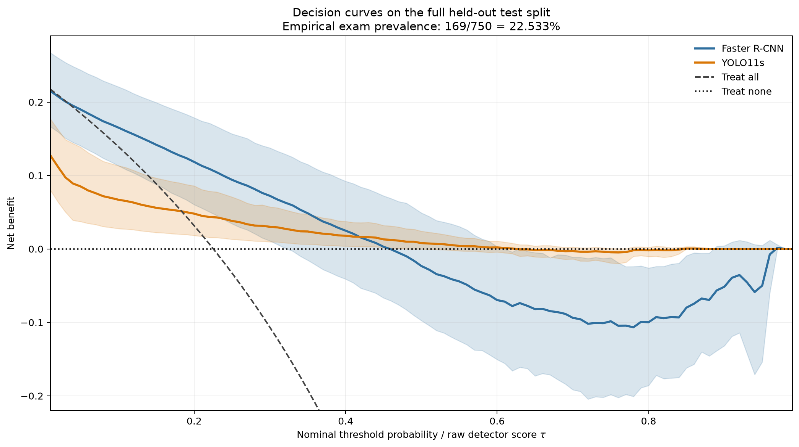
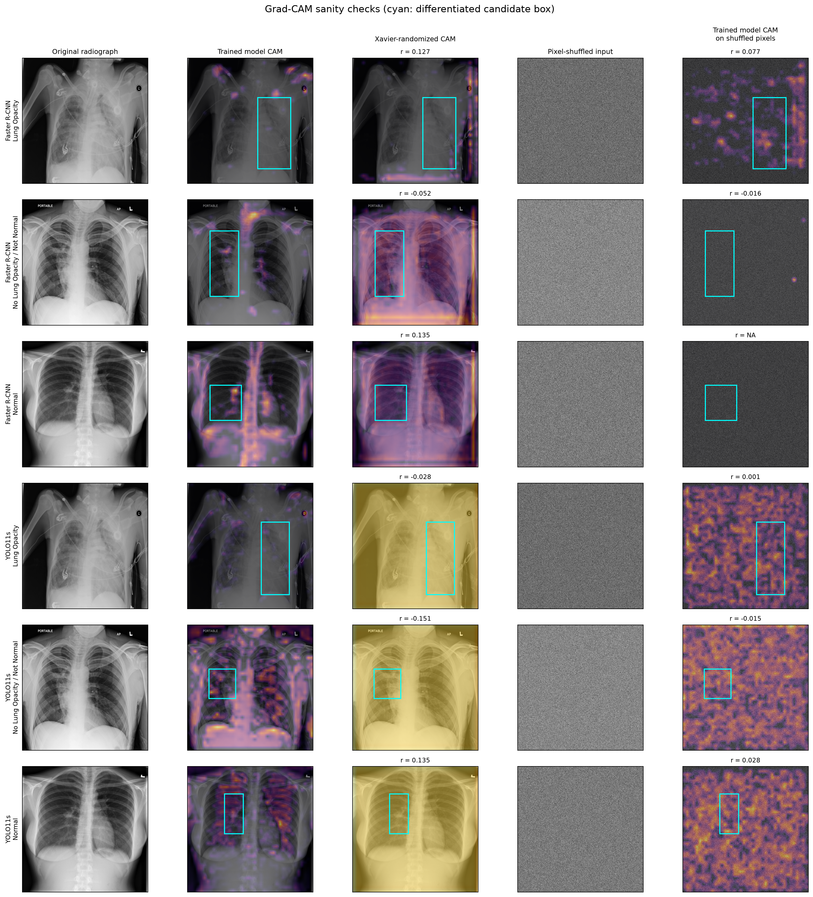

## Abstract

Comparisons between object detectors often change the data split, preprocessing,
augmentation, score threshold, and evaluator together with the model. We instead
compared a two-stage Faster R-CNN pipeline and a one-stage YOLO11s pipeline under
one patient-disjoint 5,000-radiograph protocol, common 640-pixel inputs, disabled
stochastic augmentation, frozen validation selection, and a model-independent
COCO-style evaluator. The central finding was an operating-point mismatch: the
same score threshold selected materially different regimes. At 0.25, YOLO11s
appeared more precise but had much lower recall; across the frozen three-seed
precision-recall curve, Faster R-CNN had higher mean precision at 96 of 101
recall positions and higher sensitivity at all five reported false-positive
budgets. Validation selected thresholds of 0.69 and 0.05, respectively. In the
five-seed clean analysis, Faster R-CNN achieved higher recall, F1, and average
precision, whereas YOLO11s delivered approximately threefold throughput, 78%
fewer parameters, and about 21-fold fewer registered operations. One YOLO11s
seed retained plausible average precision but compressed all test scores below
0.042, exposing recipe-level score instability. Detection-specific calibration
was also poorer for YOLO11s (mean D-ECE 0.0990 versus 0.0320). Patient-cluster
inference supported five of seven clean endpoint differences after Holm
correction, while conditional matched-box IoU and Dice were inconclusive.
Digital and raw-array acquisition-motivated stress tests showed substantial,
condition-specific degradation in both pipelines. Grad-CAM maps passed basic
parameter and input randomization checks but localized annotated opacities only
weakly. Decision curves suggested different nominal net-benefit regimes, but
used uncalibrated raw scores and an enriched internal test prevalence. These
results establish a multi-axis trade-off between two disclosed pipelines, not a
universal detector-family ranking or evidence of clinical readiness.

## 1. Introduction

Object detection on chest radiographs is not adequately characterized by one
clean-test mean average precision (mAP) value. A model can preserve ranking
quality while producing an unstable score scale, appear precise only because a
shared threshold is unusually selective, localize successful detections while
missing most annotated findings, or lose performance under small changes in
image formation and display. Conversely, a computationally heavier system may
offer better coverage without being the appropriate choice for a constrained
device. Evaluation therefore has to connect ranking accuracy, explicit
operating points, calibration, compute, robustness, explanation behavior, and
uncertainty.

Published medical-detector comparisons rarely isolate all of these dimensions.
Changing a detector commonly changes its backbone, augmentation stack, input
handling, optimization recipe, post-processing, score threshold, and metric
implementation. Point estimates from such studies remain valuable within their
own protocols, but they cannot by themselves identify whether a difference is
caused by the detector organization, the training recipe, or the evaluation
path. A shared numerical confidence threshold creates an additional problem:
two pipelines can assign scores on different scales, so the threshold can
select different portions of their respective output distributions.

We study this problem using two deliberately disclosed pipelines: Torchvision
`fasterrcnn_resnet50_fpn_v2`, representing a two-stage anchor-based proposal
detector, and Ultralytics YOLO11s, representing a compact one-stage anchor-free
dense detector. The task is localization of the RSNA challenge category `Lung
Opacity` on chest radiographs. It is not pneumonia diagnosis: the target is a
non-specific radiographic finding, and the negative strata include both normal
studies and abnormal studies without an annotated opacity.

The primary research question was:

> Under one patient-disjoint split, shared canonical preprocessing and
> augmentation policy, a common training-budget framework, and one
> model-independent evaluator, how do Faster R-CNN and YOLO11s trade off
> lung-opacity detection coverage and ranking accuracy, operating regimes and
> confidence calibration, computational efficiency, corruption-specific
> robustness, and Grad-CAM-observed failure patterns?

The study makes three contributions. First, it constructs a controlled,
patient-safe comparison in which both pipelines use the same images,
annotations, input size, absence of stochastic training augmentation, seed
grid, held-out boundary, and metric path. Second, it treats threshold behavior
as a result rather than a hidden implementation choice by combining an
exploratory threshold sweep, official precision-recall curves,
validation-selected operating points, free-response ROC (FROC), and a separate
cost-weighted validation sensitivity analysis. Third, it broadens the evidence
base beyond clean mAP through detection-specific calibration, patient-cluster
inference, accuracy-efficiency Pareto analysis, decision-curve analysis (DCA),
digital and acquisition-motivated robustness, and Grad-CAM localization plus
randomization sanity checks.

The hypotheses were recorded retrospectively after most experimental artifacts
had been frozen; they are result-linked checks, not preregistration. More
importantly, the design does not estimate a universal causal effect of
"one-stage" versus "two-stage" architecture. Numerical precision,
normalization, learning rate, scheduling, loss, assignment, and intrinsic
post-processing could not all be made identical. The appropriate unit of claim
is therefore these two working pipelines under the stated controls and hardware
budget.

## 2. Related Work

### 2.1 Two-stage and one-stage detector organization

Faster R-CNN couples a Region Proposal Network to an RoI-based second-stage
classifier and box regressor while sharing convolutional features
[@ren2015fasterrcnn]. The implementation used here adds a ResNet-50 Feature
Pyramid Network, which represents objects at multiple semantic scales
[@lin2017fpn]. Multiple anchor shapes generate spatial hypotheses; proposal
filtering and the second stage then refine a smaller candidate set.

YOLO originated from the contrasting formulation of dense detection in one
network pass [@redmon2016yolo]. YOLO11 retains that one-stage organization but
uses anchor-free grid references, multi-scale features, separate
classification and regression branches, distributed box offsets, and
non-maximum suppression. Distributed regression follows the general approach
introduced with Generalized Focal Loss [@li2020gfl]. Because YOLO11 has no
standalone peer-reviewed architecture paper, the pinned source release,
official configuration, and instantiated graph are the implementation
authority [@ultralytics2024yolo11; @ultralytics2026yoloarchitecture;
@ultralytics2026yolo11config]. YOLO11s was chosen over a larger model to fit the
8-GB GPU budget and over the newer NMS-free YOLO26 family to retain closer
continuity with the medical-detector literature.

Architecture motivates a computational hypothesis, not an accuracy ranking.
The dense head avoids per-proposal second-stage processing, while proposal
refinement could behave differently for subtle or variably sized opacity
annotations. The realized result also depends on optimization, score formation,
candidate filtering, and the dataset.

### 2.2 The comparability gap in medical detection studies

The RSNA resource paper documents a large chest-radiograph collection and an
expert annotation workflow for possible pneumonia-like pulmonary opacities
[@shih2019rsna]. Subsequent detector studies demonstrate the relevance of both
proposal-based and dense approaches, but do not form a controlled
architecture-family experiment. Modified Faster R-CNN work changes the
backbone, feature pyramid, anchors, and suppression strategy
[@yao2021pneumonia]. Anchor-free RSNA work combines a custom detector with
augmentation, focal loss, study-specific thresholds, NMS, and its own AP/AR
definitions [@wu2024pneumonia]. Related brain-MRI studies change the modality,
pretraining, loss, input organization, and YOLO variant
[@kang2023rcsyolo; @kang2025pkyolo].

| Prior work | Data and detector focus | Relevance to the present study | Comparability limit |
|---|---|---|---|
| Shih et al. [@shih2019rsna] | RSNA chest radiographs and expert opacity boxes | Defines the source resource and target | Resource paper, not a detector-family comparison |
| Yao et al. [@yao2021pneumonia] | Modified Faster R-CNN for chest radiographs | Shows two-stage adaptation to low-contrast opacity | Backbone, anchors, preprocessing, and post-processing change together |
| Wu et al. [@wu2024pneumonia] | Anchor-free RSNA detector | Supports dense localization on the same task family | Augmentation, losses, thresholds, and metrics differ |
| Kang et al. [@kang2023rcsyolo] | Efficiency-oriented YOLO for 2-D brain MRI | Treats medical detection as an accuracy-speed problem | Different modality and YOLO-to-YOLO emphasis |
| Kang et al. [@kang2025pkyolo] | Multiplanar MRI with domain pretraining | Highlights small-target and pretraining choices | Different data organization, pretraining, and model variants |

Across this reviewed set, split construction, preprocessing, augmentation,
thresholds, and metric aggregation move alongside the architecture. The gap is
therefore not an absence of high-performing detectors; it is the scarcity of
cross-paradigm evidence in which these major sources of variation are held
common and the remaining asymmetries are disclosed. Our contribution narrows
that gap for two specific pipelines. It does not close it for detector families
in the abstract.

### 2.3 Robustness, calibration, and explanation

Common-corruption studies show that clean accuracy can fail to predict behavior
under lighting, noise, blur, and compression shifts
[@hendrycks2019corruptions], including in object detection
[@michaelis2019detectionrobustness]. The ordered multi-severity principle is
useful for controlled stress testing, but digital corruptions applied to PNGs
must not be presented as scanner, acquisition, site, or population shift. We
therefore analyze post-conversion corruptions and raw-array,
acquisition-physics-motivated transformations as separate experiments with
different claim boundaries.

Confidence calibration is likewise distinct from threshold selectivity.
Changing a threshold describes how a detector moves along a precision-recall
operating curve. Calibration asks whether the stated confidence agrees with the
empirical correctness rate. Because object detectors emit variable numbers of
located boxes, classifier-style expected calibration error is inadequate. We
use the multivariate Detection Expected Calibration Error (D-ECE) framework,
which conditions correctness on confidence and predicted box geometry
[@kuppers2020calibration].

Grad-CAM weights convolutional features using gradients of a defined target
score and yields a coarse spatial association map [@selvaraju2017gradcam]. For
detectors, the target candidate, score, and feature layer must be made explicit;
candidate selection and NMS are not themselves explained. Plausible heatmaps
can persist after model randomization and do not demonstrate causal or
clinically appropriate reasoning [@adebayo2018sanity; @arun2021saliency]. We
therefore pair qualitative maps with energy-in-box and pointing-game measures
[@zhang2016excitation], then test whether maps change after parameter and input
randomization.

## 3. Materials and Methods

### 3.1 Dataset, target, and patient-safe split

We used the Stage 2 training set from the 2018 RSNA Pneumonia Detection
Challenge. The complete source contains 26,684 labeled radiographs and 9,555
positive boxes. The canonical detector task contains one foreground category,
`Lung Opacity`. The study-level categories `Normal` and `No Lung Opacity / Not
Normal` remain zero-box negative images. We avoid using "pneumonia detection"
as the task label because the bounding boxes represent a non-specific
radiographic finding rather than microbiologically or clinically confirmed
pneumonia.

Hardware and time constraints motivated a deterministic 5,000-study subset.
The Kaggle `patientId` identifies an examination rather than a unique person,
so the official RSNA mapping was used to recover NIH patient keys. A
seed-17, stratified procedure selected studies from 2,136 patient groups and
assigned whole groups to train, validation, or test. Patient-key intersections
among splits were empty.

| Split | Radiographs | NIH patient groups | Lung Opacity | No opacity / not normal | Normal | Boxes |
|---|---:|---:|---:|---:|---:|---:|
| Train | 3,500 | 1,492 | 798 | 1,554 | 1,148 | 1,267 |
| Validation | 750 | 321 | 169 | 331 | 250 | 277 |
| Test | 750 | 323 | 169 | 331 | 250 | 268 |
| **Total** | **5,000** | **2,136** | **1,136** | **2,216** | **1,648** | **1,812** |

The metadata audit found no malformed, non-positive-area, off-image, or exact
duplicate positive boxes. DICOM conversion inverted `MONOCHROME1` images when
needed, applied finite per-image min-max scaling, and wrote 8-bit grayscale
PNG. Canonical COCO JSON was the sole annotation source for both detector
adapters. The complete split manifests, source hashes, image inventory, and
preprocessing audit are indexed in the [Supplementary Materials
Index](../docs/SUPPLEMENTARY.md#s1-cohort-split-and-provenance-records).

### 3.2 Detector pipelines and controlled training factors

The two-stage arm was Torchvision
`fasterrcnn_resnet50_fpn_v2` with COCO initialization. The RPN and RoI heads
were adapted to the config-derived foreground class. The one-stage arm was
YOLO11s from Ultralytics `8.4.110`, also initialized from COCO weights. A
hardlinked YOLO view was generated from the canonical records; it did not
create a separate split or label source.

Shared factors were the patient-safe manifests, 640-pixel inputs, one
foreground class, COCO initialization, SGD, a maximum of 30 epochs,
validation-mAP@0.5:0.95 early stopping after at least eight epochs, and seeds
17, 42, 137, 271, and 314. Stochastic training augmentation was disabled in
both arms. In particular, the Ultralytics-only mosaic, mixup, cutmix,
copy-paste, HSV, flip, geometric, erasing, auto-augmentation, and multi-scale
options were off. This controlled the training distribution but could
disadvantage YOLO11s relative to its conventional augmentation-rich recipe.

The training recipe was not fully symmetric. Faster R-CNN used physical batch
2 with two-step gradient accumulation, float16 automatic mixed precision,
frozen pretrained BatchNorm running statistics, learning rate 0.005, and a
validation-plateau scheduler. YOLO11s used physical and effective batch 4,
bfloat16 forward/backward with float32 assignment and loss, native BatchNorm
updates, a one-epoch warmup to learning rate 0.001, and a constant post-warmup
rate. More closely matched YOLO settings reproducibly produced non-finite or
all-zero one-class heads during predeclared diagnostics. The accepted
exceptions preceded valid benchmark training. We therefore model training
recipe as an explicit comparison factor and interpret the experiment as two
controlled, disclosed pipelines rather than architecture alone. Full optimizer,
checkpoint, timing-gate, and environment details are delegated to the
[supplementary implementation record](../docs/SUPPLEMENTARY.md#s8-decisions-limitations-and-reproduction).

### 3.3 Unified held-out evaluation and seed scopes

Checkpoint selection used validation mAP only. After all checkpoints were
frozen, both adapters emitted original-image `xyxy` boxes, canonical category
IDs, and scores to one evaluator. It computed official COCO AP at IoU 0.50 and
averaged from 0.50 to 0.95; global micro precision, recall, and F1 at score
0.25 and match IoU 0.50; and mean box IoU and Dice over matched true positives.
Predictions were capped at 100 per image. Conditional IoU and Dice do not
penalize missed targets and were interpreted jointly with recall.

The evidence has deliberately different scopes:

- Clean precision, recall, F1, AP, and compute summaries use all five
  predeclared attempts per detector. Conditional IoU and Dice use Faster R-CNN
  `n=5` and YOLO11s `n=4` descriptively, and four complete seed pairs for
  inference, because YOLO11s seed 271 had no true positive at score 0.25.
- Threshold sweep, validation-selected operating points, official
  precision-recall curves, FROC, and Pareto analysis remain frozen to seeds 17,
  42, and 137 (`n=3`). They were not retrospectively expanded after the
  five-seed result was known.
- Digital-corruption, raw-array acquisition-shift, and primary Grad-CAM analyses
  use the seed-17 checkpoint from each detector on one fixed 300-image sample.
- Detection calibration and DCA use all five frozen clean-test bundles. The
  XAI sanity extension uses a nested 50-image subset and the seed-17
  checkpoints.

These sample-size labels travel with every result. Exhaustive seed rows and
explicit n=3 archives are linked in [Supplementary Sections S2 and
S3](../docs/SUPPLEMENTARY.md#s2-full-clean-seed-level-comparison).

### 3.4 Operating-point protocols and FROC

The original score-0.25 comparison was retained as a protocol-sensitivity
result, not a deployment choice. A frozen n=3 exploratory analysis evaluated
99 thresholds from 0.01 to 0.99 on the test predictions. It also read the
official pycocotools interpolated precision tensor at 101 recall positions,
rather than approximating the AP curve from the threshold grid.

Primary single-threshold selection was performed independently on the six n=3
validation bundles. The same 99-point grid was evaluated with the common
matcher, and the threshold maximizing arithmetic mean validation F1 across the
three seeds was frozen for each detector; exact ties favored the higher
threshold. These thresholds were then applied once to the corresponding test
bundles. Test results did not feed back into selection.

FROC reparameterized the exploratory test sweep as sensitivity versus false
positives per image. At budgets of 0.125, 0.25, 0.5, 1, and 2 FP/image, each
seed contributed its highest observed sensitivity without exceeding the
budget. No interpolation or extrapolation was used. The FROC curves describe
the available n=3 operating frontier; they do not select a clinical threshold.

### 3.5 Cost-weighted threshold sensitivity

The validation-only cost sensitivity used

$$
F1_\beta(\tau)=
\frac{(1+\beta^2)P(\tau)R(\tau)}{\beta^2P(\tau)+R(\tau)},
\qquad
\beta=\sqrt{C_{FN}/C_{FP}},
$$

for $\beta\in\{1,3,5,10\}$, corresponding to assumed false-negative to
false-positive cost ratios of 1, 9, 25, and 100. For each detector and beta,
the selected threshold maximized the lower pointwise 95% bootstrap bound over
the 0.01--0.99 grid. The same 2,000 hierarchical patient/seed draws were reused
at every threshold. Decision D-004 keeps this analysis separate from the
primary maximum-mean-F1 thresholds. No beta is clinically preferred; none of
these cost-weighted thresholds was applied to test, FROC, Pareto, or DCA.

### 3.6 Detection-specific confidence calibration

Calibration used all post-NMS detections retained at the common 0.001 bundle
floor. The canonical same-class greedy matcher at IoU 0.50 labeled each
detection as a matched true positive or false positive. Following Küppers et
al. [@kuppers2020calibration], confidence, relative center coordinates, width,
and height formed a five-dimensional vector. Each dimension was partitioned
into five equal-width bins, and cells with fewer than eight detections were
excluded. For included cells $b$, D-ECE was

$$
\operatorname{D\text{-}ECE}=
\sum_b \frac{n_b}{N}\left|
\operatorname{precision}(b)-\operatorname{confidence}(b)
\right|.
$$

This is black-box precision calibration conditional on emitted detections.
Missed targets have no score and are outside the estimand. No recalibration map
was fitted, and reliability diagrams were one-dimensional visual summaries;
the numerical endpoint remained the five-dimensional D-ECE.

### 3.7 Compute and Pareto analysis

Compute profiles used batch-1 mixed-precision inference, 10 warm-up images, 100
timed images, and CUDA synchronization on an RTX 4060 Laptop GPU. We recorded
FPS, latency, parameters, training time, peak allocated memory, and estimated
registered-operation GFLOPs. The FLOP counter included registered convolution,
matrix, and batch-matrix operations but omitted unsupported work; measured
latency was therefore the primary deployment-efficiency measure. Faster R-CNN
resizing occurred inside its timed forward, whereas YOLO tensor resizing
occurred before timed forward-plus-NMS.

The frozen n=3 Pareto analysis paired AP or validation-selected test recall with
FPS, latency, parameters, or estimated GFLOPs. Strict dominance required every
seed of one detector to be better than every seed of the other on both directed
axes. Mean-only ordering was insufficient.

### 3.8 Digital and acquisition-motivated robustness

The fixed robustness sample contained 300 test radiographs from 183 patients:
68 opacity-positive and 232 negative images with 111 boxes. Proportional
largest-remainder allocation preserved the three study strata and used no
detector result. Both detectors received identical corrupted pixels.

The post-conversion digital grid contained darker and brighter intensity,
Gaussian and salt-and-pepper noise, Gaussian and motion blur, and JPEG
compression, each at five ordered severities. Performance was reported both
raw and as clean-relative retention. These were deterministic transformations
of uint8 PNGs, not acquisition or site-shift simulations.

The separate raw-array study verified that all 300 source DICOMs were 8-bit
unsigned `CR`/`MONOCHROME2` radiographs without native Window Center/Width, VOI
LUT, Modality LUT, rescale, pixel-padding, or calibrated exposure metadata.
Before the shared 8-bit scaler it applied four exact DICOM default-`LINEAR`
center/width alternatives, three signal-dependent Poisson count conditions,
and finite 3x3, 5x5, and 9x9 Gaussian kernels. The primary endpoint was

$$
\mathrm{DSI}=1-\frac{\mathrm{performance}_{shifted}}
{\mathrm{performance}_{clean}},
$$

using mAP@0.5:0.95. These settings are acquisition-physics-motivated internal
stress tests, not recovered vendor presets, calibrated dose response, measured
scanner transfer functions, or clinical robustness.

### 3.9 Decision-curve analysis

DCA [@vickers2006decisioncurve] collapsed each frozen detector/seed output to
an exam-level action: flag an image if its maximum emitted box confidence was
at least $\tau$. Outcome
positivity meant at least one opacity annotation, irrespective of whether the
flag localized it. The full test set contained 169 positive and 581 negative
images, giving empirical image-level prevalence $169/750=0.225333$. For 99
nominal thresholds,

$$
\operatorname{NB}(\tau)=\frac{TP(\tau)}{N}
-\frac{FP(\tau)}{N}\frac{\tau}{1-\tau}.
$$

Treat-none had zero net benefit; treat-all used the empirical test prevalence.
The point curve averaged five seed-specific values. Two thousand common
patient/seed bootstrap draws yielded pointwise intervals for both detectors and
their paired difference. Raw detector scores were treated as nominal threshold
probabilities even though no clinical-risk calibration map had been fitted.
Accordingly, the DCA is an internal retrospective redescription, not a clinical
utility or threshold-validation study.

### 3.10 Grad-CAM localization and sanity checks

The primary explanation analysis used ordinary ReLU Grad-CAM at matched
stride-16, 40x40 pre-neck backbone tensors: ResNet-50
`backbone.body.layer3` and YOLO11s `model.6`. For each ground-truth box, the
target was the foreground probability of the low-threshold candidate with
highest IoU. Operating-point false negatives used an explicitly labeled,
annotation-guided proxy candidate. CAM energy within the ground-truth rectangle
and pointing-game accuracy quantified spatial agreement; box-area fraction was
a no-localization reference.

The sanity analysis selected a nested, stratified 50-image/41-patient subset.
Each trained model's highest-score candidate defined a fixed reference region.
Parameter randomization reinitialized every weight with seeded Xavier-normal
values and set biases to zero. Data randomization permuted RGB pixel vectors
over spatial positions while preserving their multiset and supplying identical
shuffled pixels to both detectors. Both tests used a fixed-region,
pre-activation foreground target to avoid requiring a fully randomized
proposal generator to emit valid post-NMS geometry. This target differs from
the primary Grad-CAM estimand. Mean full-resolution Pearson correlation between
trained and randomized maps was $C_{sanity}$; correlations at least 0.50 were
predeclared descriptive failures. Zero, constant, non-finite, or failed maps
were excluded and counted, not imputed.

### 3.11 Patient-cluster statistical protocol

All primary inference preserved repeated examinations from the same NIH patient
as one cluster. Clean pointwise 95% intervals used 2,000 paired two-stage
bootstrap draws: patient groups were sampled with replacement, every observed
exam from a selected patient moved together, and eligible paired training seeds
were also resampled. Precision, recall, F1, and AP used five seed pairs;
conditional IoU and Dice used complete pairs 17, 42, 137, and 314. Dataset-level
AP was reconstructed from score-ordered matches rather than averaged as an
ill-defined per-image statistic.

Two-sided paired permutation tests used 5,000 patient-group detector-label
swaps with a plus-one correction. The unstandardized paired aggregate
difference, Faster R-CNN minus YOLO11s, was the effect estimate. Holm correction
was applied across the seven clean endpoints. For the 35 corruption
conditions, raw performance and clean-relative retention were tested
separately, with Holm correction within each metric/estimand family. The same
patient draw was applied jointly to clean and corrupted evidence before a
retention ratio was calculated. Former image-level analyses are audit-only
archives. McNemar's test was omitted because multiple targets and false
positives do not reduce to one independent binary result per image without
discarding the detection structure.

## 4. Results

### 4.1 Clean held-out performance and seed instability

The unified evaluator processed 750 test images and 268 reference boxes for
each of 10 frozen checkpoints. At the original score threshold of 0.25, Faster
R-CNN had higher recall, F1, and both AP endpoints, whereas YOLO11s had higher
precision and slightly higher conditional localization among successfully
matched detections. YOLO11s conditional IoU and Dice used only four defined
seeds.

| Endpoint | Faster R-CNN, mean +/- SD | YOLO11s, mean +/- SD |
|---|---:|---:|
| Precision at 0.25 | 0.1959 +/- 0.0552 (n=5) | **0.2983 +/- 0.1691 (n=5)** |
| Recall at 0.25 | **0.5799 +/- 0.0911 (n=5)** | 0.0955 +/- 0.0607 (n=5) |
| F1 at 0.25 | **0.2845 +/- 0.0528 (n=5)** | 0.1427 +/- 0.0868 (n=5) |
| Conditional matched-box IoU | 0.6749 +/- 0.0065 (n=5) | **0.6985 +/- 0.0157 (n=4)** |
| Conditional matched-box Dice | 0.8010 +/- 0.0049 (n=5) | **0.8181 +/- 0.0111 (n=4)** |
| mAP@0.5 | **0.3042 +/- 0.0189 (n=5)** | 0.1626 +/- 0.0162 (n=5) |
| mAP@0.5:0.95 | **0.0995 +/- 0.0067 (n=5)** | 0.0542 +/- 0.0060 (n=5) |

YOLO11s seed 271 was a critical all-attempt result. Its training losses
decreased and validation mAP converged normally, while held-out AP@0.5 and
AP@0.5:0.95 were 0.15872 and 0.05558, within the other YOLO seed range. Yet its
maximum held-out confidence was 0.0412735. It therefore emitted no detection at
0.25 and contributed observed zeros to precision, recall, and F1; matched-box
IoU and Dice were mathematically undefined. This was operational confidence-
score degeneracy, not classic loss/head collapse or a failure of otherwise
high-scoring boxes to meet the IoU rule. Retaining it prevented outcome-based
seed replacement.

The raincloud summary in Figure 1 visualizes the full clean seed distributions
and labels the actual finite n in each panel. The n=3 historical threshold data
are not mixed into it.

### 4.2 Precision-recall regimes, validation thresholds, and FROC

The frozen n=3 threshold sweep showed why the score-0.25 comparison cannot be
read as a general YOLO precision advantage. Lowering YOLO11s from 0.25 to 0.01
raised mean recall from 0.1356 to 0.3321 and F1 from 0.1981 to 0.2840; its best
observed F1 was at the lower grid boundary. Faster R-CNN's exploratory test-sweep
peak mean F1 was 0.3549 at 0.63. These test optima were descriptive and were not
used as final thresholds.

On the official AP@0.5 curve, Faster R-CNN had higher mean interpolated
precision at 96 of 101 recall positions, with five ties and no YOLO11s-higher
positions. For the IoU-averaged AP@0.5:0.95 curve, Faster R-CNN was higher at 96
positions, YOLO11s at one near-zero-recall position, and four were tied. Thus
the shared-threshold precision difference reflected score scale and
selectivity; the underlying precision-recall frontier still favored Faster
R-CNN in this n=3 analysis (Figure 2).

Validation selection chose 0.69 for Faster R-CNN and 0.05 for YOLO11s. Applied
once to the original three test bundles, Faster R-CNN achieved precision,
recall, and F1 of 0.3543 +/- 0.0746, 0.3607 +/- 0.0608, and 0.3492 +/- 0.0135.
YOLO11s achieved 0.3096 +/- 0.0134, 0.2438 +/- 0.0302, and 0.2718 +/- 0.0181.
These values remain n=3. They were not recomputed after observing seed 271,
which would emit nothing even at the historical 0.05 threshold.

FROC sensitivity was higher for Faster R-CNN at each predeclared budget:
0.2699 versus 0.1803 at 0.125 FP/image, 0.3607 versus 0.2749 at 0.25,
0.4801 versus 0.3321 at 0.5, 0.6032 versus 0.3321 at 1, and 0.6928 versus
0.3321 at 2 (Figure 3). YOLO11s plateaued because its least selective available
point was threshold 0.01 at 0.36 FP/image. The plateau is a sweep boundary, not
a global asymptote.

### 4.3 Cost-weighted threshold sensitivity

When the lower pointwise bootstrap bound of $F1_\beta$ was optimized on
validation, Faster R-CNN shifted monotonically toward less selective thresholds
as the assumed false-negative cost increased: 0.69, 0.33, 0.12, and 0.03 for
beta 1, 3, 5, and 10. Corresponding validation recall rose from 0.4404 to
0.6534, 0.7413, and 0.8207 while precision fell from 0.4164 to 0.1958, 0.1247,
and 0.0753.

YOLO11s selected 0.02 at beta 1, with precision 0.3492 and recall 0.3670, and
reached the 0.01 lower boundary at beta 3, 5, and 10, with precision 0.3025 and
recall 0.3971. Those three rows are best observed values within the grid, not
global optima. The cost ratios were hypothetical, intervals were pointwise,
and no selected cost-weighted threshold was applied to test. Per D-004, these
results did not replace the primary 0.69/0.05 thresholds.

### 4.4 Calibration and reliability

Across five seeds, Faster R-CNN mean D-ECE was 0.0320 +/- 0.0058, compared with
0.0990 +/- 0.0232 for YOLO11s. The seed ranges did not overlap: 0.0266--0.0403
and 0.0714--0.1313. YOLO11s seed 271 was the detector's worst-calibrated run.
Among 962 detections retained at the 0.001 floor, mean confidence was 0.00538
but the matched true-positive fraction was 0.15073. Its absolute global gap was
0.14535 and five-dimensional D-ECE was 0.13130. The pathology therefore
involved scores that substantially understated empirical detection correctness,
not merely a threshold chosen too high.

Figure 4 shows confidence-only reliability summaries. The D-ECE result is more
informative because a modest global confidence gap can coexist with large
location/scale-conditional error, as occurred for YOLO11s seed 137. Calibration
remained conditional on emitted detections and was evaluated, not fitted, on
the test set.

### 4.5 Compute and the Pareto frontier

YOLO11s was the computationally lighter pipeline on the measured laptop. Mean
throughput was 60.29 +/- 12.62 FPS versus 20.28 +/- 5.62 for Faster R-CNN; mean
latency was 17.23 +/- 3.83 versus 53.93 +/- 21.15 ms/image. YOLO11s had 9.43
million parameters versus 43.26 million, 21.42 versus 450.76 estimated
registered-operation GFLOPs/image, 1,148.16 versus 1,556.89 MiB peak allocated
training memory, and 1,544.75 versus 6,661.01 seconds mean training time across
five seeds.

The n=3 Pareto panels preserved the opposing directions. Every Faster R-CNN
seed had higher AP while every YOLO11s seed had higher throughput; the same
trade-off appeared for AP versus parameters and validation-selected recall
versus latency or registered operations. Under the conservative all-seeds
dominance rule, neither detector strictly dominated in any panel (Figure 5).
This is an accuracy-efficiency trade-off on one hardware/software stack, not a
universal property of model families.

### 4.6 Decision-curve net benefit

The DCA used all five test bundles and the full 750-image test split. Treat-all
had the largest point estimate from nominal thresholds 0.01--0.03. Faster
R-CNN was the largest point-estimate strategy from 0.04--0.41; at 0.04 its net
benefit was 0.1949 (95% CI 0.1450--0.2484), compared with 0.0891
(0.0389--0.1435) for YOLO11s and 0.1931 for treat-all. At 0.20 the respective
detector values were 0.1185 (0.0603--0.1786) and 0.0481
(0.0183--0.0859), while treat-all was 0.0317.

YOLO11s was the largest point-estimate strategy from 0.42--0.62. Treat-none
was largest from 0.63--0.84. Paired pointwise intervals favored Faster R-CNN
from 0.01--0.27 and YOLO11s at 0.60--0.62 and 0.64--0.88. The latter range did
not imply positive utility: across 0.64--0.84 both detectors had negative net
benefit and YOLO11s was only less harmful than Faster R-CNN, while treat-none
was preferable. Sparse higher-threshold reversals had zero lower bounds or zero
net benefit.

The result gives scenario-linked internal descriptions, not clinically
actionable thresholds. The same deliberately stratified test set supplied the
22.533% prevalence and evaluated the curves; localization was ignored by the
exam-flag estimand; and Batch 18 demonstrated material raw-score calibration
error.

### 4.7 Digital common-corruption robustness

On the 300-image clean robustness sample, mAP@0.5:0.95 was 0.147802 for Faster
R-CNN and 0.076295 for YOLO11s. Averaged equally across all 35 corrupted
conditions, raw mAP was 0.112898 and 0.054099, while clean-relative retention
was 0.763846 and 0.709083. These corresponded to mean degradation of 23.62%
and 29.09%. Faster R-CNN had higher raw mAP in all clean and corrupted matched
conditions, conditional on the two seed-17 checkpoints and the fixed sample.

| Severity-5 retention | Faster R-CNN | YOLO11s |
|---|---:|---:|
| Darker | **0.8674** | 0.1645 |
| Brighter | 0.6706 | **0.6882** |
| Gaussian noise | **0.4643** | 0.3692 |
| Salt and pepper | **0.2025** | 0.0570 |
| Gaussian blur | 0.6936 | **0.6949** |
| Motion blur | **0.6788** | 0.5780 |
| JPEG quality 20 | 0.6825 | **0.7662** |

Salt-and-pepper noise was the most damaging tested condition for both models.
The reversal of relative ordering across corruptions supported a type-specific
rather than uniform degradation model. The strongest inferential retention
contrast was darkness severity 5: 0.8674 versus 0.1645, difference 0.7029
(95% CI 0.2734--0.8158), Holm p=0.0070. The corresponding raw mAP difference
was 0.1156 (0.0609--0.1689) but did not survive the 35-condition Holm family
(p=0.0770). Pointwise separation and multiplicity-controlled evidence therefore
led to different conclusions.

### 4.8 Raw-array acquisition-shift sensitivity

Acquisition-motivated shifts produced ordered mAP degradation within the
Poisson and Gaussian series. Under the strongest Poisson condition (12.5% of
the declared count reference), Faster R-CNN shifted mAP was 0.101314 with DSI
0.314529; YOLO11s shifted mAP was 0.042981 with DSI 0.436641. Under 9x9,
sigma-2.0 blur, the corresponding DSI values were 0.248532 and 0.282869.
YOLO11s had larger DSI at every tested Poisson level and blur kernel.

The VOI results were smaller and mixed. Center shifts produced Faster R-CNN
DSI 0.0431 and 0.0862 versus YOLO11s 0.1177 and 0.0089. A 0.75-width window
gave DSI 0.0716 and -0.0132; the 1.25-width window was nearly neutral
(-0.0001 and 0.0009). This interaction was expected because per-image min-max
scaling can cancel non-clipping affine changes. No VOI result establishes
scanner-setting invariance. The full seven-metric, 20-row table remains in
[Supplementary Section S5](../docs/SUPPLEMENTARY.md#s5-complete-digital-corruption-and-acquisition-shift-grids).

### 4.9 Explainability and XAI sanity findings

Grad-CAM localization was weak for both detectors. Faster R-CNN had 110 valid
maps from 111 boxes, mean energy-in-box 0.0869 versus a 0.0713 box-area
reference, and pointing accuracy 0.1091. YOLO11s had 111 valid maps, mean
energy 0.0975 versus area reference 0.0718, and pointing accuracy 0.1261. On
110 jointly valid targets, YOLO had higher energy for 76 and Faster R-CNN for
34; mean Faster-minus-YOLO energy was -0.0091. The modest YOLO advantage did
not imply cleaner attention. Faster maps were generally more clustered but
often centered on the mediastinum, shoulders, chest wall, borders, markers, or
devices; YOLO maps were more diffuse and punctate across similarly irrelevant
or unannotated regions. False-negative proxy maps were conditional analyses of
latent candidates, not explanations of emitted detections.

The sanity tests supported basic parameter and input sensitivity. Mean
trained-randomized correlation was 0.0014 for Faster R-CNN parameter
randomization and -0.0159 for data randomization; YOLO11s values were 0.0234
and -0.0034. No valid map crossed the predeclared correlation threshold of
0.50. Seven Faster R-CNN shuffled-input maps and four YOLO11s
randomized-weight maps were zero or constant and excluded rather than imputed.
The result reduces concern that the maps are invariant architecture templates,
but does not change the weak-localization finding or validate clinical
reasoning (Figure 8).

### 4.10 Patient-cluster statistical synthesis

The primary clean paired analysis is summarized below. Differences are Faster
R-CNN minus YOLO11s; confidence intervals are pointwise patient-cluster
bootstrap intervals. Five of seven endpoints remained significant after Holm
correction.

| Endpoint | Paired seed n | Difference (95% CI) | Holm p | Interpretation |
|---|---:|---:|---:|---|
| Precision at 0.25 | 5 | -0.1024 (-0.2529, 0.0802) | **0.0020** | YOLO11s higher at the shared threshold; score-scale/selectivity result |
| Recall at 0.25 | 5 | 0.4843 (0.4065, 0.5555) | **0.0014** | Faster R-CNN higher |
| F1 at 0.25 | 5 | 0.1419 (0.0338, 0.2526) | **0.0014** | Faster R-CNN higher |
| Conditional IoU | 4 | -0.0239 (-0.0567, 0.0074) | 0.1064 | Inconclusive among matched true positives |
| Conditional Dice | 4 | -0.0173 (-0.0410, 0.0050) | 0.1064 | Inconclusive among matched true positives |
| mAP@0.5 | 5 | 0.1416 (0.0997, 0.1856) | **0.0208** | Faster R-CNN higher |
| mAP@0.5:0.95 | 5 | 0.0453 (0.0325, 0.0595) | **0.0342** | Faster R-CNN higher |

The significant fixed-threshold precision result did not contradict the
precision-recall frontier: it tested the behavior of a common numerical cutoff
and included seed 271's observed zero output. Conditional localization did not
offset lower coverage because it excluded missed annotations and was
statistically inconclusive. Expanding the clean comparison from three to five
seeds changed F1 from non-significant to significant; precision, recall, and AP
conclusions remained, while IoU and Dice remained non-significant.

The six retrospective hypotheses were supported under their stated operational
checks: higher Faster R-CNN coverage/AP; a shared-threshold operating mismatch;
no strict accuracy-compute Pareto dominance; corruption-specific relative
degradation; weak but parameter/input-sensitive Grad-CAM localization; and
lower Faster R-CNN D-ECE with seed 271 the worst YOLO calibration result. These
are structured summaries of the same frozen evidence, not independent
confirmatory tests or preregistered claims.

## 5. Discussion

### 5.1 The main result is an operating-regime mismatch within a controlled comparison

The most informative finding is not that one detector produced a larger mAP
value. It is that a shared numerical threshold failed to create a shared
operating regime. At score 0.25, YOLO11s appeared more precise because it was
far more selective, while Faster R-CNN retained much more of the target set.
The official precision-recall and FROC analyses showed that this was not a
hidden YOLO high-precision frontier: Faster R-CNN retained higher precision at
almost every official recall position and higher sensitivity at every reported
false-positive budget. Detector-specific thresholds selected on validation
also differed sharply, 0.69 versus 0.05.

Calibration supplied a complementary result. Threshold selectivity concerns
which ranked boxes survive a cutoff; D-ECE concerns whether the scores describe
empirical correctness conditional on location and scale. YOLO11s seed 271
demonstrated that ranking quality and score behavior can diverge: AP remained
within the sibling-seed range even as all scores compressed below 0.042 and
substantially understated the matched true-positive fraction. This observation
is a property of the disclosed augmentation-disabled training recipe as much
as of the instantiated model. It argues for reporting curves, detector-specific
validation selection, calibration, and all attempted seeds rather than relying
on one shared threshold.

### 5.2 Accuracy and efficiency remain opposed

Faster R-CNN provided the stronger coverage and ranking evidence. Its recall,
F1, and both AP advantages survived patient-cluster inference, and its FROC
sensitivity was higher across the measured budgets. YOLO11s provided the
stronger implementation-efficiency evidence: approximately three times the
throughput, about one fifth the parameters, one twenty-first the estimated
registered operations, lower training memory, and shorter training time. The
Pareto result formalized this opposition; neither pipeline dominated when an
accuracy endpoint and a compute endpoint were optimized together.

Conditional matched-box IoU and Dice do not create a third conclusion in favor
of YOLO11s. They describe localization only after a true-positive match,
exclude the much larger missed-target burden, use four complete seed pairs, and
were statistically inconclusive. They are useful diagnostics, but should not be
compared directly with unconditional coverage or AP.

### 5.3 Threshold costs and decision curves do not establish clinical utility

The cost-weighted validation sweep illustrated how assumptions can dominate a
threshold. Increasing the assumed false-negative cost moved Faster R-CNN
toward progressively lower thresholds and higher recall. YOLO11s hit the lower
grid boundary by beta 3, exposing limited room within the declared sweep.
Because the cost ratios were not estimated from patient outcomes and the
intervals were pointwise, the analysis is sensitivity evidence only. D-004
appropriately preserves the equal-weight validation-F1 thresholds as the
primary historical operating points.

The DCA similarly described scenario-dependent nominal ranges, not deployment
utility. In the low-to-middle range, Faster R-CNN produced the larger internal
net benefit and aligned with an accuracy-sensitive retrospective screening
scenario. YOLO11s became the larger detector strategy over a narrower positive
range, consistent with a compute-constrained human-reviewed scenario. At high
thresholds, its paired advantage frequently meant only that it was less harmful
than Faster R-CNN while treat-none remained preferable. The analysis collapsed
localization to an exam flag, used enriched same-test prevalence, and treated
uncalibrated raw detector confidences as nominal probabilities. Those features
prevent a clinical-utility interpretation.

### 5.4 Robustness is condition-specific and remains internal

The two robustness studies answer different questions. Digital corruptions
showed that performance loss depended on corruption family and severity. Faster
R-CNN had the higher raw mAP throughout the grid and better average retention,
but relative ordering reversed for some brightness, blur, and JPEG conditions.
After patient clustering and multiplicity correction, the severe-darkness
retention advantage remained supported while the raw mAP difference did not.
This is precisely why raw and relative estimands, pointwise intervals, and
family-adjusted tests must be kept distinct.

Raw-array experiments added acquisition motivation without adding external
validity. Both detectors degraded monotonically under stronger synthetic
Poisson noise and Gaussian blur, with larger DSI for YOLO11s at each tested
level. VOI behavior was smaller and mixed because the source files lacked
native display transforms and the downstream per-image min-max scaler could
cancel non-clipping changes. Neither experiment introduced a new scanner,
protocol, institution, or patient population. The correct claim is sensitivity
to declared transformations, not clinical robustness.

### 5.5 Explainability passes a necessary check but remains weak evidence

The Grad-CAM randomization tests addressed a narrow methodological concern:
maps changed when learned parameters or image spatial structure were destroyed.
Passing this check makes the maps more defensible for model-specific failure
analysis. It does not make them causal explanations. Energy-in-box exceeded the
box-area reference only modestly, pointing accuracy was near 0.1, and both
models frequently highlighted extra-box anatomy, markers, devices, and borders.
The maps therefore identify suspicious associations and failure patterns, not
clinically validated reasoning.

### 5.6 Scenario-specific trade-offs, not a winner

For GPU-backed retrospective screening or server-side case prioritization in
which detection coverage is the binding criterion, Faster R-CNN is the more
defensible of these two measured pipelines. It has stronger AP, FROC
sensitivity, internal low-to-middle-threshold net benefit, and raw digital-
corruption performance. Its mean throughput of 20.28 FPS is slower but remains
well above the rate of a human radiograph-reading workflow on the tested GPU.

For resource-constrained point-of-care assistance in which every image still
receives human review, YOLO11s is the conditional compute-oriented option. Its
9.43-million-parameter model, 21.42 registered-operation GFLOP estimate, and
60.29 FPS profile are substantially lighter. That preference is based on
footprint and latency, not superior precision-recall behavior. Its low measured
coverage, calibration error, and seed-level score instability preclude use as a
sole triage gate or rule-out system.

For autonomous diagnosis, disease exclusion, or treatment guidance, neither
pipeline is suitable. Absolute performance is modest, calibration is not
clinical-risk calibration, explanations localize weakly, robustness is
synthetic and internal, and no prospective or external evaluation exists.

These statements apply only to the two disclosed pipelines. Decisions D-002
and D-003 explicitly descoped a second, equal-opportunity architecture-specific
tuning track. YOLO's full native augmentation recipe and a correspondingly
tuned Faster R-CNN recipe were not compared. The present evidence therefore
cannot support "two-stage detectors are better" or "YOLO is faster by nature"
as architecture-family claims. It supports a narrower, reproducible statement:
under this controlled data and evaluation protocol, the Faster R-CNN pipeline
was accuracy-oriented and the YOLO11s pipeline was efficiency-oriented, with a
material score-scale and calibration mismatch.

## 6. Limitations

This is a controlled course-project comparison, not a clinical validation
study. It must not be used to diagnose pneumonia, exclude disease, prioritize
real patients, or guide care.

**Dataset, population, and target.** The experiment uses one non-specific
`Lung Opacity` category from one historical, single-institution, adult-heavy
RSNA/NIH source. The 5,000-study subset is stratified and enriched rather than
prevalence representative. Precision, false-positive behavior, and DCA
prevalence are therefore benchmark characteristics, not deployment predictive
values. Results may not transport to pediatric patients, portable-care
settings, contemporary equipment, other institutions, modalities, or
multi-class tasks. No external test set or demographic subgroup/fairness
analysis was available. Source accrual dates, full acquisition-device and
exposure details, participant demographics, and several reference-standard
details are absent.

**Reference standard and preprocessing.** Boxes are coarse rectangles rather
than pixel-accurate opacity masks; reader disagreement and ambiguous boundaries
remain. The technical annotation audit does not constitute re-reading by an
independent radiologist. Deterministic DICOM inversion and per-image min-max
scaling do not reproduce vendor VOI/display processing, and resizing to 640
pixels can remove small-opacity detail differently across pipelines.

**Sampling and seed scope.** The hardware-scoped cohort excludes 21,684 source
studies from model training/evaluation. Five clean training attempts per
detector remain a coarse sample of seed variation. Threshold, FROC, and Pareto
results use only the original three seeds; they are not five-seed analyses.
Digital robustness, acquisition shifts, and primary Grad-CAM use one seed-17
checkpoint per detector and 300 images from 183 patients with 111 boxes. XAI
sanity uses 50 images from 41 patients. None of these secondary analyses
characterizes across-seed uncertainty.

**Pipeline attribution.** Disabling Ultralytics stochastic augmentations
controls the data distribution but may understate YOLO11s performance under its
conventional recipe. Precision type, batch behavior, BatchNorm handling,
learning rate, warmup, and scheduling differ because the more closely matched
YOLO diagnostics collapsed. Detector-intrinsic losses, assignment, proposal
handling, and NMS also differ. This is a comparison of two working pipelines,
not a causal architecture-family effect. YOLO11s seed 271's operational
confidence-score degeneracy is retained as a recipe-level instability and not
silently removed.

**Metrics, thresholds, and calibration.** Score-0.25 precision, recall, and F1
are protocol-sensitivity endpoints. The primary validation-selected thresholds
use three seeds and equal-weight F1, which does not encode clinical costs. The
cost-weighted extension assumes cost ratios of 1, 9, 25, and 100; its intervals
are pointwise, its YOLO optima reach the lower grid boundary, and none of its
thresholds was tested downstream. Conditional IoU and Dice exclude misses and
have asymmetric descriptive n. D-ECE is evaluated on the same held-out test
bundles, conditions only on emitted predictions at the 0.001 floor, depends on
the chosen IoU/binning/cell protocol, and neither fits a calibrator nor measures
missed-target or clinical-risk calibration.

**Decision analysis.** DCA uses raw detector scores as nominal threshold
probabilities despite measured calibration error. It collapses box predictions
to an exam flag, ignores localization, uses the same stratified test set for
both empirical prevalence and curve evaluation, and reports pointwise rather
than simultaneous intervals. High-threshold paired superiority can coexist
with negative net benefit relative to treat-none. No range in this study is a
deployment threshold or evidence of prospective clinical utility.

**Robustness.** The digital severity indices are not physically calibrated or
comparable across corruption types. Repeated transformations of the same 300
images are not independent deployment cohorts. The raw DICOM sample contains
only 8-bit CR arrays without native VOI, modality transforms, calibrated
exposure, or detector-response metadata. DICOM windows are controlled
sensitivity settings, Poisson counts are synthetic dose proxies, and Gaussian
kernels are not measured scanner transfer functions. Per-image scaling can
cancel affine changes. Neither robustness experiment establishes scanner
safety, external-site transportability, population robustness, or clinical
robustness.

**Explainability.** Grad-CAM uses coarse 40x40 maps and explains one selected
score, not proposal generation, NMS, box regression, candidate selection, or a
complete causal decision. False-negative maps are annotation-guided proxy
analyses unavailable in deployment. Box-based metrics treat coarse rectangles
as opacity masks. The sanity extension uses one random initialization, a severe
pixel permutation, a different fixed-region/pre-activation target, and excludes
11 zero or constant randomized maps. Near-zero correlations establish only
basic parameter/input sensitivity, not medical validity or causal attention.

**Statistical uncertainty.** Patient-cluster resampling and label swaps correct
the identified within-patient independence error for observed exams, but do not
create a representative population. Clean intervals resample only five paired
seeds, or four for conditional localization; corruption inference is
single-checkpoint. Bootstrap intervals are pointwise, permutation tests
condition on the observed checkpoints, and Holm correction does not make
corruption conditions independent cohorts or guarantee transportability.

**Compute and reproducibility.** Timing and registered-operation estimates
describe one RTX 4060 Laptop GPU, pinned environment, and implementation path.
The FLOP counter omits unsupported operations, and the two frameworks place
resizing differently relative to timing. These values are deployment-oriented
measurements of the documented pipelines, not hardware-independent architecture
constants.

**Reporting and governance gaps.** The reporting crosswalk is an evidence
audit, not certification of CLAIM, TRIPOD+AI, or STARD-AI compliance. The
repository does not contain a local ethics/consent determination, registration,
funding statement, conflict-of-interest statement, patient/public involvement
statement, participant-flow diagram, source accrual dates, or external and
demographic subgroup evaluation. These gaps cannot be repaired by narrative
wording without new traceable evidence.

Clinical deployment would require prospective and external multi-site
validation, subgroup and fairness assessment, validation-fitted risk
calibration, human-factors and workflow testing, safety and cybersecurity
controls, monitoring, and the applicable medical-device regulatory process.
Those activities are outside this study. Mentioning them defines the boundary
of the claims; it is not evidence that either pipeline is ready to enter such a
process.

## 7. Conclusion

Under one patient-disjoint dataset, common canonical inputs, disabled
stochastic augmentation, frozen validation decisions, and one evaluator,
Faster R-CNN and YOLO11s occupied different operating and resource regimes.
The shared score threshold did not align selectivity: YOLO11s appeared more
precise at 0.25 while retaining far fewer detections, whereas the frozen
precision-recall and FROC frontiers favored Faster R-CNN. The five-seed clean
analysis and patient-cluster inference supported higher Faster R-CNN recall,
F1, and average precision. YOLO11s was substantially smaller and faster, but
one retained seed exposed severe score compression and the detector had higher
detection-specific calibration error.

Neither result defines a single winner. Faster R-CNN was the more defensible
accuracy-oriented pipeline for internal, GPU-backed research scenarios;
YOLO11s was the more attractive compute-oriented pipeline only where mandatory
human review and a lower resource footprint outweighed its coverage and score
limitations. Both were vulnerable to digital and acquisition-motivated shifts,
and both produced weakly localized Grad-CAM maps despite passing basic sanity
checks. The DCA and threshold-cost analyses clarified conditional regimes but
did not validate clinical utility.

The contribution is therefore a controlled, multi-axis characterization of two
disclosed pipelines and an empirical demonstration that threshold and score
scale can materially distort detector comparisons. It is not a universal
one-stage-versus-two-stage conclusion and not evidence that either system can
support clinical care. Complete seed-level tables, exhaustive stress-test
grids, archives, provenance, and exact reproduction routes are maintained in
the [Supplementary Materials Index](../docs/SUPPLEMENTARY.md).
