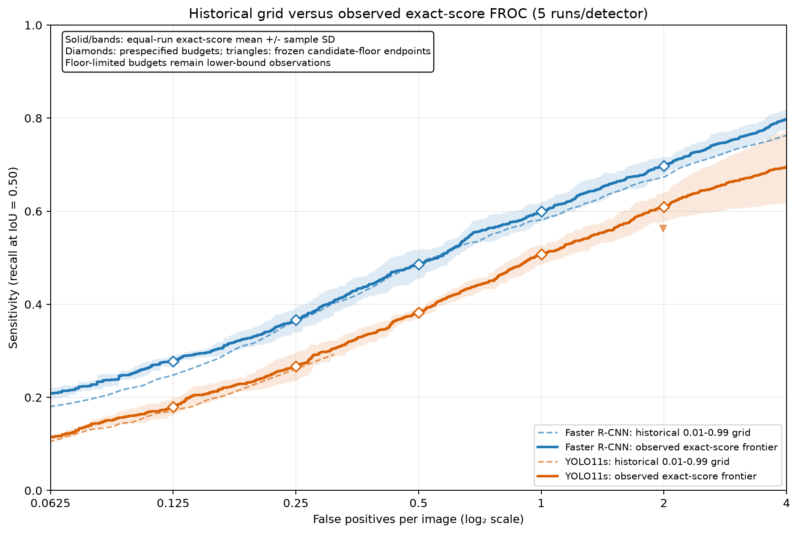

## Abstract

**Background:** Cross-detector conclusions can depend materially on how an
operating point is defined. We examined this dependence in two deep-learning
pipelines for lung-opacity localization.

**Methods:** This retrospective internal benchmark used 5,000 RSNA radiographs
in patient-disjoint training, validation, and internal-testing partitions
(3,500/750/750 studies). Faster R-CNN and YOLO11s shared canonical inputs,
disabled stochastic augmentation, and a common evaluator. All five retained
training runs per detector contributed to AP/PR, shared-threshold comparisons,
and exact-score FROC. Historical thresholds selected from three validation
runs were applied unchanged to five test runs; five-run validation selection
was a separate post-hoc sensitivity. Primary uncertainty combined patient-cluster
and independent detector-run resampling. Runtime used a matched decoded-host
boundary on the reporting laptop.

**Results:** At score 0.25, YOLO11s had higher mean precision but substantially
lower recall. Faster R-CNN had higher mean interpolated precision at 97 of 101
AP@0.5 recall positions and mean mAP@0.5:0.95 of 0.0995 versus 0.0542.
Validation-selected thresholds differed markedly between detectors and changed
the precision comparison. Five-run validation selection weakened the
precision/recall/F1 margins and reversed FP/image ordering relative to the
historical thresholds. Faster R-CNN had higher observed sensitivity at all five
FROC budgets; a conservative bound preserved the ordering despite one
floor-limited run. Training-procedure intervals excluded zero for recall, F1,
and AP differences, but included zero for shared-threshold precision. Matched
timing with one checkpoint per detector and three technical repetitions yielded
2.75-fold higher throughput for YOLO11s, which had 78% fewer parameters.

**Conclusions:** Ranking performance, raw-threshold behavior,
validation-selected operating points, training variability, false-positive
budgets, and measured efficiency describe different properties of these
pipelines. The results concern an internal localization benchmark; external
testing and clinical utility remain unestablished.

## 1. Introduction

Detector comparisons often summarize performance with average precision (AP)
and precision or recall at a chosen confidence cutoff. These answer different
questions: AP summarizes a ranked detection set, whereas a cutoff determines
which detections are emitted at an operating point. Equal numerical cutoffs
need not produce equal selectivity across detectors. Prior calibration work
already identifies this problem and the dependence of detector assessment on
threshold and metric design [@kuzucu2024calibration].

We examine its practical consequences for localization of the RSNA challenge
category `Lung Opacity`. The annotations describe possible pneumonia-like
pulmonary opacities rather than clinically confirmed pneumonia
[@shih2019rsna]. Our intended use is methodological comparison of research
pipelines, not diagnosis or patient prioritization.

The central question is whether cross-detector conclusions change when the
same patient-disjoint test set is evaluated through ranking performance,
shared raw thresholds, detector-specific validation-selected operating points,
and false-positive budgets. We compare Faster R-CNN and YOLO11s using common
data, canonical preprocessing, no stochastic augmentation, a common evaluator,
and five retained training runs per detector. Patient-cluster and detector-run
resampling characterize uncertainty; standardized timing describes the measured
implementation costs.

The contribution is an empirical account of these distinctions under one
leakage-aware internal protocol. We do not claim the first discovery of
detector score-scale mismatch. Optimization and numerical-precision differences
remain disclosed, so conclusions apply to the evaluated pipelines. Secondary
calibration, stress-test, and explanation analyses are indexed in the
[supplement](../docs/SUPPLEMENTARY.md). The analysis is retrospective and was
not preregistered.

## 2. Related Work

### 2.1 Detector scores and operating-point assessment

Küppers et al. introduced multivariate detection-confidence calibration,
including dependence on predicted location and box scale
[@kuppers2020calibration]. Kuzucu et al. subsequently showed how shared score
thresholds and inconsistent detection populations can distort joint accuracy
and calibration comparisons; AP alone does not select an operating threshold
[@kuzucu2024calibration]. This motivates separate reporting of AP/PR,
validation-selected thresholds, and FROC here. We evaluate existing prediction
sets and fit no calibration model. Supplementary D-ECE is a descriptive,
detection-level statistic of the emitted-detection population, dependent on
support and binning; it is not clinical-risk calibration.

### 2.2 RSNA methodology and direct detector comparisons

The RSNA resource augments NIH chest radiographs with expert opacity boxes and
categorical labels, including an adjudication process [@shih2019rsna]. Its
official dataset description identifies the radiologist annotation workflow
and conversion to DICOM with limited demographic and projection tags
[@rsna2022datasetdescription]. The challenge evaluated a custom image-aggregated
score across IoU thresholds 0.40--0.75 [@rsna2018challenge]. Our internal COCO
AP protocol uses different matching/aggregation and IoU ranges; its values are
not challenge leaderboard scores.

Direct RSNA comparisons already exist. Wu et al. compare an anchor-free
detector with SSD, Faster R-CNN, RetinaNet, and FCOS, alongside augmentation
and focal-loss ablations [@wu2024pneumonia]. More recently, Chinnam et al.
compare YOLOv8l, Faster R-CNN with FPN, and Deformable DETR on RSNA, reporting
accuracy and speed and selecting a confidence cutoff using validation
[@chinnam2026modern]. Their reported input resolutions differ by detector;
their split, model scales, and evaluation choices also differ from ours.
Neither paper's numerical results are directly interchangeable with this
benchmark. The present focus is the effect of operating-point definition and
training variability within two disclosed pipelines, rather than a new claim
that detector comparisons are absent.

### 2.3 Implementation and reporting context

Faster R-CNN combines region proposals with a second-stage classifier and box
regressor [@ren2015fasterrcnn]; FPN supplies multiscale features
[@lin2017fpn]. The YOLO11s implementation is identified by its pinned
Ultralytics release and model configuration
[@ultralytics2026release; @ultralytics2026yolo11config]. These specify the
compared implementations without implying a causal effect of detector family.

CLAIM 2024 recommends explicit data partitions, reference standards,
uncertainty, reproducibility, and reporting of unavailable information
[@tejani2024claim]. We use its distinction between internal and external
testing; `validation` below denotes the model-optimization partition used for
checkpoint and threshold selection. The accompanying reporting crosswalk
records remaining gaps and is not a certification of compliance.

## 3. Materials and Methods

### 3.1 Dataset, target, and patient-disjoint split

We used the Stage 2 training set from the 2018 RSNA Pneumonia Detection
Challenge. The complete source contains 26,684 labeled radiographs and 9,555
positive boxes. The single foreground category was `Lung Opacity`; `Normal`
and `No Lung Opacity / Not Normal` remained zero-box negative studies.

Compute constraints motivated a deterministic 5,000-study subset, without a
formal sample-size or power calculation. Selection used seed 17, SHA-256
ordering, and the three label strata while keeping each NIH patient group
together and tracking source stratum proportions. The other 21,684 studies
were excluded for compute scope. The Kaggle `patientId` identifies an
examination, so the official RSNA mapping supplied NIH patient keys. Selected
studies came from 2,136 patient groups; train/validation/internal-test patient-key
intersections were empty.

For cohort description, split manifests were matched to original DICOM files.
Header-only extraction retained aggregate age, sex, and projection counts.
All 5,000 age elements had VR `AS` but bare numeric values without required
D/W/M/Y units. Values from 0 to 120 were interpreted as nominal years; one
out-of-range value was excluded. Quartiles used linear percentiles. Sex and
projection were counted as encoded, with percentages based on all studies in
each partition.

| Characteristic | Training | Validation | Internal testing | Total |
|---|---:|---:|---:|---:|
| Studies | 3,500 | 750 | 750 | 5,000 |
| Patient groups | 1,492 | 321 | 323 | 2,136 |
| Opacity-positive, n (%) | 798 (22.8%) | 169 (22.5%) | 169 (22.5%) | 1,136 (22.7%) |
| Reference boxes | 1,267 | 277 | 268 | 1,812 |
| Age, median [IQR], nominal y | 50 [36--60] | 49 [34--59] | 47 [35--61] | 49 [36--60] |
| Age summary, n | 3,499 | 750 | 750 | 4,999 |
| Age unavailable, n (%) | 1 (0.03%) | 0 (0.0%) | 0 (0.0%) | 1 (0.02%) |
| Female, n (%) | 1,614 (46.1%) | 399 (53.2%) | 349 (46.5%) | 2,362 (47.2%) |
| Male, n (%) | 1,886 (53.9%) | 351 (46.8%) | 401 (53.5%) | 2,638 (52.8%) |
| AP, n (%) | 1,690 (48.3%) | 348 (46.4%) | 325 (43.3%) | 2,363 (47.3%) |
| PA, n (%) | 1,810 (51.7%) | 402 (53.6%) | 425 (56.7%) | 2,637 (52.7%) |
| Sex / projection missing, n | 0 / 0 | 0 / 0 | 0 / 0 | 0 / 0 |

No other sex or projection category was observed. These header fields are
study-level descriptors, not independently verified clinical demographics.

#### Canonical preprocessing

The annotation audit found no malformed, non-positive-area, off-image, or
exact duplicate positive boxes. One conversion path checked DICOM pixel arrays
for finite content, inverted `MONOCHROME1` where needed, and applied per-image
min-max scaling to 8-bit grayscale PNG. COCO annotations were canonical; the
YOLO labels were derived from the same records. Both pipelines used 640-pixel
inputs and their disclosed native resizing paths. Source hashes and split
records are indexed in [Supplementary Section S1](../docs/SUPPLEMENTARY.md#s1-cohort-split-and-provenance-records).

### 3.2 Detector pipelines and controlled training factors

The models were Torchvision `fasterrcnn_resnet50_fpn_v2` and Ultralytics
YOLO11s (`8.4.110`), both initialized from COCO weights and adapted to the
single foreground class. Both used SGD, at most 30 epochs, validation
mAP@0.5:0.95 checkpoint selection and early stopping after at least eight
epochs, and seeds 17, 42, 137, 271, and 314. Stochastic augmentation was
disabled, including the Ultralytics-only mosaic, mixup, cutmix, copy-paste,
color, flip, geometric, erasing, and multi-scale transforms.

Faster R-CNN used physical batch 2 with two-step accumulation, float16 AMP,
frozen pretrained BatchNorm statistics, learning rate 0.005, and a
validation-plateau scheduler. YOLO11s used batch 4, bfloat16 forward/backward
with float32 assignment/loss, native BatchNorm updates, and one-epoch warmup
to a constant learning rate of 0.001. These exceptions followed numerical
stability diagnostics before accepted benchmark training. Thus the training
budget framework and data controls were common, but optimization, precision,
losses, and assignment were not identical. Full configurations are indexed in
the [implementation record](../docs/SUPPLEMENTARY.md#s8-decisions-limitations-and-reproduction).

### 3.3 Five retained runs and common evaluation

All five accepted training attempts per detector were retained, including a
YOLO11s run with no detections at the shared cutoff. None was replaced because
of internal-test behavior. Seed labels identify reproducible runs; they are
not matched stochastic blocks across frameworks. Checkpoints were selected
using validation mAP before internal testing.

Both adapters emitted source-image `xyxy` boxes, canonical categories, and
scores to one evaluator. COCO AP used the official pycocotools protocol
[@lin2014coco] at IoU 0.50 and averaged over 0.50:0.95, with a retained score
floor of 0.001 and at most 100 detections per image. Single-point precision,
recall, and F1 were global micro metrics within each run at match IoU 0.50;
run summaries used equal-run means and sample SDs. The matcher processed
predictions in stable descending-score order, choosing the highest-IoU
unmatched same-class reference without reuse. Native NMS used IoU 0.50.
Zero detections contributed zero precision, recall, and F1 by the declared
convention. Mean matched-box IoU and Dice were undefined without a true
positive and excluded misses; they used five Faster R-CNN and four YOLO11s
runs and remain secondary localization diagnostics.

### 3.4 Operating-point protocols and exact-score FROC

The shared cutoff of 0.25 was a protocol-sensitivity endpoint, not a
deployment choice. Five-run exploratory test sweeps used 99 thresholds from
0.01 to 0.99. Official PR curves came from the COCO interpolated precision
tensor at 101 recall positions, independently of this threshold grid. Test
curve optima were descriptive and did not select operating thresholds.

Historical detector-specific thresholds maximized arithmetic mean validation
F1 across seeds 17, 42, and 137 on the same 99-point grid; exact ties favored
the higher threshold. They were frozen and applied unchanged to all five test
runs. A separate post-hoc sensitivity applied the identical rule to validation
predictions from all five frozen checkpoints per detector, then applied its
thresholds unchanged to the same five test runs. Test labels were not used in
either selection. The five-run sensitivity was not prospectively frozen and
did not replace the historical three-run rule.

FROC evaluated every unique retained score in descending order, plus an empty
upper sentinel and the lower candidate endpoint. Separate inference-only
prediction collection used the same ten frozen checkpoints, 750 images,
annotations, preprocessing, matcher, NMS, and detection cap, with a candidate
floor of 0.00001. No retraining or threshold optimization on test outcomes was
performed. At each prespecified budget (0.125, 0.25, 0.5, 1, and 2 FP/image),
each run contributed its highest observed sensitivity without exceeding that
budget. No interpolation or extrapolation was used. Means and sample SDs
summarized five runs per detector. The frontier remains conditional on the
candidate floor; an endpoint below a budget is reported as floor-limited.

### 3.5 Training-procedure uncertainty

Primary pointwise 95% bootstrap intervals combined patient sampling and
stochastic training variability [@efron1993bootstrap]. In 2,000 two-stage
draws, NIH patient groups were sampled with replacement, all examinations of
each selected patient moved together, and runs were resampled independently
within detector. AP and other nonlinear metrics were reconstructed from each
resampled prediction set. Precision, recall, F1, and AP used five runs per
detector; conditional IoU/Dice used five/four defined runs. The effect estimate
was the unstandardized Faster-R-CNN-minus-YOLO11s difference.

Secondary two-sided permutation tests held checkpoints fixed and used 5,000
patient-group detector-label swaps, a plus-one correction
[@phipson2010permutation], and Holm adjustment across seven clean endpoints
[@holm1979simple]. Conditional localization used four complete same-label
pairs for this secondary test only. These p-values do not test the same
training-procedure estimand as the bootstrap intervals. No seed-aware p-value
was introduced. The intervals do not incorporate threshold-selection
uncertainty and are not intervals for validation-selected or FROC results.

### 3.6 Standardized implementation timing

The primary timer starts from the same decoded uint8 RGB source image in host
memory. It includes resize/letterbox, tensor conversion, host-to-device transfer,
model forward, native postprocessing/NMS, source-coordinate restoration, and
CPU extraction of boxes, scores, and labels. It excludes disk I/O and decoding.
CUDA synchronization brackets every timed interval. The protocol uses the
same 100 test images ranked by SHA256 of seed 17 and filename, batch 1, and
the frozen seed-17 checkpoint per detector. Three full repetitions alternate
detector order, each preceded by 10 warm-up images per detector. Model setup,
fusion, reference inference, and result checking are outside the timer.

The reporting machine was an ASUS ROG Strix G16 with i7-13650HX, 16 GB RAM,
and RTX 4060 Laptop GPU (8 GB). The environment was Windows, Python 3.11.15,
Torch 2.6.0+cu124, Torchvision 0.21.0+cu124, Ultralytics 8.4.110, CUDA 12.4,
cuDNN 90100, and driver 610.47. Explicit inference AMP used verified float16
convolutions for Faster R-CNN and bfloat16 for YOLO11s. Both models were
resident; one CPU thread, disabled TF32/cuDNN benchmarking, and deterministic
algorithms were used. The common floor was 0.001, NMS IoU 0.50, and cap 100.

Timed outputs were checked against ordinary file inference using the same
explicit AMP and postprocessing. Agreement is not claimed against the
historical FP32 YOLO evaluation bundles, which remain unchanged. FPS divides
timed calls by total elapsed time; median and IQR describe image latency.
Timing repetitions are technical repeats, not independent biological or
training replicates. Full timing conditions and raw checks are in the
[compute record](../docs/COMPUTE_TIMING.md). Historical asymmetric timing,
Pareto panels, training profiles, and incomplete profiler-registered operation
counts remain supplementary and are not pooled with this timing protocol.

### 3.7 Secondary analyses

Detection-level D-ECE [@kuppers2020calibration] used post-NMS predictions at
the 0.001 floor and the same IoU-0.50 matcher. Within the one-class stratum,
confidence, relative center coordinates, width, and height each used five
equal-width bins. Cells with fewer than eight detections contributed zero;
all emitted detections remained in the weighting denominator. Thus D-ECE is
descriptive and support/binning dependent, conditional on the emitted-detection
population, and excludes missed targets. The existing bin/support/floor
sensitivity and confidence-only marginal reliability plots are in
[Supplementary Section S4](../docs/SUPPLEMENTARY.md#s4-calibration-and-exploratory-raw-score-utility).
No calibration map was fitted; this is not clinical-risk calibration.

Common corruptions, stored-array acquisition/display stress, and Grad-CAM use
one checkpoint per detector and a fixed 300-image sample; explanation controls
use a nested 50-image sample. Their methods and results are in
[Supplementary Sections S5--S6](../docs/SUPPLEMENTARY.md#s5-complete-digital-corruption-and-acquisition-shift-grids).
They describe synthetic sensitivity and score-associated maps, not external
transportability or causal explanations. Validation-only F-beta and
hypothetical linear-loss analyses remain in
[Supplementary Section S3](../docs/SUPPLEMENTARY.md#s3-operating-point-and-threshold-evidence);
their thresholds were not applied to test data. Conventional decision-curve
analysis and clinical net benefit were not evaluated.

## 4. Results

### 4.1 Clean internal-testing performance

Across the selected cohort,
median nominal age was 49 years (IQR 36--60; n=4,999), 2,362 studies (47.2%)
were encoded female and 2,638 (52.8%) male, and 2,363 (47.3%) were AP versus
2,637 (52.7%) PA. Sex and projection had no missing or other values. Age had no
missing tags, but all age values lacked encoded units and the single
out-of-range value was excluded. These are descriptive cohort characteristics;
no demographic subgroup comparison or fairness inference was performed.

The unified evaluator processed 750 internal-testing images and 268 reference boxes for
each of 10 frozen checkpoints. Both AP endpoints favored Faster R-CNN. At the
shared score threshold of 0.25, Faster R-CNN had higher recall and F1, whereas
YOLO11s had higher precision and slightly higher conditional localization
among successfully matched detections. YOLO11s conditional IoU and Dice used
only four defined seeds.

| Endpoint | Faster R-CNN, mean +/- SD | YOLO11s, mean +/- SD |
|---|---:|---:|
| Precision at 0.25 | 0.1959 +/- 0.0552 (n=5) | **0.2983 +/- 0.1691 (n=5)** |
| Recall at 0.25 | **0.5799 +/- 0.0911 (n=5)** | 0.0955 +/- 0.0607 (n=5) |
| F1 at 0.25 | **0.2845 +/- 0.0528 (n=5)** | 0.1427 +/- 0.0868 (n=5) |
| Conditional matched-box IoU | 0.6749 +/- 0.0065 (n=5) | **0.6985 +/- 0.0157 (n=4)** |
| Conditional matched-box Dice | 0.8010 +/- 0.0049 (n=5) | **0.8181 +/- 0.0111 (n=4)** |
| mAP@0.5 | **0.3042 +/- 0.0189 (n=5)** | 0.1626 +/- 0.0162 (n=5) |
| mAP@0.5:0.95 | **0.0995 +/- 0.0067 (n=5)** | 0.0542 +/- 0.0060 (n=5) |

YOLO11s seed 271 illustrates the distinction between ranking and score scale.
Its training losses decreased and validation mAP converged normally, while
internal-testing AP@0.5 and AP@0.5:0.95 were 0.15872 and 0.05558, within the
other YOLO seed range. Yet its maximum internal-testing confidence was 0.0412735.
It therefore emitted no detection at 0.25 and contributed observed zeros to
precision, recall, and F1; matched-box IoU and Dice were mathematically
undefined. Its low scores changed fixed-threshold behavior without a
corresponding AP collapse. The run remained in every analysis where its
endpoint was defined.

### 4.2 Shared thresholds and validation-selected operating points

On the five-run official AP@0.5 curve, Faster R-CNN had higher mean
interpolated precision at 97 of 101 recall positions, with four ties. COCO AP
ranking does not depend on the selected single operating threshold, but
remains conditional on the retained prediction floor and common
evaluation/post-processing protocol. The higher YOLO11s precision at 0.25
therefore did not imply a precision advantage at matched recall (Figure 1).

Historical validation selection used n=3 and chose 0.69 for Faster R-CNN and
0.05 for YOLO11s. Applying those thresholds unchanged to five test runs gave
precision/recall/F1 0.3624 +/- 0.0581, 0.3507 +/- 0.0463, and
0.3511 +/- 0.0184 for Faster R-CNN, versus 0.2524 +/- 0.1418,
0.1948 +/- 0.1110, and 0.2192 +/- 0.1233 for YOLO11s. Seed 271 also emitted
no detection at 0.05 and contributed the declared zeros.

The post-hoc validation sensitivity selected 0.70 for Faster R-CNN and 0.01
for YOLO11s from all five validation runs. Applied unchanged to the test set,
precision/recall/F1 was 0.3686 +/- 0.0632, 0.3388 +/- 0.0567, and
0.3458 +/- 0.0222 for Faster R-CNN, versus 0.2631 +/- 0.0360,
0.2925 +/- 0.0886, and 0.2657 +/- 0.0367 for YOLO11s. Faster R-CNN's mean
precision, recall, and F1 advantages remained but weakened. Mean FP/image was
0.2205 versus 0.3104, reversing the historical-threshold ordering. This is
post-hoc validation sensitivity, not a prospectively frozen operating point.

### 4.3 Exact-score false-positive operating regimes

Five-run FROC sensitivity was higher for Faster R-CNN at each prespecified
budget: 0.2776 versus 0.1799 at 0.125 FP/image, 0.3664 versus 0.2664 at 0.25,
0.4858 versus 0.3821 at 0.5, 0.6000 versus 0.5075 at 1, and 0.6978 versus
0.6090 at 2 (Figure 2). These are descriptive equal-run means.

The 0.00001 candidate floor permits all runs to reach 1 FP/image. YOLO11s
seed 137 nevertheless ends at 1.9907 FP/image, so the aggregate at 2 FP/image
remains a lower-bound observation. Assigning that run the mathematical
maximum sensitivity of 1.0 gives a YOLO11s aggregate upper bound of 0.6963,
below Faster R-CNN's observed 0.6978. The ordering therefore cannot reverse
under this bound for these frozen runs; this is not a population-level
uncertainty statement or evidence of a terminal plateau.

### 4.4 Training-procedure uncertainty and conditional tests

The table reports the primary training-procedure differences and separately the
secondary checkpoint-conditional p-values. Differences are Faster R-CNN minus
YOLO11s; the corresponding absolute endpoint estimates are reported in Section
4.1. Every row contains 750 images from 323 patient clusters. `Runs A/B`
gives the eligible Faster R-CNN/YOLO11s trained-run counts.

| Endpoint | Runs A/B | Conditioning | Difference (95% training-procedure CI) | Seed 271 | Holm p, conditional on observed checkpoints |
|---|---:|---|---:|---|---:|
| Precision at 0.25 | 5/5 | Unconditional | -0.1024 (-0.2423, 0.0553) | Both runs; YOLO contributes zero | **0.0020** |
| Recall at 0.25 | 5/5 | Unconditional | 0.4843 (0.3830, 0.5830) | Both runs; YOLO contributes zero | **0.0014** |
| F1 at 0.25 | 5/5 | Unconditional | 0.1419 (0.0559, 0.2290) | Both runs; YOLO contributes zero | **0.0014** |
| Conditional IoU | 5/4 | Conditional on a matched detection | -0.0236 (-0.0585, 0.0089) | Faster defined; YOLO undefined | 0.1064 |
| Conditional Dice | 5/4 | Conditional on a matched detection | -0.0171 (-0.0420, 0.0066) | Faster defined; YOLO undefined | 0.1064 |
| mAP@0.5 | 5/5 | Unconditional | 0.1416 (0.1013, 0.1845) | Both ranked bundles contribute | **0.0208** |
| mAP@0.5:0.95 | 5/5 | Unconditional | 0.0453 (0.0313, 0.0599) | Both ranked bundles contribute | **0.0342** |

Under the primary estimand, the recall, F1, and both AP intervals remained
wholly above zero. Fixed-threshold precision did not: its interval crossed
zero, so it did not support a training-procedure difference. The
small checkpoint-conditional precision p-value instead says that the observed
checkpoints favored YOLO11s at the common numerical cutoff across patient
clusters. The CI and p-value differ because the former also resamples trained
runs; neither arithmetic result is wrong, and they do not test the same target.
Conditional localization excluded missed annotations and remained
inconclusive.

### 4.5 Standardized inference timing

The matched v1 protocol measured Faster R-CNN at 20.91 FPS and YOLO11s at
57.56 FPS. Pooled median image latencies were 47.20 and 17.29 ms, respectively
(Figure 3). The table pools three complete 100-image repetitions per frozen
checkpoint; dispersion is image-latency IQR, not training-run SD.

| Matched v1 metric | Faster R-CNN | YOLO11s |
|---|---:|---:|
| Total timed elapsed, 300 calls (s) | 14.3466 | 5.2124 |
| FPS (300 / total elapsed) | 20.91 | 57.56 |
| Median image latency (ms) | 47.20 | 17.29 |
| Q1--Q3 image latency (ms) | 46.78--48.00 | 16.68--17.88 |
| IQR image latency (ms) | 1.22 | 1.19 |
| Total parameters | 43,256,153 | 9,428,179 |
| Training-trainable parameters | 43,030,809 | 9,428,163 |

All 600 timed-image checks agreed exactly with ordinary inference in counts,
category labels, boxes, and scores; per repetition this covered 2,471 Faster
R-CNN and 165 YOLO11s detections. Per-repetition FPS was
21.18/20.58/20.99 for Faster R-CNN and 58.55/57.60/56.55 for YOLO11s.
These are technical repetitions of one checkpoint per detector, not a new
training-replicate analysis. The machine-readable source is
`results/tables/inference_timing_v1.csv`; full protocol, individual repetitions,
raw intervals, and provenance are indexed in `docs/COMPUTE_TIMING.md`.

The matched throughput ratio was 2.75 in favor of YOLO11s, which had 78% fewer
parameters. This compares measured implementations on one machine, not
architecture families or clinical workflow speed.

### 4.6 Secondary descriptive evidence

Mean D-ECE was 0.0320 +/- 0.0058 for Faster R-CNN and
0.0990 +/- 0.0232 for YOLO11s across five runs. Only 68--354 of 3,125 cells
were occupied per run and 15--169 met minimum support. Existing sensitivity
analyses showed changes with binning, support, and the retained population;
these descriptive errors do not establish clinical-risk calibration.
The supplementary stress tests were condition-specific, and Grad-CAM
localization was weak despite parameter sensitivity. These secondary findings
do not alter the scope of the operating-point comparison.

## 5. Discussion

Cross-detector conclusions depended on operating-point definition. The shared
cutoff suggested higher YOLO11s precision, while the PR curves, both
validation-selection scopes, and observed FROC favored Faster R-CNN on their
respective endpoints. The five-run validation sensitivity also changed the
false-positive ordering without reversing the mean precision/recall/F1
ordering. Reporting these as separate measurements makes the comparison
interpretable without treating raw scores as common probabilities.

This result is consistent with prior detector-threshold critiques
[@kuzucu2024calibration]. The added evidence is its magnitude and interaction
with retained training variability in this internal lung-opacity benchmark.
The low-score YOLO11s run retained nonzero AP while contributing no detections
at the shared and historical selected cutoffs. Patient-only comparisons of
fixed checkpoints consequently answer a narrower question than intervals that
also resample training runs. The precision results illustrate that distinction.

Faster R-CNN's stronger ranking and coverage coexisted with YOLO11s' smaller
parameter count and higher matched-boundary throughput. Those measurements
describe an implementation trade-off, not an intended-use recommendation.
The comparison does not isolate architecture: precision, normalization,
optimization, assignment, losses, and native API behavior differ. Nor does it
compare fully tuned native recipes. Current direct RSNA comparisons
[@wu2024pneumonia; @chinnam2026modern] provide context, but their scores cannot
be pooled with ours without reproducing their data and metric protocols.

## 6. Limitations

**Data and reference standard.** This is one internal, hardware-scoped subset
of the RSNA/NIH source with a single non-specific finding. Sampling tracks
source label strata rather than deployment prevalence. Precision and FP/image
depend on this case mix. Coarse expert boxes retain ambiguity; our technical
annotation audit is not an independent radiologist rereading. Source accrual
dates and broader clinical, demographic, and acquisition variables are
unavailable locally. Header age requires the disclosed nominal-year assumption.
Min-max conversion does not reproduce vendor display processing, and native
resizing can affect image detail. No external testing, demographic subgroup
performance, fairness analysis, prospective evaluation, or clinical utility
assessment has been performed.

**Training and selection.** Five runs per detector provide a coarse estimate
of stochastic training variability. Disabled augmentation controls the input
distribution but may disadvantage YOLO11s relative to its usual recipe.
Optimization and precision asymmetries prevent architecture-family causal
attribution. Historical thresholds were selected using only three validation
runs; the five-run alternative is explicitly post-hoc. Equal-weight F1 does
not encode measured clinical harms, and YOLO11s' five-run optimum reaches the
grid's lower boundary. Analyses and hypotheses were retrospective, not
preregistered confirmatory tests.

**Evaluation and uncertainty.** AP remains bounded by the prediction floor and
postprocessing. FROC retains one floor-limited contribution at 2 FP/image;
its conservative no-reversal bound applies only to the observed runs. No
FROC inferential interval is claimed. Matched-box IoU/Dice exclude misses and
use unequal numbers of defined runs. Primary bootstrap intervals are
pointwise and omit threshold-selection uncertainty; secondary permutation
tests condition on observed checkpoints. Neither procedure establishes
transportability. D-ECE depends on emitted-detection support and binning and
does not include missed targets or estimate exam-level risk.

**Secondary and compute scope.** Stress and explanation studies use one
checkpoint per detector. Stored-array perturbations operate on converted,
lossily compressed Secondary Capture images with insufficient metadata for a
dose or scanner model. Grad-CAM maps and randomization checks do not establish
causal or clinically appropriate reasoning. The runtime comparison covers one
checkpoint per detector, different AMP dtypes, 100 images, and one machine
state; disk I/O and workflow costs are excluded. Technical repetitions do not
estimate retraining or hardware uncertainty. Ordinary-reference agreement uses
the timing protocol's AMP, not the historical YOLO prediction precision.

**Reproducibility and reporting.** A clean checkout can verify and replay
committed prediction evidence. Exact inference still requires separately
supplied licensed images and matching checkpoints; the ten checkpoint binaries
are local and have no public release URL. Retraining is not promised to be
bitwise identical, including the recorded nondeterministic CUDA ROI Align
backward path. Author declarations, source-data reporting gaps, and a
participant-flow diagram remain unresolved in the reporting crosswalk.

## 7. Conclusion

Under a patient-disjoint common evaluation protocol, ranking performance,
shared raw cutoffs, detector-specific validation selection, stochastic
training variability, false-positive operating regimes, and implementation
efficiency yielded different comparisons of Faster R-CNN and YOLO11s.
Retaining all five runs and reporting these properties separately exposed
differences that a single threshold or AP value could not describe. The
conclusions apply to these internal pipelines; external evidence is still
needed to assess their reach beyond this benchmark.

## 8. Declarations

The following fields are intentionally unresolved placeholders. They are not
statements of absence, approval, exemption, or applicability.

**Funding and support — AUTHOR ACTION REQUIRED:** Identify every funding or
support source, grant and recipient where applicable, and the funder's role, or
insert an author-confirmed journal-appropriate no-funding statement.

**Competing interests — AUTHOR ACTION REQUIRED:** Provide an author-by-author
declaration under the target journal's policy, including an explicit
author-confirmed none statement where appropriate.

**Ethics and data use — AUTHOR ACTION REQUIRED:** Insert the responsible
institution's determination for this retrospective secondary analysis,
including the body, determination type, identifier, and date where applicable;
separately confirm compliance with the RSNA/Kaggle and NIH data-use terms.

**Consent — AUTHOR ACTION REQUIRED:** State whether consent was required,
waived, or not applicable under the documented ethics determination and give
the responsible rationale required by the journal.

**Author contributions — AUTHOR ACTION REQUIRED:** Insert the final author list
and author-approved contribution statement, preferably using CRediT roles where
accepted.

**Data, code, and model availability — AUTHOR ACTION REQUIRED:** Provide the
actual public repository/archive identifier, release or commit, license,
source-data access instructions, artifact scope, and exact checkpoint-release
status at submission. Do not insert a speculative checkpoint URL.

**Patient and public involvement — AUTHOR ACTION REQUIRED:** Confirm whether
patients or members of the public were involved and insert the journal-required
statement; do not infer non-involvement from the repository.
