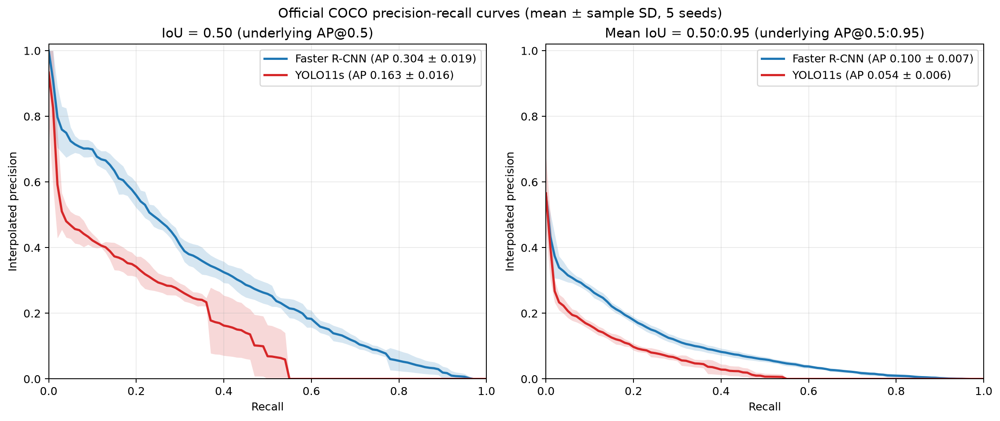
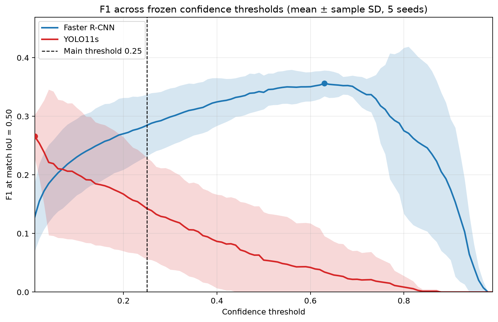
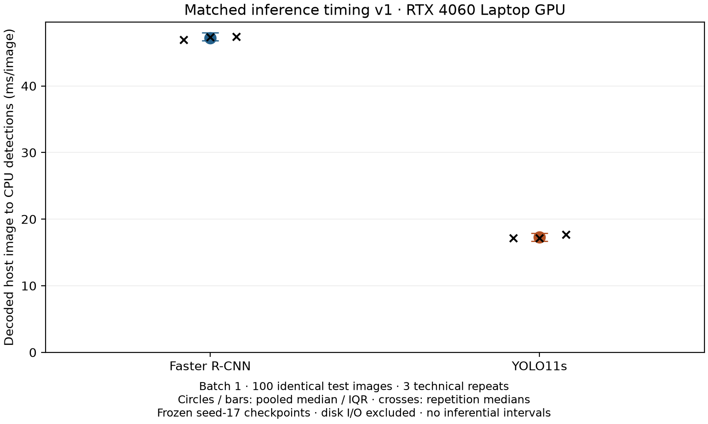
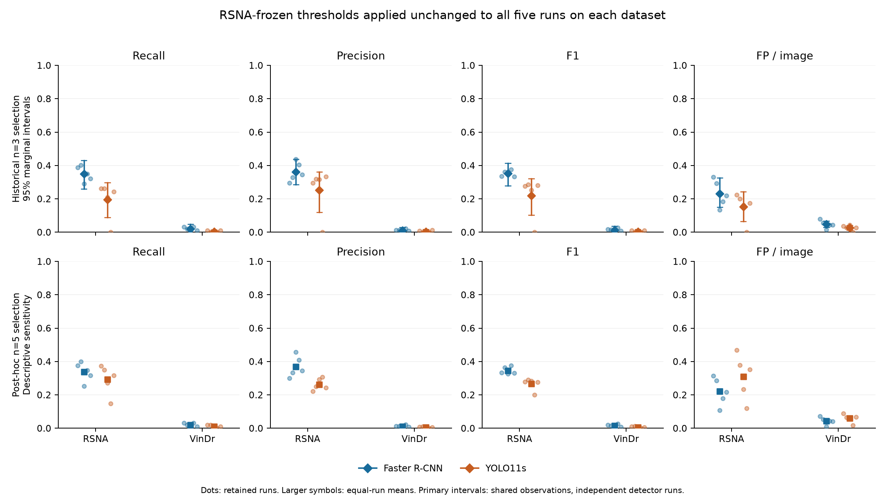

## Abstract

**Background:** Ranking performance, confidence cutoffs, and false-positive
budgets characterize different aspects of object detection. We examined whether
these aspects transport together in two deep-learning lung-opacity pipelines.

**Methods:** This retrospective study used 5,000 RSNA radiographs in
patient-disjoint training, validation, and internal-testing partitions
(3,500/750/750). Faster R-CNN and YOLO11s shared canonical inputs, disabled
stochastic augmentation, and a common evaluator. All five training runs per
detector were retained. A protocol frozen before external inference applied
the same checkpoints without adaptation to 3,000 VinDr-CXR images, including
84 images with 95 strict-target boxes. Historical three-run RSNA validation
thresholds remained primary; five-run selection was post-hoc sensitivity.
Primary uncertainty resampled held-out observations and independent detector
runs. Timing used a matched boundary on an RTX 4060 laptop.

**Results:** Mean AP@0.50 fell from 0.304224 to 0.002505 for Faster R-CNN and
from 0.162612 to 0.000501 for YOLO11s. External AP contrasts retained positive
marginal intervals, but historical-threshold recall fell from 0.350746/0.194776
to 0.018947/0.004211, respectively. External precision was 0.010830/0.004271;
all historical-threshold metric contrast intervals included zero. Observed
FROC means retained the internal ordering, but most external contrast intervals
included zero. Missing candidate support allowed an ordering reversal beyond
the observed frontier at the upper budgets; detection-cap saturation imposed
an additional limit. One low-score YOLO run emitted nothing at the historical
threshold and remained included. YOLO11s had 2.75-fold higher measured
throughput under the matched timing protocol.

**Conclusions:** Preserved observed AP ordering did not imply preserved
performance or successful operating-point transport. Ranking, score scale,
training variability, false-positive regimes, and implementation efficiency
require separate interpretation. This is cross-dataset and cross-annotation-
ontology transportability testing, with remaining confounding among dataset
and pipeline factors; it does not establish diagnostic utility.

## 1. Introduction

Detector comparisons often summarize performance with average precision (AP)
and precision or recall at a chosen confidence cutoff. These answer different
questions: AP summarizes a ranked detection set, whereas a cutoff determines
which detections are emitted at an operating point. Equal numerical cutoffs
need not produce equal selectivity across detectors. Prior calibration work
already identifies this problem and the dependence of detector assessment on
threshold and metric design [@kuzucu2024calibration].

We examine its practical consequences for localization of the RSNA challenge
category `Lung Opacity`. The annotations describe possible pneumonia-like
pulmonary opacities rather than clinically confirmed pneumonia
[@shih2019rsna]. Our intended use is methodological comparison of research
pipelines, not diagnosis or patient prioritization.

The central question is whether cross-detector conclusions change when the
same patient-disjoint test set is evaluated through ranking performance,
shared raw thresholds, detector-specific validation-selected operating points,
and false-positive budgets, and whether those conclusions transport to an
independent dataset under a non-identical opacity ontology. We compare Faster R-CNN and YOLO11s using common
data, canonical preprocessing, no stochastic augmentation, a common evaluator,
and five retained training runs per detector. Patient-cluster and detector-run
resampling characterize uncertainty; standardized timing describes the measured
implementation costs.

The contribution is a controlled separation of these evaluation objects under
a leakage-aware internal protocol and frozen external testing. The RSNA-trained
checkpoints and operating rules are applied to VinDr-CXR without adaptation;
the question concerns both relative ordering and absolute performance. We do not claim the first discovery of
detector score-scale mismatch. Optimization and numerical-precision differences
remain disclosed, so conclusions apply to the evaluated pipelines. Secondary
calibration, stress-test, and explanation analyses are indexed in the
[supplement](../docs/SUPPLEMENTARY.md). The internal analysis is retrospective and was not preregistered. The external
protocol was locally frozen before full inference, not publicly preregistered.

## 2. Related Work

### 2.1 Detector scores and operating-point assessment

Küppers et al. introduced multivariate detection-confidence calibration,
including dependence on predicted location and box scale
[@kuppers2020calibration]. Kuzucu et al. subsequently showed how shared score
thresholds and inconsistent detection populations can distort joint accuracy
and calibration comparisons; AP alone does not select an operating threshold
[@kuzucu2024calibration]. This motivates separate reporting of AP/PR,
validation-selected thresholds, and FROC here. We evaluate existing prediction
sets and fit no calibration model. Supplementary D-ECE is a descriptive,
detection-level statistic of the emitted-detection population, dependent on
support and binning; it is not clinical-risk calibration.

### 2.2 RSNA methodology and direct detector comparisons

The RSNA resource augments NIH chest radiographs with expert opacity boxes and
categorical labels, including an adjudication process [@shih2019rsna]. Its
official dataset description identifies the radiologist annotation workflow
and conversion to DICOM with limited demographic and projection tags
[@rsna2022datasetdescription]. The challenge evaluated a custom image-aggregated
score across IoU thresholds 0.40--0.75 [@rsna2018challenge]. Our internal COCO
AP protocol uses different matching/aggregation and IoU ranges; its values are
not challenge leaderboard scores.

Direct RSNA comparisons already exist. Wu et al. compare an anchor-free
detector with SSD, Faster R-CNN, RetinaNet, and FCOS, alongside augmentation
and focal-loss ablations [@wu2024pneumonia]. More recently, Chinnam et al.
compare YOLOv8l, Faster R-CNN with FPN, and Deformable DETR on RSNA, reporting
accuracy and speed and selecting a confidence cutoff using validation
[@chinnam2026modern]. Their reported input resolutions differ by detector;
their split, model scales, and evaluation choices also differ from ours.
Neither paper's numerical results are directly interchangeable with this
benchmark. The present focus is the effect of operating-point definition and
training variability within two disclosed pipelines, rather than a new claim
that detector comparisons are absent.

### 2.3 Implementation and reporting context

Faster R-CNN combines region proposals with a second-stage classifier and box
regressor [@ren2015fasterrcnn]; FPN supplies multiscale features
[@lin2017fpn]. The YOLO11s implementation is identified by its pinned
Ultralytics release and model configuration
[@ultralytics2026release; @ultralytics2026yolo11config]. These specify the
compared implementations without implying a causal effect of detector family.

CLAIM 2024 recommends explicit data partitions, reference standards,
uncertainty, reproducibility, and reporting of unavailable information
[@tejani2024claim]. We use its distinction between internal and external
testing; `validation` below denotes the model-optimization partition used for
checkpoint and threshold selection. The accompanying reporting crosswalk
records remaining gaps and is not a certification of compliance.

### 2.4 External testing under a different annotation ontology

VinDr-CXR provides radiologist-annotated local findings and separate global
labels [@nguyen2022vindr]. Its local lung-opacity category is not an identical
reference standard to RSNA's pneumonia-like opacity target. External testing
therefore assesses cross-dataset and cross-annotation-ontology transportability.
Holding checkpoints and operating rules fixed allows ranking transport to be
examined separately from the transport of absolute performance and emissions.
It does not isolate which dataset or implementation difference causes a shift.

## 3. Materials and Methods

### 3.1 Dataset, target, and patient-disjoint split

We used the Stage 2 training set from the 2018 RSNA Pneumonia Detection
Challenge. The complete source contains 26,684 labeled radiographs and 9,555
positive boxes. The single foreground category was `Lung Opacity`; `Normal`
and `No Lung Opacity / Not Normal` remained zero-box negative studies.

Compute constraints motivated a deterministic 5,000-study subset, without a
formal sample-size or power calculation. Selection used seed 17, SHA-256
ordering, and the three label strata while keeping each NIH patient group
together and tracking source stratum proportions. The other 21,684 studies
were excluded for compute scope. The Kaggle `patientId` identifies an
examination, so the official RSNA mapping supplied NIH patient keys. Selected
studies came from 2,136 patient groups; train/validation/internal-test patient-key
intersections were empty.

For cohort description, split manifests were matched to original DICOM files.
Header-only extraction retained aggregate age, sex, and projection counts.
All 5,000 age elements had VR `AS` but bare numeric values without required
D/W/M/Y units. Values from 0 to 120 were interpreted as nominal years; one
out-of-range value was excluded. Quartiles used linear percentiles. Sex and
projection were counted as encoded, with percentages based on all studies in
each partition.

Table 1. RSNA cohort and limited DICOM-header characteristics by partition.

| Characteristic | Training | Validation | Internal testing | Total |
|---|---:|---:|---:|---:|
| Studies | 3,500 | 750 | 750 | 5,000 |
| Patient groups | 1,492 | 321 | 323 | 2,136 |
| Opacity-positive, n (%) | 798 (22.8%) | 169 (22.5%) | 169 (22.5%) | 1,136 (22.7%) |
| Reference boxes | 1,267 | 277 | 268 | 1,812 |
| Age, median [IQR], nominal y | 50 [36--60] | 49 [34--59] | 47 [35--61] | 49 [36--60] |
| Age summary, n | 3,499 | 750 | 750 | 4,999 |
| Age unavailable, n (%) | 1 (0.03%) | 0 (0.0%) | 0 (0.0%) | 1 (0.02%) |
| Female, n (%) | 1,614 (46.1%) | 399 (53.2%) | 349 (46.5%) | 2,362 (47.2%) |
| Male, n (%) | 1,886 (53.9%) | 351 (46.8%) | 401 (53.5%) | 2,638 (52.8%) |
| AP, n (%) | 1,690 (48.3%) | 348 (46.4%) | 325 (43.3%) | 2,363 (47.3%) |
| PA, n (%) | 1,810 (51.7%) | 402 (53.6%) | 425 (56.7%) | 2,637 (52.7%) |
| Sex / projection missing, n | 0 / 0 | 0 / 0 | 0 / 0 | 0 / 0 |

No other sex or projection category was observed. These header fields are
study-level descriptors, not independently verified clinical demographics.

#### Canonical preprocessing

The annotation audit found no malformed, non-positive-area, off-image, or
exact duplicate positive boxes. One conversion path checked DICOM pixel arrays
for finite content, inverted `MONOCHROME1` where needed, and applied per-image
min-max scaling to 8-bit grayscale PNG. COCO annotations were canonical; the
YOLO labels were derived from the same records. Both pipelines used 640-pixel
inputs and their disclosed native resizing paths. Source hashes and split
records are indexed in [Supplementary Section S1](../docs/SUPPLEMENTARY.md#s1-cohort-split-and-provenance-records).

### 3.2 Detector pipelines and controlled training factors

The models were Torchvision `fasterrcnn_resnet50_fpn_v2` and Ultralytics
YOLO11s (`8.4.110`), both initialized from COCO weights and adapted to the
single foreground class. Both used SGD, at most 30 epochs, validation
mAP@0.5:0.95 checkpoint selection and early stopping after at least eight
epochs, and seeds 17, 42, 137, 271, and 314. Stochastic augmentation was
disabled, including the Ultralytics-only mosaic, mixup, cutmix, copy-paste,
color, flip, geometric, erasing, and multi-scale transforms.

Faster R-CNN used physical batch 2 with two-step accumulation, float16 AMP,
frozen pretrained BatchNorm statistics, learning rate 0.005, and a
validation-plateau scheduler. YOLO11s used batch 4, bfloat16 forward/backward
with float32 assignment/loss, native BatchNorm updates, and one-epoch warmup
to a constant learning rate of 0.001. These exceptions followed numerical
stability diagnostics before accepted benchmark training. Thus the training
budget framework and data controls were common, but optimization, precision,
losses, and assignment were not identical. Full configurations are indexed in
the [implementation record](../docs/SUPPLEMENTARY.md#s8-decisions-limitations-and-reproduction).

### 3.3 Five retained runs and common evaluation

All five accepted training attempts per detector were retained, including a
YOLO11s run with no detections at the shared cutoff. None was replaced because
of internal-test behavior. Seed labels identify reproducible runs; they are
not matched stochastic blocks across frameworks. Checkpoints were selected
using validation mAP before internal testing.

Both adapters emitted source-image `xyxy` boxes, canonical categories, and
scores to one evaluator. COCO AP used the official pycocotools protocol
[@lin2014coco] at IoU 0.50 and averaged over 0.50:0.95, with a retained score
floor of 0.001 and at most 100 detections per image. Single-point precision,
recall, and F1 were global micro metrics within each run at match IoU 0.50;
run summaries used equal-run means and sample SDs. The matcher processed
predictions in stable descending-score order, choosing the highest-IoU
unmatched same-class reference without reuse. Native NMS used IoU 0.50.
Zero detections contributed zero precision, recall, and F1 by the declared
convention. Mean matched-box IoU and Dice were undefined without a true
positive and excluded misses; they used five Faster R-CNN and four YOLO11s
runs and remain secondary localization diagnostics.

### 3.4 Operating-point protocols and exact-score FROC

The shared cutoff of 0.25 was a protocol-sensitivity endpoint, not a
deployment choice. Five-run exploratory test sweeps used 99 thresholds from
0.01 to 0.99. Official PR curves came from the COCO interpolated precision
tensor at 101 recall positions, independently of this threshold grid. Test
curve optima were descriptive and did not select operating thresholds.

Historical detector-specific thresholds maximized arithmetic mean validation
F1 across seeds 17, 42, and 137 on the same 99-point grid; exact ties favored
the higher threshold. They were frozen and applied unchanged to all five test
runs. A separate post-hoc sensitivity applied the identical rule to validation
predictions from all five frozen checkpoints per detector, then applied its
thresholds unchanged to the same five test runs. Test labels were not used in
either selection. The five-run sensitivity was not prospectively frozen and
did not replace the historical three-run rule.

FROC evaluated every unique retained score in descending order, plus an empty
upper sentinel and the lower candidate endpoint. Separate inference-only
prediction collection used the same ten frozen checkpoints, 750 images,
annotations, preprocessing, matcher, NMS, and detection cap, with a candidate
floor of 0.00001. No retraining or threshold optimization on test outcomes was
performed. At each prespecified budget (0.125, 0.25, 0.5, 1, and 2 FP/image),
each run contributed its highest observed sensitivity without exceeding that
budget. Tied scores entered together; a tied-score group was not partially
admitted to fill a budget. No interpolation or extrapolation was used. Means and sample SDs
summarized five runs per detector. The frontier remains conditional on the
candidate floor; an endpoint below a budget is reported as floor-limited.

### 3.5 Frozen VinDr external testing

We included the complete official VinDr-CXR v1.0.0 test release obtained through
credentialed PhysioNet access [@nguyen2021vindrrelease; @pollard2026physionet].
The source describes consensus test annotations from three initial radiologists
and two reviewers [@nguyen2022vindr]. The strict target concept was `Lung opacity`,
mapped only to the exact released local label `Lung Opacity`. Consolidation,
Infiltration, Atelectasis, ILD, global Pneumonia, and other findings were not
merged. Images without strict-target boxes remained negatives for this task,
including images with other abnormalities; those findings were not ignore regions.

The protocol fixed cohort inclusion, ontology, preprocessing, checkpoints,
endpoints, candidate floor, cap, and both transported threshold policies before
full external inference. No VinDr annotations were used for training,
fine-tuning, model or checkpoint selection, threshold selection, calibration
fitting, or outcome-guided ontology, preprocessing, NMS, or endpoint changes.
No VinDr-optimized threshold was created. All ten RSNA-trained checkpoints were
applied without adaptation. AP used the common 0.001 evaluation floor; exact-score
FROC used the frozen 0.00001 collection floor, IoU-0.50 matching/NMS, and cap of
100 detections per image. Native candidate filters use strict `score > floor`;
the common evaluator uses `>=` on the retained candidates. FROC score coordinates
were not exported as operating rules.

Source checksums, complete decoding, PNG round trips, source-to-COCO equality,
common-loader compatibility, and inverse-coordinate checks preceded inference.
External conversion used the same min-max/inversion policy and frozen native
resizing, with no test-time augmentation. External inference verified float16
AMP for Faster R-CNN and bfloat16 AMP for YOLO11s. Historical internal YOLO
accuracy inference used FP32. Thus internal/external score and performance
changes cannot be attributed solely to dataset differences.

A secondary sensitivity subsequently applied the external YOLO numerical path
to the same internal images and all retained checkpoints, preserving historical
FP32 results. It used explicit bfloat16 autocast and the external disabled-TF32
policy, unchanged native preprocessing/postprocessing, candidate support,
evaluator and frozen thresholds. Historical effective TF32 flags were not
recorded, so this assesses the numerical path rather than activation dtype alone.
Candidate agreement used same-image, same-class greedy descending-IoU matching;
unmatched candidates were retained in the emission comparison. Full settings,
paired differences and matching details are in
[Supplementary Section S10](../docs/SUPPLEMENTARY.md#s10-yolo-numerical-inference-path-sensitivity).

A narrow Faster R-CNN numerical correction canonicalized a documented one-ULP
float32 inverse-coordinate overshoot at the upper image boundary. Negative
lower bounds and materially out-of-range coordinates still fail. The correction
preceded any completed external result and changed no frozen scientific setting;
it was not post-hoc external tuning. Raw-coordinate replay and the original
failed attempt are documented in
[Supplementary Section S9](../docs/SUPPLEMENTARY.md#s9-frozen-external-testing-and-transportability).

No defensible VinDr patient linkage was available in the released annotations
or inspected headers. The external resampling unit was therefore the released
image, not a verified independent patient. Repeated patients could make these
intervals too narrow.

### 3.6 Estimands and uncertainty

Primary pointwise 95% bootstrap intervals combined patient sampling and
stochastic training variability [@efron1993bootstrap]. In 2,000 two-stage
draws, NIH patient groups were sampled with replacement, all examinations of
each selected patient moved together, and runs were resampled independently
within detector. AP and other nonlinear metrics were reconstructed from each
resampled prediction set. Precision, recall, F1, and AP used five runs per
detector; conditional IoU/Dice used five/four defined runs. The effect estimate
was the unstandardized Faster-R-CNN-minus-YOLO11s difference.

Secondary two-sided permutation tests held checkpoints fixed and used 5,000
patient-group detector-label swaps, a plus-one correction
[@phipson2010permutation], and Holm adjustment across seven clean endpoints
[@holm1979simple]. Conditional localization used four complete same-label
pairs for this secondary test only. These p-values do not test the same
training-procedure estimand as the bootstrap intervals. No seed-aware p-value
was introduced. Those historical intervals do not incorporate threshold-selection
uncertainty and do not cover validation-selected or FROC endpoints.

The external analysis used the same inferential principles, with 2,000 draws
separately per dataset. Within each draw, observations were shared across
both detectors and all runs; trained runs were sampled independently within
detector. RSNA resampled its 323 known patient groups, while VinDr resampled
3,000 released images. Cohort-level AP, exact-score FROC, and historical-threshold
precision, recall, F1, and FP/image were reconstructed before averaging runs.
The primary estimand concerns the disclosed training procedure conditional on
its fixed training data and recipe; training patients were not resampled or
retrained. Secondary seed-17 checkpoint-conditional intervals resampled only
observations. Same-number detector seeds were not paired stochastic replicates.

Aligned internal intervals for these endpoints were computed separately and
preserve the historical analysis above. Percentile intervals are marginal 95%
intervals, not simultaneous or familywise guarantees. They condition on the
selected thresholds and retained floor/cap support; neither threshold-selection
uncertainty nor missing candidate support is resolved. Undefined draws are
reported without retrying or imputing. The post-hoc five-run threshold policy
and score/emission summaries remain descriptive. Cohorts and predictions were
never pooled, and no cross-dataset interaction test was performed. Labels such
as unchanged, strengthened, weakened, and reversed describe observed ordering
or raw gaps, not significance decisions. Full estimands and all intervals are in
[Supplementary Section S9](../docs/SUPPLEMENTARY.md#s9-frozen-external-testing-and-transportability).

### 3.7 Standardized implementation timing

The primary timer starts from the same decoded uint8 RGB source image in host
memory. It includes resize/letterbox, tensor conversion, host-to-device transfer,
model forward, native postprocessing/NMS, source-coordinate restoration, and
CPU extraction of boxes, scores, and labels. It excludes disk I/O and decoding.
CUDA synchronization brackets every timed interval. The protocol uses the
same 100 test images ranked by SHA256 of seed 17 and filename, batch 1, and
the frozen seed-17 checkpoint per detector. Three full repetitions alternate
detector order, each preceded by 10 warm-up images per detector. Model setup,
fusion, reference inference, and result checking are outside the timer.

The reporting machine was an ASUS ROG Strix G16 with i7-13650HX, 16 GB RAM,
and RTX 4060 Laptop GPU (8 GB). The environment was Windows, Python 3.11.15,
Torch 2.6.0+cu124, Torchvision 0.21.0+cu124, Ultralytics 8.4.110, CUDA 12.4,
cuDNN 90100, and driver 610.47. Explicit inference AMP used verified float16
convolutions for Faster R-CNN and bfloat16 for YOLO11s. Both models were
resident; one CPU thread, disabled TF32/cuDNN benchmarking, and deterministic
algorithms were used. The common floor was 0.001, NMS IoU 0.50, and cap 100.

Timed outputs were checked against ordinary file inference using the same
explicit AMP and postprocessing. Agreement is not claimed against the
historical FP32 YOLO evaluation bundles, which remain unchanged. FPS divides
timed calls by total elapsed time; median and IQR describe image latency.
Timing repetitions are technical repeats, not independent biological or
training replicates. Full timing conditions and raw checks are in the
[compute record](../docs/COMPUTE_TIMING.md). Historical asymmetric timing,
Pareto panels, training profiles, and incomplete profiler-registered operation
counts remain supplementary and are not pooled with this timing protocol.

### 3.8 Secondary analyses

Detection-level D-ECE [@kuppers2020calibration] used post-NMS predictions at
the 0.001 floor and the same IoU-0.50 matcher. Within the one-class stratum,
confidence, relative center coordinates, width, and height each used five
equal-width bins. Cells with fewer than eight detections contributed zero;
all emitted detections remained in the weighting denominator. Thus D-ECE is
descriptive and support/binning dependent, conditional on the emitted-detection
population, and excludes missed targets. The existing bin/support/floor
sensitivity and confidence-only marginal reliability plots are in
[Supplementary Section S4](../docs/SUPPLEMENTARY.md#s4-calibration-and-exploratory-raw-score-utility).
No calibration map was fitted; this is not clinical-risk calibration.

Common corruptions, stored-array acquisition/display stress, and Grad-CAM use
one checkpoint per detector and a fixed 300-image sample; explanation controls
use a nested 50-image sample. Their methods and results are in
[Supplementary Sections S5--S6](../docs/SUPPLEMENTARY.md#s5-complete-digital-corruption-and-acquisition-shift-grids).
They describe synthetic sensitivity and score-associated maps, not external
transportability or causal explanations. Validation-only F-beta and
hypothetical linear-loss analyses remain in
[Supplementary Section S3](../docs/SUPPLEMENTARY.md#s3-operating-point-and-threshold-evidence);
their thresholds were not applied to test data. Conventional decision-curve
analysis and clinical net benefit were not evaluated.

## 4. Results

All detector summaries weight the five retained runs equally. AP is on the
0--1 scale, not a percentage. A denotes Faster R-CNN and B denotes YOLO11s.
No checkpoint predictions are pooled into an ensemble.

### 4.1 Clean internal-testing performance

Across the selected cohort,
median nominal age was 49 years (IQR 36--60; n=4,999), 2,362 studies (47.2%)
were encoded female and 2,638 (52.8%) male, and 2,363 (47.3%) were AP versus
2,637 (52.7%) PA. Sex and projection had no missing or other values. Age had no
missing tags, but all age values lacked encoded units and the single
out-of-range value was excluded. These are descriptive cohort characteristics;
no demographic subgroup comparison or fairness inference was performed.

The unified evaluator processed 750 internal-testing images and 268 reference boxes for
each of 10 frozen checkpoints. Both AP endpoints favored Faster R-CNN. At the
shared score threshold of 0.25, Faster R-CNN had higher recall and F1, whereas
YOLO11s had higher precision and slightly higher conditional localization
among successfully matched detections. YOLO11s conditional IoU and Dice used
only four defined seeds.

Table 2. Internal-test endpoints at the shared cutoff and on ranked predictions.

| Endpoint | Faster R-CNN, mean +/- SD | YOLO11s, mean +/- SD |
|---|---:|---:|
| Precision at 0.25 | 0.1959 +/- 0.0552 (n=5) | **0.2983 +/- 0.1691 (n=5)** |
| Recall at 0.25 | **0.5799 +/- 0.0911 (n=5)** | 0.0955 +/- 0.0607 (n=5) |
| F1 at 0.25 | **0.2845 +/- 0.0528 (n=5)** | 0.1427 +/- 0.0868 (n=5) |
| Conditional matched-box IoU | 0.6749 +/- 0.0065 (n=5) | **0.6985 +/- 0.0157 (n=4)** |
| Conditional matched-box Dice | 0.8010 +/- 0.0049 (n=5) | **0.8181 +/- 0.0111 (n=4)** |
| mAP@0.5 | **0.3042 +/- 0.0189 (n=5)** | 0.1626 +/- 0.0162 (n=5) |
| mAP@0.5:0.95 | **0.0995 +/- 0.0067 (n=5)** | 0.0542 +/- 0.0060 (n=5) |

YOLO11s seed 271 illustrates the distinction between ranking and score scale.
Its training losses decreased and validation mAP converged normally, while
internal-testing AP@0.5 and AP@0.5:0.95 were 0.15872 and 0.05558, within the
other YOLO seed range. Yet its maximum internal-testing confidence was 0.0412735.
It therefore emitted no detection at 0.25 and contributed observed zeros to
precision, recall, and F1; matched-box IoU and Dice were mathematically
undefined. Its low scores changed fixed-threshold behavior without a
corresponding AP collapse. The run remained in every analysis where its
endpoint was defined.

### 4.2 Shared thresholds and validation-selected operating points

On the five-run official AP@0.5 curve, Faster R-CNN had higher mean
interpolated precision at 97 of 101 recall positions, with four ties. COCO AP
ranking does not depend on the selected single operating threshold, but
remains conditional on the retained prediction floor and common
evaluation/post-processing protocol. The higher YOLO11s precision at 0.25
therefore did not imply a precision advantage at matched recall (Figure 1).

Historical validation selection used n=3 and chose 0.69 for Faster R-CNN and
0.05 for YOLO11s. Applying those thresholds unchanged to five test runs gave
precision/recall/F1 0.3624 +/- 0.0581, 0.3507 +/- 0.0463, and
0.3511 +/- 0.0184 for Faster R-CNN, versus 0.2524 +/- 0.1418,
0.1948 +/- 0.1110, and 0.2192 +/- 0.1233 for YOLO11s. Seed 271 also emitted
no detection at 0.05 and contributed the declared zeros.

The post-hoc validation sensitivity selected 0.70 for Faster R-CNN and 0.01
for YOLO11s from all five validation runs. Applied unchanged to the test set,
precision/recall/F1 was 0.3686 +/- 0.0632, 0.3388 +/- 0.0567, and
0.3458 +/- 0.0222 for Faster R-CNN, versus 0.2631 +/- 0.0360,
0.2925 +/- 0.0886, and 0.2657 +/- 0.0367 for YOLO11s. Faster R-CNN's mean
precision, recall, and F1 advantages remained but weakened. Mean FP/image was
0.2205 versus 0.3104, reversing the historical-threshold ordering. This is
post-hoc validation sensitivity, not a prospectively frozen operating point.

### 4.3 Internal exact-score false-positive regimes

Five-run FROC sensitivity was higher for Faster R-CNN at each prespecified
budget: 0.2776 versus 0.1799 at 0.125 FP/image, 0.3664 versus 0.2664 at 0.25,
0.4858 versus 0.3821 at 0.5, 0.6000 versus 0.5075 at 1, and 0.6978 versus
0.6090 at 2 (Figure 2). These are descriptive equal-run means; aligned inferential
intervals are separately available with the transportability analysis.

The 0.00001 candidate floor permits all runs to reach 1 FP/image. YOLO11s
seed 137 nevertheless ends at 1.9907 FP/image, so the aggregate at 2 FP/image
remains a lower-bound observation. Assigning that run the mathematical
maximum sensitivity of 1.0 gives a YOLO11s aggregate upper bound of 0.6963,
below Faster R-CNN's observed 0.6978. The internal ordering therefore cannot reverse
under this bound for these frozen runs; this is not a population-level
uncertainty statement or evidence of a terminal plateau.

### 4.4 Training-procedure uncertainty and conditional tests

The table reports the primary training-procedure differences and separately the
secondary checkpoint-conditional p-values. Differences are Faster R-CNN minus
YOLO11s; the corresponding absolute endpoint estimates are reported in Section
4.1. Every row contains 750 images from 323 patient clusters. `Runs A/B`
gives the eligible Faster R-CNN/YOLO11s trained-run counts.

Table 3. Historical internal uncertainty, with distinct inferential targets.

| Endpoint | Runs A/B | Conditioning | Difference (95% training-procedure CI) | Seed 271 | Holm p, conditional on observed checkpoints |
|---|---:|---|---:|---|---:|
| Precision at 0.25 | 5/5 | Unconditional | -0.1024 (-0.2423, 0.0553) | Both runs; YOLO contributes zero | **0.0020** |
| Recall at 0.25 | 5/5 | Unconditional | 0.4843 (0.3830, 0.5830) | Both runs; YOLO contributes zero | **0.0014** |
| F1 at 0.25 | 5/5 | Unconditional | 0.1419 (0.0559, 0.2290) | Both runs; YOLO contributes zero | **0.0014** |
| Conditional IoU | 5/4 | Conditional on a matched detection | -0.0236 (-0.0585, 0.0089) | Faster defined; YOLO undefined | 0.1064 |
| Conditional Dice | 5/4 | Conditional on a matched detection | -0.0171 (-0.0420, 0.0066) | Faster defined; YOLO undefined | 0.1064 |
| mAP@0.5 | 5/5 | Unconditional | 0.1416 (0.1013, 0.1845) | Both ranked bundles contribute | **0.0208** |
| mAP@0.5:0.95 | 5/5 | Unconditional | 0.0453 (0.0313, 0.0599) | Both ranked bundles contribute | **0.0342** |

Under the primary estimand, the recall, F1, and both AP intervals remained
wholly above zero. Fixed-threshold precision did not: its interval crossed
zero, so it did not support a training-procedure difference. The
small checkpoint-conditional precision p-value instead says that the observed
checkpoints favored YOLO11s at the common numerical cutoff across patient
clusters. The CI and p-value differ because the former also resamples trained
runs; neither arithmetic result is wrong, and they do not test the same target.
Conditional localization excluded missed annotations and remained
inconclusive.

### 4.5 Standardized inference timing

The matched v1 protocol measured Faster R-CNN at 20.91 FPS and YOLO11s at
57.56 FPS. Pooled median image latencies were 47.20 and 17.29 ms, respectively
(Figure 3). The table pools three complete 100-image repetitions per frozen
checkpoint; dispersion is image-latency IQR, not training-run SD.

Table 4. Measured implementation timing and model size on the reporting laptop.

| Matched v1 metric | Faster R-CNN | YOLO11s |
|---|---:|---:|
| Total timed elapsed, 300 calls (s) | 14.3466 | 5.2124 |
| FPS (300 / total elapsed) | 20.91 | 57.56 |
| Median image latency (ms) | 47.20 | 17.29 |
| Q1--Q3 image latency (ms) | 46.78--48.00 | 16.68--17.88 |
| IQR image latency (ms) | 1.22 | 1.19 |
| Total parameters | 43,256,153 | 9,428,179 |
| Training-trainable parameters | 43,030,809 | 9,428,163 |

All 600 timed-image checks agreed exactly with ordinary inference in counts,
category labels, boxes, and scores. These are technical repetitions of one checkpoint per detector, not a new
training-replicate analysis. The machine-readable source is
`results/tables/inference_timing_v1.csv`; full protocol, individual repetitions,
raw intervals, and provenance are indexed in `docs/COMPUTE_TIMING.md`.

The matched throughput ratio was 2.75 in favor of YOLO11s, which had 78% fewer
parameters. This compares measured implementations on one machine, not
architecture families or clinical workflow speed.

### 4.6 External cohort and ranking performance

All 3,000 official test images passed the adapter and all ten checkpoint runs
completed. The strict target occurred in 84 images (2.8%), with 95 boxes;
2,916 images had no strict-target box. These counts describe target support,
not pneumonia prevalence or independent patient counts. They contrast with
169 positive internal-test images and 268 boxes, and limit the precision of
external estimates.

Both AP endpoints retained the direction of the equal-run internal ordering,
but absolute AP collapsed for both pipelines (Table 5). External AP@0.50
contrasts and AP@0.50:0.95 contrasts had positive marginal training-procedure
intervals. This supports a relative difference under the declared estimand,
not successful absolute generalization. No particular dataset or numerical
implementation factor is identified as the cause.

Table 5. Equal-run AP means +/- sample SD (n=5 per detector); external contrasts
are A minus B with marginal 95% training-procedure intervals.

| Endpoint | RSNA A | RSNA B | VinDr A | VinDr B | External difference [95% CI] |
|---|---:|---:|---:|---:|---:|
| AP@0.50 | 0.304224 +/- 0.018896 | 0.162612 +/- 0.016174 | 0.002505 +/- 0.001380 | 0.000501 +/- 0.000272 | 0.002004 [0.000331, 0.006689] |
| AP@0.50:0.95 | 0.099502 +/- 0.006681 | 0.054168 +/- 0.006030 | 0.000618 +/- 0.000170 | 0.000119 +/- 0.000077 | 0.000499 [0.000075, 0.001719] |

### 4.7 Failure of frozen operating-point transport

Historical RSNA validation thresholds of 0.69/0.05 transported poorly (Table 6).
External precision, recall, and F1 were near zero for both pipelines. The
lower external FP/image values accompanied sharply reduced emission and recall;
they do not establish improvement. All four primary operating-metric contrast
intervals included zero: neither a positive mean gap nor preserved AP ordering
establishes the same external ordering at the frozen operating points.

Table 6. Historical n=3 validation-selection policy applied unchanged to all
five runs in each cohort. Values are equal-run means; full sample SDs and run
counts are in Supplementary Section S9. External contrasts have marginal 95%
training-procedure intervals. Emission rows are descriptive without intervals.

| Historical-policy endpoint | RSNA A | RSNA B | VinDr A | VinDr B | External difference [95% CI] |
|---|---:|---:|---:|---:|---:|
| Precision | 0.362419 | 0.252403 | 0.010830 | 0.004271 | 0.006559 [-0.008360, 0.025664] |
| Recall | 0.350746 | 0.194776 | 0.018947 | 0.004211 | 0.014737 [-0.004880, 0.045485] |
| F1 | 0.351144 | 0.219206 | 0.013580 | 0.004214 | 0.009366 [-0.006376, 0.031685] |
| FP/image | 0.232000 | 0.151733 | 0.047667 | 0.027067 | 0.020600 [-0.001735, 0.045672] |
| Detections/image | 0.357333 | 0.221333 | 0.048267 | 0.027200 | Descriptive |
| Images with detections (%) | 25.573333 | 14.213333 | 4.260000 | 2.140000 | Descriptive |

The separately transported post-hoc n=5 RSNA policy used 0.70/0.01. External
precision/recall/F1 was 0.011367/0.018947/0.014046 for Faster R-CNN and
0.004499/0.010526/0.006277 for YOLO11s. FP/image was 0.044200 versus 0.060067,
reversing the historical-policy ordering within the external cohort, as it did
internally. These descriptive sensitivities do not select a replacement policy.
Neither policy restores external recall. The proportion of images with detections
also changed ordering across datasets under the secondary policy; ordering is
endpoint- and policy-specific.

YOLO11s seed 271 emitted no external detection at 0.05 and remained in the
five-run zero-valued precision/recall/F1 summaries. At the secondary cutoff of
0.01 it emitted 54 detections, all false positives against the strict target.
Its AP still contributed. No inconvenient run was removed or downweighted.

At the common AP support, mean detections/image changed from 16.326133/1.080800
internally to 11.502800/0.217200 externally. The equal-run percentage of images
with no such detections rose from 7.466667%/62.373333% to 8.333333%/87.073333%.
Per-run score distributions and counts are reported together in the supplement;
these emitted-population summaries are not probability calibration and exclude
missed targets. Historical FP32 versus external bfloat16 YOLO inference was
examined separately in the secondary sensitivity below; score shifts still
cannot be assigned to a single dataset or pipeline factor.

### 4.8 External FROC and uncertainty boundaries

Observed external FROC means retained the internal direction at every specified
budget (Figure 2; Table 7), with smaller raw gaps. Four of the five external
contrast intervals included zero; only the interval at 0.25 FP/image was wholly
positive. These marginal intervals do not establish a simultaneous ordering
across budgets.

Table 7. External observed exact-score sensitivities (equal-run means, n=5)
and A-minus-B marginal 95% training-procedure intervals. Asterisks identify
YOLO11s aggregates containing a floor-limited lower-bound contribution at 1
and 2 FP/image; the missing-support bound permits reversal there. Faster R-CNN
cap saturation is an additional support limit. No interpolation or extrapolation
was used, and intervals do not recover unobserved candidate support.

| FP/image budget | VinDr A sensitivity | VinDr B sensitivity | External difference [95% CI] |
|---|---:|---:|---:|
| 0.125 | 0.056842 | 0.018947 | 0.037895 [-0.002128, 0.092453] |
| 0.25 | 0.086316 | 0.033684 | 0.052632 [0.005345, 0.113471] |
| 0.5 | 0.094737 | 0.061053 | 0.033684 [-0.014829, 0.092312] |
| 1 | 0.117895 | 0.077895* | 0.040000 [-0.020939, 0.108700] |
| 2 | 0.164211 | 0.098947* | 0.065263 [-0.005663, 0.149396] |

YOLO11s seed 137 ended at 0.793333 FP/image and was floor-limited at budgets
1 and 2. Replacing that run's observed sensitivity with the mathematical
maximum of 1.0 gives conservative aggregate upper bounds of 0.258947 and
0.280000, respectively, above Faster R-CNN's observed 0.117895 and 0.164211.
Thus, unlike the internal bound, the external missing-support bound does not
rule out an ordering reversal beyond retained candidates. These are support
bounds, not confidence bounds; bootstrapping cannot restore unobserved support.
The floor was not lowered after external results.

Faster R-CNN reached the collection cap on 3,000/2,635/3,000/3,000/209 images
for seeds 17/42/137/271/314; no YOLO11s image reached it. This substantial cap
saturation is another limitation on the observed frontier, not corrected by
the YOLO floor bound. The cap remained frozen. No unrestricted or full-frontier
external FROC superiority is established.

Checkpoint conditioning also changed the comparison. For the seed-17 pair,
external AP contrast intervals included zero, and observed FROC sensitivity
favored YOLO11s at the three largest budgets. Those secondary results are
available in the complete interval table and cannot replace the primary
training-procedure interpretation. One checkpoint does not represent an entire
training procedure.

### 4.9 Secondary YOLO numerical-path sensitivity

Under the harmonised internal path, mean AP@0.50 was 0.158412 and mean
AP@0.50:0.95 was 0.053137, compared with historical FP32 means of 0.162612
and 0.054168. Mean recall was 0.191791 at the historical cutoff and 0.285821
under the post-hoc policy. Equal-run FROC sensitivity changes ranged from
-0.005970 to +0.002239. Observed internal detector orderings at these endpoints
were unchanged. Seed 271 retained nonzero AP@0.50 of 0.151761 and a maximum
score of 0.040771, remaining below the historical cutoff.

These aggregate performance changes were modest, although post-NMS candidate
composition changed and predictions were not numerically equivalent. Detailed
score distributions, emissions and box/score agreement are in Supplementary
Section S10. Harmonisation left severe external performance and operating-point
transport failure intact; it reduces the numerical-path concern without
identifying the causes of the remaining cross-dataset differences. Historical
primary values and their uncertainty analyses remain unchanged.

## 5. Discussion

The central finding is the separation between relative ordering and performance
transport. Faster R-CNN retained higher observed equal-run AP on VinDr, while
both pipelines' AP and the recall of their RSNA-selected operating rules fell
severely. **Preserved ordering is not preserved performance** here refers to
the observed equal-run AP direction. It does not mean that every external
endpoint resolves the same detector difference, that the complete FROC frontier
was observed, or that external generalization succeeded.

Internally, a shared numerical cutoff suggested higher YOLO11s precision,
whereas ranking curves and detector-specific validation selection gave different
comparisons. The post-hoc five-run selection also reversed FP/image ordering
relative to the historical policy. Externally, both policies produced very
low recall and emission; lower FP/image was therefore an incomplete account
of their behavior. Confidence scales are not interchangeable across detectors,
and higher AP does not imply better performance at every operating point.
Score-scale mismatch is established prior knowledge [@kuzucu2024calibration];
the contribution is its controlled examination alongside training variability,
false-positive support, measured efficiency, and external transport.

The retained low-score run illustrates why stochastic training variability
matters. Its nonzero internal AP coexisted with zero emissions at conventional
cutoffs; excluding it would conceal behavior of the evaluated recipe. Likewise,
image/patient-only uncertainty for fixed checkpoints answers a narrower question
than resampling both observations and independently trained detector runs.
The external seed-17 sensitivity and the historical internal precision analysis
show why these interpretations should remain separate.

Measured implementation costs provided another distinct comparison. YOLO11s'
smaller parameter count and higher matched-boundary throughput coexisted with
lower AP for the studied pipelines. Timing on one machine does not establish
an architecture-family efficiency law or clinical workflow benefit. The
comparison controls several data and evaluation factors but does not isolate
architecture from optimization, normalization, precision, losses, or native API
behavior, and it does not compare fully tuned native recipes. Prior RSNA
comparisons [@wu2024pneumonia; @chinnam2026modern] give context without supplying
interchangeable scores.

VinDr external testing was deliberately frozen without adaptation, so it
measures transport of established pipelines and rules. Its strict local opacity
ontology differs from RSNA's reference standard. Acquisition, hospital/site,
country, population, annotation ontology and preprocessing effects remain
confounded. Internal numerical-path harmonisation produced modest aggregate
changes and preserved the major observed comparisons, weakening precision
asymmetry as an explanation for the severe transport collapse in this sensitivity.
It does not establish that every remaining difference is a dataset effect or
attribute the collapse to any one factor. Nor would combining labels after seeing results repair
that inference. The adverse result motivates separately designed future
transport studies; it does not justify post-hoc tuning on this external test set.

## 6. Limitations

**Data and reference standards.** The hardware-scoped 5,000-study RSNA subset
is not a deployment-prevalence sample, and only two disclosed detector pipelines
were evaluated. Coarse expert boxes and the nonspecific opacity target do not
establish pneumonia diagnosis. Technical annotation checks are not an independent
radiologist rereading. RSNA source accrual dates and broader clinical/acquisition
variables are unavailable locally; header age requires the nominal-year
assumption. Min-max conversion and resizing do not reproduce vendor display
processing. VinDr has a non-identical ontology, only 84 strict-target-positive
images and 95 boxes, and no defensible patient grouping. Image-level external
intervals may be too narrow if repeat patients exist. The numerical-path
sensitivity narrows one implementation concern; dataset, site, population,
annotation and preprocessing differences remain inseparable in this design.

**Training and selection.** Five runs per detector are a coarse empirical
sample of training variability, conditional on one fixed training dataset.
Disabled augmentation may disadvantage YOLO11s relative to its usual recipe.
Optimization, normalization, and precision asymmetries limit architecture-only
interpretation. Historical thresholds used three validation runs; five-run
selection remains post-hoc sensitivity and does not rewrite that provenance.
Equal-weight F1 does not encode measured clinical harms, and the YOLO five-run
choice reaches the selection grid's lower boundary. Internal hypotheses and
analyses were retrospective; the external freeze was a local prespecification.

**Evaluation and uncertainty.** AP and FROC depend on retained support and
postprocessing. The internal floor-bound no-reversal result does not transport
to VinDr's upper budgets. External YOLO candidate-floor limits and substantial
Faster R-CNN detection-cap saturation preclude a full-frontier conclusion.
Marginal intervals offer no familywise coverage, omit threshold-selection
uncertainty, and cannot recover missing support. No cross-dataset interaction
test was conducted. Conditional IoU/Dice exclude misses and use unequal numbers
of defined runs. Historical internal YOLO accuracy inference used FP32 while
external inference used verified bfloat16 AMP. The secondary internal sensitivity
found modest aggregate changes but non-identical candidate composition; it is
not an equivalence test, and historical TF32 flags were not recorded. It does
not identify a dataset-only cause for the remaining shifts. No calibration map was fitted.
Detection-level D-ECE remains descriptive, emitted-population dependent,
binning/support dependent, and not patient-level clinical-risk calibration.

**Secondary analyses and compute.** Corruption, acquisition stress, and Grad-CAM
analyses use one primary checkpoint per detector and limited samples. Synthetic
stored-array changes do not validate scanner/dose models; Grad-CAM and its
controls do not establish causal or clinically appropriate reasoning. The
runtime comparison uses one checkpoint per detector, different AMP dtypes,
100 images, and one hardware/software state. Technical repetitions do not
estimate retraining or hardware uncertainty, and disk I/O and workflow costs
are excluded. Incomplete profiler GFLOPs remain supplementary.

**Clinical and reporting scope.** No prospective evaluation, reader study,
validated clinical deployment, diagnostic utility, patient benefit, or complete
fairness analysis was established. Demographic representation is not subgroup
performance evidence. Portable CI verifies public evidence without licensed
images; full scientific replay requires authorized data and matching checkpoints.
Restricted VinDr image-linked derivatives remain private, and the ten checkpoint
binaries have no public release URL. Retraining is not promised to be bitwise
identical, including the recorded CUDA ROI Align backward limitation.
Institutional ethics/consent applicability, the final submission release
identifier, source-reporting gaps, and a participant-flow diagram remain
unresolved in the reporting crosswalk.

## 7. Conclusion

A leakage-aware, multi-run comparison separated ranking performance, raw-score
behavior, validation-selected operating points, false-positive regimes,
training variability, and measured implementation efficiency. Frozen VinDr
testing preserved the observed equal-run AP ordering while exposing severe
loss of absolute performance and failure of internal operating rules to
transport well. Uncertain endpoint contrasts and finite FROC support limit
broader ordering claims. Reporting these evaluation objects separately makes
the comparison informative without implying clinical validation or universal
superiority of either detector family.

## 8. Declarations

**Funding and support.** This research received no external funding or
institutional research support. The work was conducted using the authors' own
resources, without project-specific scholarships or sponsored computing or
equipment support.

**Competing interests.** The authors declare no financial or nonfinancial
competing interests related to this work.

**Ethics and data use.** This study was a secondary analysis of previously
collected, de-identified RSNA/NIH and VinDr-CXR datasets. The authors did not
recruit participants. No separate institutional ethics approval, exemption or
written determination was sought or obtained from Imam Khomeini International
University or K. N. Toosi University of Technology for this analysis. The
official VinDr-CXR documentation reports approval of the original study by the
institutional review boards of Hanoi Medical University Hospital and Hospital
108 [@nguyen2021vindrrelease]. These source-study approvals are distinct from a
determination for the present secondary analysis.

**Consent.** The authors did not obtain new participant consent. The VinDr-CXR
dataset documentation reports a consent waiver for the original retrospective
study because clinical care and workflow were unaffected and identifying
information had been removed [@nguyen2021vindrrelease]. No separate consent
determination was obtained for the present analysis.

**Ethics review status.** The authors have not yet confirmed whether their
institutions or the target journal require a separate ethics review or consent
determination for this secondary use of RSNA/NIH and VinDr-CXR data.

**Author contributions (CRediT).** Pouyan Delivandani: Methodology, Software,
Data curation, Investigation, Formal analysis, Visualization, Writing - original
draft, Writing - review & editing. Mohammad Amin Hajialirezaei: Formal analysis,
Visualization, Writing - review & editing.

**Data, code, and model availability.** Code, configurations, reproduction
instructions and public aggregate results are available in the
[project repository](https://github.com/Alpha-lacrim/medical-object-detector-benchmark).
Repository-authored software is licensed under AGPL-3.0-only; source datasets
and third-party components retain their respective terms. RSNA/NIH source data
are accessed through the [RSNA challenge](https://www.kaggle.com/c/rsna-pneumonia-detection-challenge/data)
under its provider terms. VinDr-CXR is accessed through its
[credentialed PhysioNet release](https://physionet.org/content/vindr-cxr/1.0.0/)
and data-use agreement. Raw source data and restricted VinDr image-linked
derivatives are not redistributed by this repository. The authors have chosen
to keep all ten trained model checkpoints unpublished at initial submission;
no public checkpoint download is provided. Reproduction using the exact trained
checkpoints requires access to those unpublished files. The public repository
supports portable code and aggregate-artifact verification without them.

**Submission version.** A public commit or archive identifier for the version
submitted to the journal has not yet been selected.

**Patient and public involvement.** Patients and members of the public were
not involved in developing the research question, designing or conducting the
study, interpreting the results, or planning dissemination. This study used
previously collected datasets.
