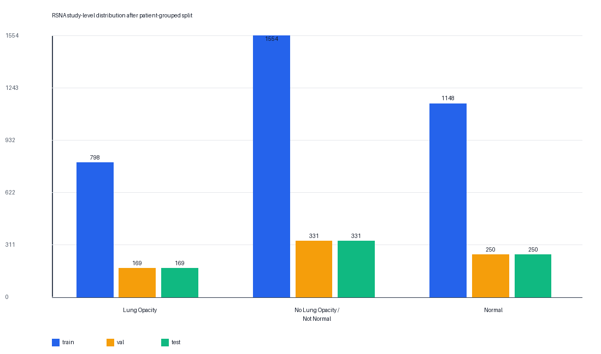
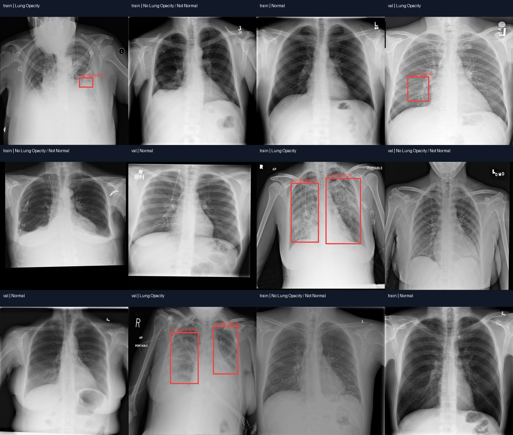
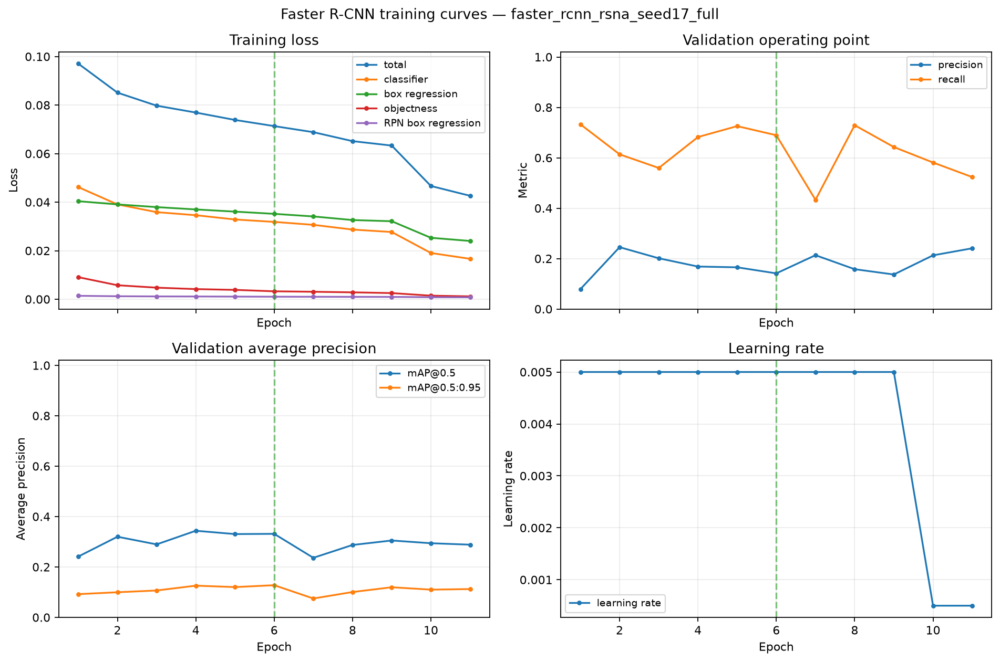
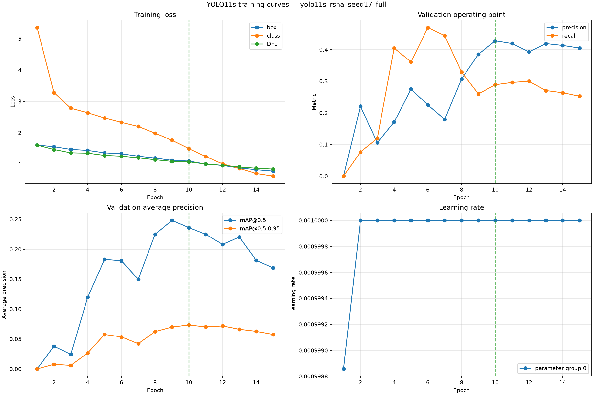
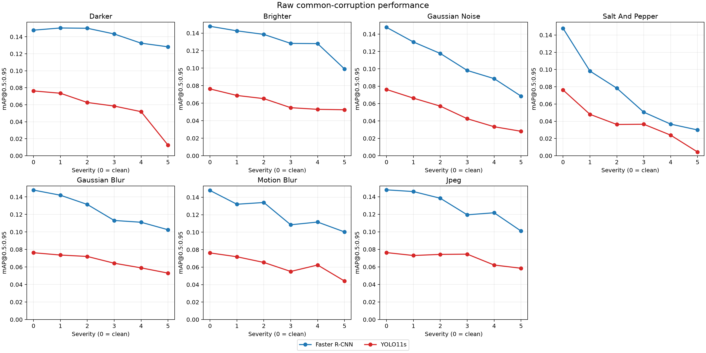
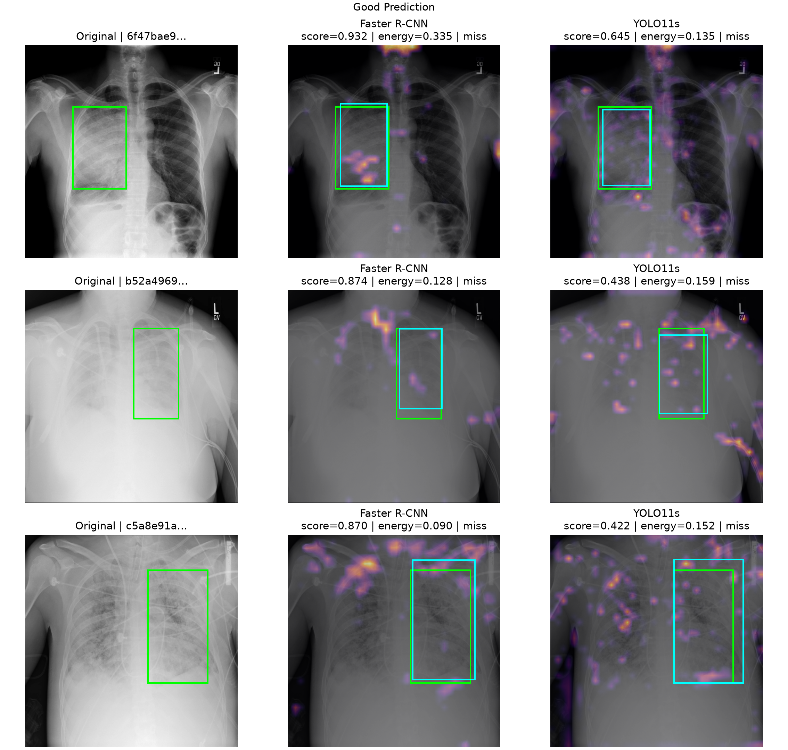
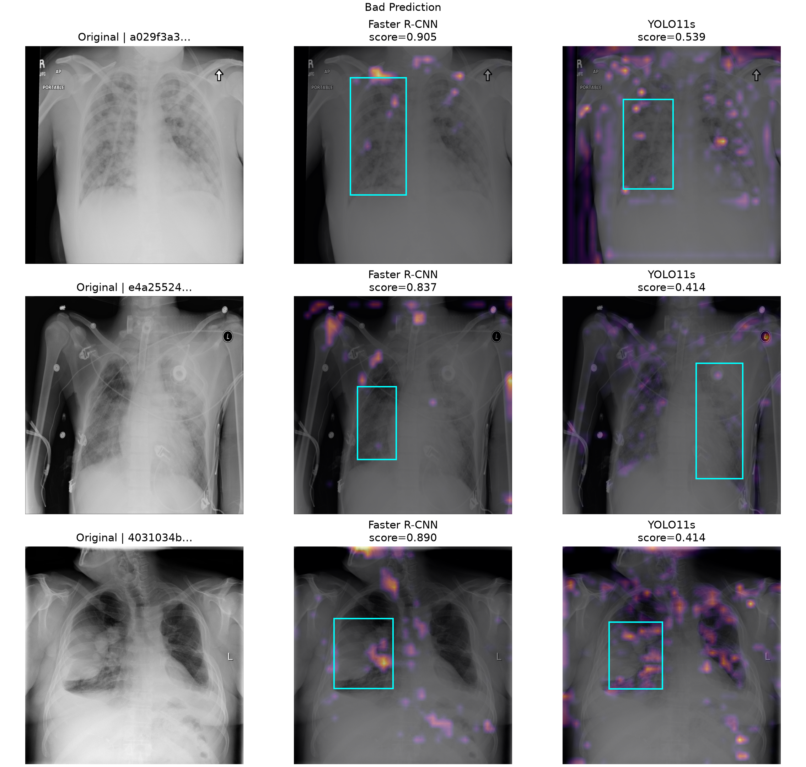
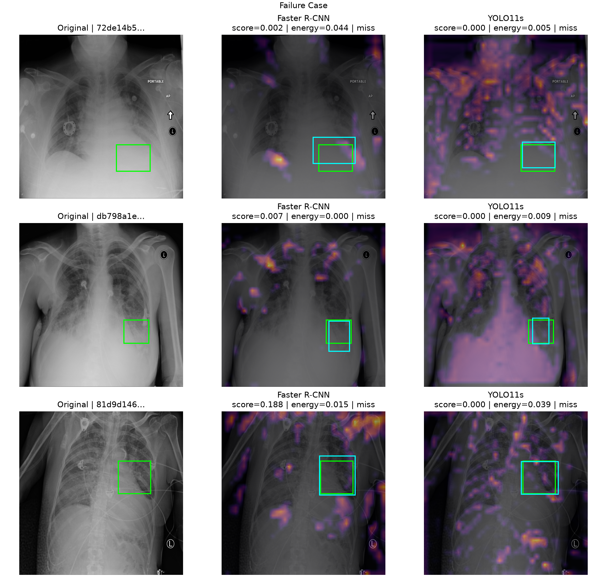

All numerical results in this report are quoted or rounded from the committed
artifacts under [`results/`](../results/); no model inference, resampling, or
report-only metric recomputation was performed during report assembly. The
commands that regenerate every cited table and figure are indexed in the
repository [`README.md`](../README.md).

## 1. Introduction

Object detectors intended for lung-opacity detection on chest radiographs must
be assessed on more than a single clean-test accuracy score. A useful system
must localize annotated lung-opacity regions with an acceptable miss rate,
remain stable under plausible image degradation, operate within its deployment
hardware budget, and expose enough auditable post-hoc evidence to support
failure analysis. These requirements can pull in
different directions: a proposal-based detector may spend more computation on
each candidate, while a dense one-stage detector may favor throughput and model
compactness.

This study asks:

> Under identical data, a common evaluation protocol, and a matched training
> budget, how do a two-stage anchor-based Faster R-CNN and a modern one-stage
> anchor-free YOLO trade off lung-opacity detection coverage and ranking
> accuracy, robustness to common image corruptions, and interpretability on
> chest radiographs, and which trade-off is
> preferable for plausible deployment scenarios such as resource-constrained
> point-of-care assistance and retrospective batch screening?

The comparison uses `fasterrcnn_resnet50_fpn_v2` and Ultralytics YOLO11s on a
patient-grouped 5,000-study subset of the RSNA Pneumonia Detection Challenge,
formulated here strictly as lung-opacity detection rather than pneumonia
diagnosis.
Both models consume the same canonical annotations, use 640-pixel inputs, are
trained under the same seed grid and broadly matched optimization budget, and
are scored by one evaluator. The study then adds a seven-corruption,
five-severity stress test, matched-layer Grad-CAM analysis, and paired
patient-cluster bootstrap and permutation analysis. The intended contribution
is a controlled, resource-scoped benchmark, not a claim that either detector
is clinically effective or safe.

## 2. Literature Review

### 2.1 Detector paradigms

Faster R-CNN introduced a Region Proposal Network that shares convolutional
features with an RoI-based second-stage classifier and box regressor
[@ren2015fasterrcnn]. The implementation studied here couples a ResNet-50
backbone to a Feature Pyramid Network (FPN), which supplies semantically useful
representations at several spatial scales [@lin2017fpn]. Anchors encode multiple
candidate shapes at each feature location; proposal filtering and the second
stage then refine a smaller candidate set.

YOLO began from the contrasting idea of predicting detections in a single
dense network pass [@redmon2016yolo]. This study uses YOLO11s rather than the
newer YOLO26 family because YOLO11 retains a conventional anchor-free,
NMS-based detection pipeline with greater continuity to the existing medical
object-detection literature. The implementation is pinned to
`ultralytics==8.4.110`. Its backbone and neck create stride-8, stride-16, and
stride-32 features; its decoupled dense head predicts classification scores and
distributed box offsets without predefined anchor shapes. Distributional box
regression follows the general approach developed for Generalized Focal Loss
[@li2020gfl]. YOLO11 has no standalone peer-reviewed architecture paper, so the
pinned source, official configuration, and instantiated model are treated as
the implementation authority [@ultralytics2024yolo11;
@ultralytics2026yoloarchitecture; @ultralytics2026yolo11config].

Architecture suggests hypotheses rather than a guaranteed ranking. A dense
one-stage head should reduce latency and model complexity, whereas proposal
refinement may help with subtle or variably sized opacity annotations. In the
medical-detector studies reviewed here, split construction, preprocessing,
augmentation, thresholds, and metric definitions or aggregation are not held
common. RSNA work combines detector changes with custom backbones or heads,
anchors, augmentation, losses, and post-processing [@yao2021pneumonia;
@wu2024pneumonia], while related MRI work also changes modality, input
organization, pretraining, and detector variants [@kang2023rcsyolo;
@kang2025pkyolo]. Because several factors move simultaneously, published point
estimates cannot isolate detector architecture. This study narrows that gap
with a patient-disjoint split, common canonical inputs and augmentation policy,
one evaluator, and compute measured on one machine; it does not claim a
universal detector-family effect.

### 2.2 Robustness and explainability

Common-corruption benchmarks show why clean accuracy is insufficient:
performance can change sharply under lighting, noise, blur, and compression
without changing the semantic label [@hendrycks2019corruptions]. Detection
models are also vulnerable to such transformations [@michaelis2019detectionrobustness].
The present benchmark transfers the ordered, multi-severity stress-test
principle to chest radiographs while avoiding the claim that digital
corruptions faithfully reproduce scanner physics or clinical distribution
shift.

Grad-CAM uses gradients of a selected target score to weight convolutional
feature channels and produce a coarse spatial association map
[@selvaraju2017gradcam]. Detector explanations require additional decisions:
the exact candidate and score must be defined, discrete NMS and selection are
not explained, and layers must be matched by approximate spatial role rather
than name. Visually plausible saliency is not proof of causal or clinically
appropriate reasoning [@adebayo2018sanity; @arun2021saliency]. This study
therefore combines paired heatmaps with energy-in-box and pointing-game
localization measures [@zhang2016excitation].

## 3. Materials and Dataset

### 3.1 Dataset choice and task

The selected data are the 2018 RSNA Pneumonia Detection Challenge Stage 2
training set, whose expert bounding-box annotation process is documented by
Shih et al. [@shih2019rsna]. It was chosen over two smaller brain-MRI exports
because it has stronger annotation provenance, coherent negative-image
semantics, and an official mapping that permits patient-level grouping. The
canonical detector task has exactly one foreground category, `Lung Opacity`.
`Normal` and `No Lung Opacity / Not Normal` are study-level strata and remain
negative images with zero detector annotations; an opacity is a radiographic
finding, not a confirmed pneumonia diagnosis.

The full Stage 2 set contains 26,684 labeled studies and 9,555 boxes. To fit the
predeclared RTX 4060 Laptop GPU (8 GB VRAM), 16 GB RAM, and course-project time
budget, a deterministic seed-17, patient-grouped, stratified procedure selected
5,000 studies from 2,136 NIH patient groups. The Kaggle `patientId` is an exam
UUID; grouping instead uses the NIH patient prefix recovered from the official
RSNA mapping. No patient key crosses train, validation, or test.

**Table 1. Patient-grouped benchmark composition.**

| Split | Studies | Patient groups | Opacity | No opacity / not normal | Normal | Boxes |
|---|---:|---:|---:|---:|---:|---:|
| Train | 3,500 | 1,492 | 798 | 1,554 | 1,148 | 1,267 |
| Validation | 750 | 321 | 169 | 331 | 250 | 277 |
| Test | 750 | 323 | 169 | 331 | 250 | 268 |
| **Total** | **5,000** | **2,136** | **1,136** | **2,216** | **1,648** | **1,812** |

Table 1 is sourced from the generated
[`rsna-pneumonia-5000-audit.json`](../data/manifests/rsna-pneumonia-5000-audit.json)
and committed split manifests. Figure 1 confirms that the three study strata
retain the intended split proportions.

### 3.2 Integrity, preprocessing, and data governance

The complete metadata audit found 26,684 valid studies, 9,555 valid positive
boxes, and no missing/non-numeric, non-positive-area, off-image, or exact
duplicate positive boxes. DICOM conversion streams one study at a time,
inverts `MONOCHROME1`, applies finite per-image min-max scaling, and writes
8-bit grayscale PNG. Per-split COCO JSON is the canonical annotation format
used by both model adapters. Figure 2 shows the generated 12-image EDA sample;
its role is illustrative and not a substitute for expert re-annotation.

The challenge uses bespoke RSNA terms that permit research and education while
prohibiting re-identification and imposing attribution requirements on shared
data. Raw images and processed pixels are not redistributed in this repository.
The cohort is historical, single-institution, adult-heavy, and enriched rather
than prevalence representative; these properties constrain every downstream
claim.

## 4. Experimental Methodology

### 4.1 Controlled training protocol

Both arms use the same patient-safe data, one foreground class, 640 x 640 input,
COCO transfer initialization, SGD, a maximum of 30 epochs, validation
mAP@0.5:0.95 early stopping after a minimum of eight epochs, and seeds 17, 42,
and 137. The primary seed-17 runs were developed first; the two additional
seeds were spent only where they add the most inferential value—the final
held-out comparison. No stochastic training augmentation is used. In
particular, YOLO mosaic, mixup, cutmix, copy-paste, HSV changes, flips,
geometric transforms, erasing, auto-augmentation, and multi-scale training are
disabled to avoid changing both detector and training distribution.

Hardware and numerical constraints create disclosed asymmetries. Faster R-CNN
uses physical batch 2 with two-step gradient accumulation, float16 AMP, frozen
pretrained BatchNorm running statistics, learning rate 0.005, and a plateau
scheduler. YOLO11s uses physical/effective batch 4, bfloat16 AMP with float32
target assignment and loss, native BatchNorm updates, one-epoch warmup to
learning rate 0.001, and a constant post-warmup learning rate. Matched YOLO
settings caused reproducible numerical collapse; the accepted exceptions were
made before the valid benchmark runs and are treated as threats to a pure
architecture-only interpretation.

### 4.2 Unified evaluation

Training and checkpoint selection use only train and validation data. Once all
ten validation-selected checkpoints are frozen, one adapter-to-metric harness
opens the held-out 750-image test set. Both frameworks emit original-image
`xyxy` boxes, canonical category IDs, and scores. The common evaluator applies:

- official pycocotools AP at IoU 0.50 and averaged over 0.50:0.95;
- original Phase 5 global micro precision, recall, and F1 at score 0.25 and
  matching IoU 0.50;
- greedy, class-aware, score-ordered matching; and
- mean IoU and box Dice only over matched true-positive boxes.

Conditional IoU and Dice do not penalize missed opacity annotations and must
be read with recall. Framework-native validation mAP is used only to choose
checkpoints.
The clean headline and compute summaries use all five predeclared seeds unless
an endpoint is mathematically undefined. Specifically, seed 271 contributes to
every YOLO11s metric except matched-only IoU and Dice because it produced no
fixed-threshold true positive; those two descriptive YOLO11s summaries use the
four defined seeds. The validation-threshold, precision-recall, FROC, and Pareto
artifacts remain explicitly scoped to the original three seeds, while
robustness and explainability remain scoped to seed 17.

The fixed 0.25 operating point is retained as the original Phase 5 protocol
sensitivity result, not as a deployment-threshold choice. Within the frozen
three-seed Batch 14 analysis, the validation-selected single-threshold
comparison applies the same 0.01--0.99 grid to validation predictions and
maximum mean validation F1 selects 0.69 for Faster R-CNN and 0.05 for YOLO11s;
each frozen threshold is then applied once to the original three test bundles.
This was not reselected or reevaluated as an n=5 threshold analysis: seed 271's
maximum test score of 0.0412735 yields zero detections even at 0.05. The
complete test sweep is descriptive only. Official COCO precision-recall curves
and a free-response ROC (FROC) reparameterization describe the frozen n=3
held-out frontier without choosing a deployment threshold from test results.

### 4.3 Compute, robustness, explainability, and inference

Compute profiles use batch-1 AMP inference, ten warm-up images, 100 timed images,
and CUDA synchronization. They record FPS, latency, parameter counts, estimated
registered-operation GFLOPs, training time, and peak allocated training memory.
FLOP counts exclude unsupported operations and are secondary to measured
latency. Faster R-CNN performs resizing inside its timed forward, while the YOLO
profile resizes before its timed forward-plus-NMS; the speed comparison is thus
implementation-specific and deployment-oriented, not architecture-general or a
pure kernel benchmark.

Robustness uses the seed-17 checkpoints and a fixed proportional 300-image test
sample containing 68 positive images, 232 negative images, 111 boxes, and 183
patients. Seven corruptions—darker, brighter, Gaussian noise, salt-and-pepper
noise, Gaussian blur, motion blur, and JPEG compression—are each evaluated at
five ordered severities. Both detectors receive identical corrupted pixels.

Explainability reuses the same 300 images and all 111 boxes. Ordinary ReLU
Grad-CAM hooks a stride-16, 40 x 40 pre-neck backbone tensor in each model:
ResNet-50 `backbone.body.layer3` for Faster R-CNN and YOLO11s `model.6`.
The target is the foreground probability of the retained low-threshold
candidate with highest IoU to each ground-truth box. Missed operating-point
detections use an explicitly labeled annotation-guided proxy candidate.

Statistical analysis reconstructs every metric from frozen prediction bundles.
The primary training-procedure comparison uses 2,000 patient-cluster bootstrap
draws over 323 groups and independent trained-run draws within detector. Equal
seed integers are not matched blocks because the framework, loader, batch,
initialization, RNG-consumption, and stopping paths are not coupled. Five runs
per detector contribute to unconditional endpoints; conditional IoU/Dice use
five defined Faster R-CNN runs and four defined YOLO11s runs. Nonlinear metrics,
including AP, are reconstructed from sampled predictions in every draw.

A secondary checkpoint-conditional analysis uses 5,000 patient-group
detector-label permutations. Its Holm-adjusted p-values condition on the
observed checkpoints and are not tests of retraining variability. The
unstandardized training-procedure difference is the effect. No seed-aware
p-value was created. Former image-level and paired-seed outputs remain in
explicitly named audit or sensitivity archives. The corruption analysis remains
the frozen seed-17 patient-cluster analysis over 183 groups.

## 5. Baseline Faster R-CNN Implementation

The baseline is Torchvision `fasterrcnn_resnet50_fpn_v2` initialized from the
default COCO weights. The RPN and RoI heads are adapted to the config-derived
single foreground class while background remains implicit. Six DataLoader
workers are used in non-persistent train/validation pools so the two pools do
not coexist beyond the 16 GB Windows memory budget.

The seed-17 run stopped after epoch 11; epoch 6 was selected by validation
mAP@0.5:0.95. Table 2 is a direct excerpt of
[`faster_rcnn_baseline_validation.csv`](../results/tables/faster_rcnn_baseline_validation.csv)
and [`faster_rcnn_compute.csv`](../results/tables/faster_rcnn_compute.csv).

**Table 2. Seed-17 Faster R-CNN validation and compute summary.**

| Validation/compute measure | Faster R-CNN seed 17 |
|---|---:|
| Validation precision / recall / F1 | 0.1414 / 0.6895 / 0.2346 |
| Validation mAP@0.5 / mAP@0.5:0.95 | 0.3314 / 0.1276 |
| FPS / mean latency | 11.00 / 90.92 ms |
| Parameters / estimated GFLOPs | 43.26 M / 450.76 |
| Peak training GPU memory | 1,556.60 MiB |
| Training time | 7,017.80 s (1.95 h) |
| Checkpoint size | 165.38 MiB |

Training loss decreased through the accepted run, while validation AP
fluctuated after the epoch-6 maximum. The plateau scheduler reduced learning
rate at epoch 10, and the patience rule stopped the run at epoch 11 (Figure 3).

## 6. YOLO Implementation

The comparison model is YOLO11s initialized from the pinned official
`yolo11s.pt` checkpoint. It is a small, dense, anchor-free model with native
multi-scale prediction and NMS. A hardlinked YOLO data view is derived from the
same canonical COCO records; it does not define an independent split or label
source.

The seed-17 run stopped at epoch 15 and retained epoch 10. Table 3 is taken from
[`yolo_baseline_validation.csv`](../results/tables/yolo_baseline_validation.csv)
and [`yolo_compute.csv`](../results/tables/yolo_compute.csv).

**Table 3. Seed-17 YOLO11s validation and compute summary.**

| Validation/compute measure | YOLO11s seed 17 |
|---|---:|
| Validation precision / recall / F1 | 0.5714 / 0.2022 / 0.2987 |
| Validation mAP@0.5 / mAP@0.5:0.95 | 0.2646 / 0.0869 |
| FPS / mean latency | 65.24 / 15.33 ms |
| Parameters / estimated GFLOPs | 9.43 M / 21.42 |
| Peak training GPU memory | 1,148.16 MiB |
| Training time | 1,975.64 s (32.93 min) |
| Checkpoint size | 18.28 MiB |

Figure 4 shows decreasing training losses and the validation AP maximum at the
selected epoch. Ultralytics' native epoch-10 mAP@0.5:0.95 of 0.07335 drove
checkpoint selection only; the 0.0869 value in Table 3 comes from the common
final validation evaluator.

## 7. Quantitative Performance Comparison

The common evaluator processed 750 held-out images and 268 boxes for each of
the ten frozen checkpoints. Tables 4a and 4b are rounded presentations of
[`detector_comparison.csv`](../results/tables/detector_comparison.csv); the
ten run-level records remain in
[`detector_comparison_per_seed.csv`](../results/tables/detector_comparison_per_seed.csv).

**Table 4a. Original score-0.25 held-out predictive metrics, mean ± sample SD with endpoint-specific seed counts.**

| Predictive metric | Faster R-CNN | n | YOLO11s | n |
|---|---:|---:|---:|---:|
| Precision | 0.1959 ± 0.0552 | 5 | **0.2983 ± 0.1691** | 5 |
| Recall | **0.5799 ± 0.0911** | 5 | 0.0955 ± 0.0607 | 5 |
| F1 | **0.2845 ± 0.0528** | 5 | 0.1427 ± 0.0868 | 5 |
| Conditional matched-box IoU | 0.6749 ± 0.0065 | 5 | **0.6985 ± 0.0157** | **4** |
| Conditional matched-box Dice | 0.8010 ± 0.0049 | 5 | **0.8181 ± 0.0111** | **4** |
| mAP@0.5 | **0.3042 ± 0.0189** | 5 | 0.1626 ± 0.0162 | 5 |
| mAP@0.5:0.95 | **0.0995 ± 0.0067** | 5 | 0.0542 ± 0.0060 | 5 |

The asymmetric n is substantive, not a footnote: YOLO11s seed 271 is retained
in every all-attempt metric but has undefined matched-only IoU and Dice because
it produced no true positives at the frozen operating point.

**Table 4b. Compute metrics, mean ± sample SD over all five seeds (n=5 per detector).**

| Compute metric | Faster R-CNN (n=5) | YOLO11s (n=5) |
|---|---:|---:|
| FPS, batch 1 | 20.28 ± 5.62 | **60.29 ± 12.62** |
| Mean inference time | 53.93 ± 21.15 ms | **17.23 ± 3.83 ms** |
| Total parameters | 43.26 M | **9.43 M** |
| Estimated GFLOPs/image | 450.76 | **21.42** |
| Peak training memory | 1,556.89 ± 0.26 MiB | **1,148.16 ± 0.00 MiB** |
| Training time | 6,661.01 ± 2,127.72 s | **1,544.75 ± 425.40 s** |

Table 4a retains the original fixed-threshold comparison. Faster R-CNN has
about 1.84 times YOLO11s' mean mAP@0.5:0.95 and, at score 0.25, a 0.4843
absolute recall advantage. YOLO11s' 0.1024 higher precision at that same
nominal threshold is not a general precision-recall advantage. The frozen n=3
official AP@0.5 curve gives Faster R-CNN higher mean precision at 96 of 101 recall
positions, five ties, and no YOLO11s-higher positions. YOLO's slightly higher
matched-box IoU and Dice at 0.25 describe only matched true positives and do
not offset its lower coverage.

The frozen seed-stability analysis in
[`yolo_seed_stability.csv`](../results/tables/yolo_seed_stability.csv) makes
seed 271's score-scale instability concrete. Its losses decreased and
validation mAP converged normally, and its test AP@0.5/AP@0.5:0.95 values were
0.1587217/0.0555799, within the sibling-seed range. Nevertheless, its maximum
test confidence was only 0.0412735, so it emitted zero detections at score 0.25
and contributed observed precision/recall/F1 values of zero. This is a legitimate
all-attempt outcome and a seed-specific confidence/output-score degeneracy, not
a numerically failed run. Replacing it after observing the outcome would hide
recipe-level instability; coercing its undefined conditional localization to
zero would instead change the matched-only estimand.

**Table 4c. Frozen n=3 validation-selected thresholds and one-shot test operating points.**

| Detector | Frozen threshold | Test precision | Test recall | Test F1 |
|---|---:|---:|---:|---:|
| Faster R-CNN | 0.69 | **0.3543 ± 0.0746** | **0.3607 ± 0.0608** | **0.3492 ± 0.0135** |
| YOLO11s | 0.05 | 0.3096 ± 0.0134 | 0.2438 ± 0.0302 | 0.2718 ± 0.0181 |

Table 4c contains the validation-selected single-threshold precision, recall,
and F1 results for its original three-seed scope; threshold selection, FROC,
and Pareto analysis were not rerun at five seeds. Seed 271 would contribute
zero detections even at the historical YOLO threshold 0.05, so Table 4c must
not be generalized to all five attempts. The defensible cross-system
trade-off is therefore detection quality versus computational cost: YOLO11s
provides roughly three times the measured
throughput, 78% fewer parameters, and about 21 times fewer estimated registered
operations, while Faster R-CNN has the stronger precision-recall frontier. The
accuracy-efficiency [`Pareto frontier`](../results/figures/pareto_frontier.png)
shows that neither system strictly dominates once compute is an objective, and
the [`FROC curves`](../results/figures/froc_curves.png) show higher Faster R-CNN
sensitivity at every reported false-positive budget.

## 8. Robustness Evaluation

The clean 300-image subset mAP@0.5:0.95 is 0.147802 for Faster R-CNN and
0.076295 for YOLO11s. Averaged equally across 35 corrupted conditions, the raw
scores are 0.112898 and 0.054099, while clean-relative retention is 0.763846
and 0.709083. These correspond to mean degradations of 23.62% and 29.09%.
Faster R-CNN has higher raw mAP@0.5:0.95 in every clean and corrupted matched
condition. The full 72-row evidence is
[`robustness_results.csv`](../results/tables/robustness_results.csv), with tidy
per-type and family curves in
[`robustness_curves.csv`](../results/tables/robustness_curves.csv) and
[`robustness_family_mean_curves.csv`](../results/tables/robustness_family_mean_curves.csv).

**Table 5. Severity-5 clean-relative mAP@0.5:0.95 retention.**

| Severity-5 mAP@0.5:0.95 retention | Faster R-CNN | YOLO11s |
|---|---:|---:|
| Darker | **0.8674** | 0.1645 |
| Brighter | 0.6706 | **0.6882** |
| Gaussian noise | **0.4643** | 0.3692 |
| Salt and pepper | **0.2025** | 0.0570 |
| Gaussian blur | 0.6936 | **0.6949** |
| Motion blur | **0.6788** | 0.5780 |
| JPEG quality 20 | 0.6825 | **0.7662** |

Salt-and-pepper noise is the most damaging tested corruption for both
detectors. YOLO also collapses under the darkest condition: it emits no true
positive at the 0.25 operating threshold, leaving conditional IoU and Dice
undefined, though COCO AP remains defined from lower-score predictions. Mild
darkening slightly improves Faster R-CNN mAP on this finite sample, so the
empirical curves are not forced to be monotonic.

These results describe deterministic corruptions applied after PNG conversion.
They do not simulate acquisition physics, reconstruction, DICOM windowing,
population shift, or a new institution.

## 9. Explainability Analysis

Table 6 is drawn directly from
[`gradcam_localization_summary.csv`](../results/tables/gradcam_localization_summary.csv).
The box-area fraction is a no-localization reference, not a chance-corrected
inferential baseline.

**Table 6. Grad-CAM localization on all ground-truth boxes in the fixed sample.**

| Detector | Valid / boxes | Mean energy in box | Box-area reference | Lift over area | Pointing accuracy |
|---|---:|---:|---:|---:|---:|
| Faster R-CNN | 110 / 111 | 0.0869 | 0.0713 | +0.0156 | 0.1091 |
| YOLO11s | 111 / 111 | 0.0975 | 0.0718 | +0.0257 | 0.1261 |

On 110 targets with valid maps for both detectors, YOLO places more energy in
the ground-truth rectangle for 76 targets and Faster R-CNN for 34; the mean
Faster-minus-YOLO energy difference is -0.0091. The absolute values remain
weak. Faster R-CNN's valid true-positive maps average 0.1122 energy, but its
miss-proxy maps average only 0.0303. YOLO's corresponding descriptive values
are 0.1448 and 0.0877, over different status subsets.

The paired figures use cases selected from frozen prediction behavior before
CAM values were consulted: three shared high-IoU true positives, three shared
false positives on box-negative images, and three shared false negatives at
predeclared proxy-IoU quantiles. Green rectangles are ground truth and cyan
rectangles are the exact candidates whose foreground scores are differentiated.

Faster R-CNN tends to produce more clustered hotspots, but they are not
consistently centered on the boxed opacity. YOLO11s is more diffuse and
punctate while attaining a modest energy-in-box advantage. Both frequently
activate on the mediastinum, shoulders, chest wall, image borders, markers,
devices, and other anatomy. Neither set of maps supports a claim that the model
is reasoning clinically or reliably localizing the annotated opacity. In
particular, false-negative proxy maps answer a conditional failure-analysis
question about a latent candidate; they do not explain an emitted detection.

## 10. Statistical Analysis

Table 7 reports the clean estimand-separated analysis from
[`statistical_clean_comparison.csv`](../results/tables/statistical_clean_comparison.csv).
Differences are Faster R-CNN minus YOLO11s. Intervals are pointwise 95%
training-procedure bootstrap CIs; p-values are a separate sensitivity
conditional on the observed checkpoints. Every row uses 323 patient clusters.

**Table 7. Primary training-procedure intervals and secondary checkpoint-conditional permutation p-values.**

| Metric | Runs A/B | Conditioning | Faster R-CNN | YOLO11s | Difference/effect [95% training-procedure CI] | Holm p, conditional on observed checkpoints |
|---|---:|---|---:|---:|---:|---:|
| Precision | **5/5** | Unconditional | 0.1959 | 0.2983 | -0.1024 [-0.2423, 0.0553] | **0.0019996001** |
| Recall | **5/5** | Unconditional | 0.5799 | 0.0955 | 0.4843 [0.3830, 0.5830] | **0.0013997201** |
| F1 | **5/5** | Unconditional | 0.2845 | 0.1427 | 0.1419 [0.0559, 0.2290] | **0.0013997201** |
| Conditional IoU | **5/4** | Matched detection | 0.6749 | 0.6985 | -0.0236 [-0.0585, 0.0089] | 0.1063787243 |
| Conditional Dice | **5/4** | Matched detection | 0.8010 | 0.8181 | -0.0171 [-0.0420, 0.0066] | 0.1063787243 |
| mAP@0.5 | **5/5** | Unconditional | 0.3042 | 0.1626 | 0.1416 [0.1013, 0.1845] | **0.0207958408** |
| mAP@0.5:0.95 | **5/5** | Unconditional | 0.0995 | 0.0542 | 0.0453 [0.0313, 0.0599] | **0.0341931614** |

Under the primary training-procedure estimand, recall, F1, and both AP
differences remain wholly above zero. Precision crosses zero and is not robust
evidence of a training-procedure difference. Its small checkpoint-conditional
Holm p-value instead says the observed checkpoints favored YOLO11s at the common
score-0.25 cutoff across patient clusters. These results can differ because the
CI also resamples trained runs. Conditional localization crosses zero and is
descriptive among matched detections.

Seed 271 contributes to every endpoint for which it is defined. Both runs
contribute to unconditional endpoints; YOLO11s contributes observed zeros to
precision/recall/F1 and ranked predictions to AP. For conditional IoU/Dice,
Faster R-CNN seed 271 contributes while YOLO11s seed 271 is undefined. The
leave-one-seed-label-out comparison is an influence diagnostic only: omitting
271 changes precision difference from -0.1024 to -0.1892, F1 from 0.1419 to
0.0938, and mAP@0.5:0.95 from 0.04533 to 0.04504. The paired-seed sensitivity
archive changes no endpoint's zero-exclusion conclusion.

The corruption table contains 497 rows in
[`statistical_robustness_comparison.csv`](../results/tables/statistical_robustness_comparison.csv).
Although Faster R-CNN has higher point-estimate raw mAP@0.5:0.95 for all 35
corruptions, no raw AP comparison survives the 35-condition patient-cluster
Holm family. At darkness severity 5, raw mAP@0.5:0.95 is 0.1282 versus 0.0126,
a difference of 0.1156 [0.0609, 0.1689] (`p_Holm=0.0770`). Its clean-relative
retention is 0.8674 versus 0.1645, a difference of 0.7029 [0.2734, 0.8158]
(`p_Holm=0.0070`). The raw advantage is therefore descriptive; the retention
advantage remains multiplicity-controlled evidence. This distinction prevents
overclaiming across a correlated grid.

McNemar's test is intentionally omitted. The task has multiple targets per
image plus false positives on negative images, not one independent binary
outcome per image. Collapsing detection into an image-level correct/incorrect
flag would discard the outcome structure, while target-level indicators would
remain nested within images.

## 11. Discussion

### 11.1 Accuracy and operating-point behavior

The frozen n=3 analysis gives Faster R-CNN the stronger precision-recall
frontier, not merely a different operating regime. Its mean precision is higher
at 96 of 101 official AP@0.5 recall positions, with five ties and no
YOLO11s-higher positions. YOLO11s'
apparent precision advantage at the original shared threshold of 0.25 is a
score-scale/selectivity artifact: the same nominal cutoff retains very
different fractions of the two score distributions. At thresholds selected by
maximum mean validation F1 and applied once to test, Faster R-CNN is higher in
precision, recall, and F1 within the frozen n=3 threshold-analysis scope. Its AP,
original fixed-threshold recall, and fixed-threshold F1 differences also have
wholly positive primary training-procedure intervals.
YOLO11s' slightly higher conditional IoU and Dice at 0.25 exclude missed
opacity annotations, use five defined Faster R-CNN runs and four defined
YOLO11s runs, and remain inconclusive.
The seed-271 contrast between ordinary AP and zero fixed-threshold output shows
that ranking quality can remain plausible while confidence-scale stability
fails under the disclosed augmentation-disabled recipe.

The defensible trade-off is detection quality versus implementation-specific
computational cost. The [`Pareto frontier`](../results/figures/pareto_frontier.png)
shows higher Faster R-CNN AP and validation-selected recall opposed by higher
YOLO11s throughput and lower latency, parameter count, and registered-operation
estimate; neither frozen n=3 seed cloud strictly dominates when both axes matter.
The [`FROC curves`](../results/figures/froc_curves.png) independently show
higher Faster R-CNN sensitivity at every reported FP/image budget. Absolute
performance remains modest: at the validation-selected thresholds, mean test
precision/recall/F1 is 0.354/0.361/0.349 for Faster R-CNN and
0.310/0.244/0.272 for YOLO11s. Neither frozen system is an acceptable
autonomous lung-opacity detector for clinical use. These analyses characterize
score-scale/selectivity; they do not assess probabilistic calibration.

### 11.2 Robustness and explanation evidence

Faster R-CNN combines its clean accuracy advantage with higher raw AP in every
tested corruption condition and better mean retention over the full grid. Its
darkness retention advantage is especially strong and survives the 35-condition
correction, whereas the raw darkest-condition AP difference no longer does
after patient clustering. Yet both detectors are fragile to impulse noise, and
the single-primary-seed digital-corruption benchmark measures digital
robustness, not real-world clinical robustness or safety.

Explainability does not supply a reason to relax those concerns. YOLO11s has a
small descriptive energy-in-box advantage, while Faster R-CNN maps are more
clustered, but both pointing accuracies are near 0.1 and both models often
highlight extra-box anatomy and acquisition artifacts. The maps are useful for
failure investigation, not as evidence that either system uses a medically
valid causal mechanism. Consequently, neither detector earns a deployment
preference on interpretability grounds.

### 11.3 Scenario-specific recommendation

For **high-sensitivity retrospective screening or server-side case
prioritization**, Faster R-CNN is preferred. Its measured recall, AP, and
corruption-grid raw performance are stronger, and its FROC sensitivity is
higher at every reported false-positive budget. Although 20.28 FPS is slower
than YOLO, it still processes images far faster than a human reading workflow
on the tested GPU. The cost is more parameters, registered operations, and
latency.

For **resource-constrained point-of-care assistance in which a human reviews
every image**, YOLO11s is conditionally preferred. Its 9.43 M parameters,
21.42 estimated GFLOPs, and 60.29 FPS make this implementation easier to place
on constrained hardware. This recommendation rests on compute, not on a
precision-recall frontier advantage: at the validation-selected threshold its
mean test recall is 0.244, and it has lower sensitivity at every reported FROC
budget. It is unsuitable as the sole triage gate or a rule-out system and is
defensible only as an auxiliary cue after model improvement and external
utility elicitation followed by validation-only threshold selection.

For **autonomous diagnosis, disease exclusion, or treatment guidance**, neither
model is suitable. Accuracy is low, Grad-CAM localization is weak, corruptions
are synthetic, and the study is retrospective and single-source. The benchmark
provides no evidence of prospective benefit or safety.

This assignment of implementations is conditional rather than universal. If
point-of-care triage requires high sensitivity more than low latency, Faster
R-CNN remains the better of the measured models despite its compute cost. If a
retrospective service faces a severe throughput or edge-memory limit, YOLO's
efficiency may dominate, but accepting its miss rate would be a deployment
choice not supported by this benchmark. On the measured RTX 4060, raw detector
speed is unlikely to be the bottleneck for ordinary single-radiograph use; data
transfer, viewer integration, calibration, and human response also matter.

### 11.4 Limitations and scope of claims

The benchmark uses one historical, single-institution dataset, one foreground
category, a fixed 5,000-study subset, and only five training seeds. Robustness
and explainability use one seed-17 checkpoint per detector on a 300-image,
111-box subset. Batch 13 corrected the identified within-patient independence
error by resampling and permuting all exams from each patient together; the
remaining 323/183 patient-group counts, five ordinary-endpoint seeds, and four
complete conditional-localization pairs still limit uncertainty estimation.
YOLO11s seed 271 further exposes confidence/output-score instability despite
normal loss and validation-AP convergence. Training precision, learning rate,
normalization, and scheduler differ where needed for stable YOLO learning; the
augmentation policy is controlled but may understate YOLO's conventional
augmentation-rich performance. Compute measurements compare these two documented
implementations on one laptop, not detector architectures in general. Common
corruptions act on converted PNGs and are not scanner or site-shift models.
Bounding boxes are coarse rectangles around opacity annotations, Grad-CAM is
layer- and target-dependent, and one Faster R-CNN CAM is zero energy. The full
consolidated limitations are maintained in
[`docs/LIMITATIONS.md`](../docs/LIMITATIONS.md).

Clinical deployment would require prospective clinical validation, external
multi-site validation, subgroup and calibration assessment, human-factors and
workflow testing, safety and cybersecurity controls, ongoing monitoring, and
the applicable medical-device regulatory process (for example FDA clearance or
CE marking). Those activities are beyond this retrospective benchmark. This is
a scope-of-claims statement, not an implementation requirement or evidence that
either model is ready to enter such a process.

## 12. Conclusions and Future Work

Under the frozen data and evaluation protocol, Faster R-CNN is the stronger
accuracy-oriented detector: it has the stronger precision-recall frontier and
higher sensitivity at every reported FROC budget within the frozen n=3
research-track analyses, and higher recall and AP at
the original operating point with wholly positive training-procedure
intervals; the fixed-threshold F1 interval is also wholly positive. Its
raw mAP point estimate is also higher across every tested digital
corruption condition, while its severe-darkness retention advantage survives
grid-wide correction. YOLO11s is the stronger efficiency-oriented
implementation: it is roughly three times faster, uses about one fifth of the
parameters and one twenty-first of the estimated registered operations. Its
apparent precision advantage at the original 0.25 threshold is a
score-scale/selectivity artifact, not a frontier advantage, and seed 271 shows
that this operating-point behavior can become degenerate even when AP remains
plausible. Neither model is reliably focused on annotated lung-opacity regions
under the selected Grad-CAM protocol, and neither supports clinical use.

The deployment implication is therefore conditional. Faster R-CNN is the more
defensible research choice for accuracy-sensitive, GPU-backed screening or
case prioritization. YOLO11s is attractive for constrained, human-in-the-loop
assistance where compute footprint and latency dominate, but its measured miss
rate precludes use as an autonomous screen. Future work should evaluate the full
cohort and external sites, extend patient-cluster inference to larger cohorts,
run robustness and explainability over multiple seeds, elicit meaningful
action/error utilities before selecting thresholds on validation and external
cohorts, assess probabilistic calibration,
test clinically motivated acquisition shifts, compare augmentation-rich and
matched-control recipes as separate ablations, add saliency sanity checks or a
detector-specific method such as D-RISE [@petsiuk2021drise], and perform
prospective workflow evaluation before making any clinical claim.
